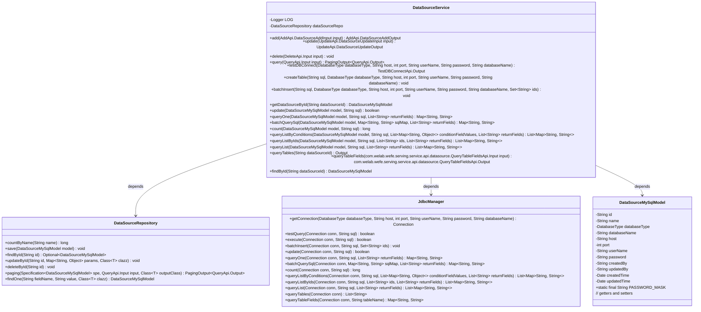

# Basic Information

|      |      |
|------|------|
| Name | DataSourceService |
| Language | .java |
| Code Path | WeFe/serving/serving-service/src/main/java/com/welab/wefe/serving/service/service/DataSourceService.java |
| Package Name | com.welab.wefe.serving.service.service |
| Dependencies | ['com.alibaba.fastjson.JSONObject', 'com.welab.wefe.common.StatusCode', 'com.welab.wefe.common.data.mysql.Where', 'com.welab.wefe.common.exception.StatusCodeWithException', 'com.welab.wefe.common.jdbc.base.DatabaseType', 'com.welab.wefe.common.web.util.CurrentAccountUtil', 'com.welab.wefe.common.web.util.ModelMapper', 'com.welab.wefe.serving.service.api.datasource', 'com.welab.wefe.serving.service.api.datasource.QueryTableFieldsApi.FieldOutput', 'com.welab.wefe.serving.service.api.datasource.QueryTablesApi.Output', 'com.welab.wefe.serving.service.database.entity.DataSourceMySqlModel', 'com.welab.wefe.serving.service.database.repository.DataSourceRepository', 'com.welab.wefe.serving.service.dto.PagingOutput', 'com.welab.wefe.serving.service.manager.JdbcManager', 'org.apache.commons.lang3.StringUtils', 'org.slf4j.Logger', 'org.slf4j.LoggerFactory', 'org.springframework.beans.factory.annotation.Autowired', 'org.springframework.data.jpa.domain.Specification', 'org.springframework.stereotype.Service', 'java.sql.Connection', 'java.sql.SQLException', 'java.util'] |
| Brief Description | The DataSourceService provides data source management functionalities, including CRUD operations, connection testing, SQL execution, and table structure queries. It supports multiple database types to ensure data source validity and security. |

# Description

The DataSourceService is a service class that handles data source-related operations, providing functionalities such as CRUD for data sources, connection testing, and SQL execution. Key methods include: checking name uniqueness and testing connections when adding a data source; validating connections and updating parameters when modifying a data source; deleting a data source; paginated querying of data sources; testing database connections; executing SQL statements such as table creation and batch insertion; querying a data source by ID; and retrieving database table and field information. All operations are managed through JdbcManager for database connections, with exception handling in place.

# Class Summary

| Name   | Type  | Description |
|-------|------|-------------|
| DataSourceService | class | The DataSourceService provides data source management functionalities, including addition, deletion, modification, and query operations, connection testing, SQL execution, and table structure queries. It supports multiple database types, ensuring the security and effectiveness of data source operations. |

## Class DataSourceService

|      |      |
|------|------|
| Access Modifier | @Service;public |
| Type | class |
| Name | DataSourceService |
| Description | The DataSourceService provides data source management functionalities, including addition, deletion, modification, and query operations, connection testing, SQL execution, and table structure queries. It supports multiple database types, ensuring the security and effectiveness of data source operations. |

### UML Class Diagram

Class diagram description: DataSourceService is a service class responsible for operations such as CRUD of data sources and database connection testing. It depends on DataSourceRepository for data persistence operations, uses JdbcManager to manage database connections and execute SQL, and operates on the data model DataSourceMySqlModel. The diagram shows their relationships and main methods, reflecting the design philosophy of a layered architecture.

### Internal Method Call Graph

```mermaid
graph TD
    A["Class DataSourceService"]
    B["Property: Logger LOG"]
    C["Property: DataSourceRepository dataSourceRepo"]
    D["Method: add(DataSourceAddInput input)"]
    E["Method: update(DataSourceUpdateInput input)"]
    F["Method: delete(Input input)"]
    G["Method: query(Input input)"]
    H["Method: testDBConnect(...)"]
    I["Method: createTable(...)"]
    J["Method: batchInsert(...)"]
    K["Method: getDataSourceById(String)"]
    L["Method: update(model, sql)"]
    M["Method: queryOne(...)"]
    N["Method: batchQuerySql(...)"]
    O["Method: count(...)"]
    P["Method: queryListByConditions(...)"]
    Q["Method: queryListByIds(...)"]
    R["Method: queryList(...)"]
    S["Method: queryTables(...)"]
    T["Method: queryTableFields(...)"]
    U["Method: findById(String)"]

    A --> B
    A --> C
    A --> D
    A --> E
    A --> F
    A --> G
    A --> H
    A --> I
    A --> J
    A --> K
    A --> L
    A --> M
    A --> N
    A --> O
    A --> P
    A --> Q
    A --> R
    A --> S
    A --> T
    A --> U
```

This code represents a data source service class, whose primary functionalities include CRUD operations for data sources, database connection testing, and SQL execution. The class utilizes JdbcManager for database connections and operations, while employing DataSourceRepository for data persistence. Core methods encompass name validation and connection testing during data source addition, parameter processing and connection verification during updates, as well as various query methods such as paginated queries and batch queries. All database operations incorporate exception handling and logging to ensure data consistency and traceability.

### Field List

| Name  | Type  | Description |
|-------|-------|------|
| dataSourceRepo | DataSourceRepository | Automatically inject data source repository instances. |
| LOG = LoggerFactory.getLogger(this.getClass()) | Logger | The class defines a protected and immutable logger instance for logging output within the current class. |

### Method List

| Name  | Type  | Description |
|-------|-------|------|
| queryList | List<Map<String, String>> | This method executes an SQL query through a MySQL data source and returns a list of fields. It throws an exception if the data source is invalid; otherwise, it establishes a connection and retrieves the query results. |
| count | long | The method `count` calculates the number of query results from a MySQL data source, with parameters being the data source model and SQL statement. If the data source does not exist, an exception is thrown. |
| getDataSourceById | DataSourceMySqlModel | This method queries and returns the corresponding MySQL data source model from the data source repository by ID, or returns null if it does not exist. |
| add | AddApi.DataSourceAddOutput | The method `add` is used to add a data source: it checks the uniqueness of the name, tests the connection, maps the input to the model and saves it, then returns the ID of the new data source. If the name already exists, an exception is thrown. |
| batchQuerySql | Map<String, String> | The method `batchQuerySql` accepts a data source model, SQL mapping, and return fields, validates the data source, establishes a database connection, executes batch SQL queries, and returns the results. If the data source is invalid, it throws an exception. |
| queryOne | Map<String, String> | Query a single record from a MySQL data source, establish a connection after verifying the data source exists, execute the SQL query, and return the specified field results. |
| update | UpdateApi.DataSourceUpdateOutput | Method for updating data source information: Locate the data source by the input ID, report an error if it does not exist; test the database connection and then update the parameters, returning the updated ID. |
| createTable | void | This method connects to the database via JDBC and executes SQL table creation statements, throwing an SQL error exception upon failure. Parameters include the SQL statement, database type, connection information, and credentials. |
| queryTables | Output | Query the table information of the specified data source. If the data source does not exist, an exception will be thrown. Returns the database type, name, and table list. |
| queryListByIds | List<Map<String, String>> | This method connects to a MySQL database via JDBC and queries data based on an ID list and return fields. It throws an exception if the data source does not exist. |
| query | PagingOutput<QueryApi.Output> | The Java method `query` constructs query conditions based on the `id` and `name` parameters from the input `input`, and returns paginated data results. The `id` is matched exactly, while `name` uses fuzzy matching. It ultimately invokes the `dataSourceRepo` for paginated querying. |
| update | boolean | Updating MySQL Data Source Method: Check if the data source exists, obtain a connection, execute the SQL update, and return the operation result. |
| batchInsert | void | Batch data insertion method, executing SQL via JDBC database connection, handling exceptions and returning error status. |
| delete | void | This method searches the database for data based on the input ID. If the record exists, it deletes the corresponding entry; if not, it returns directly. |
| queryListByConditions | List<Map<String, String>> | This method executes an SQL query through a MySQL data source and returns a list of fields that meet the criteria. If the data source does not exist, an exception is thrown. It uses JdbcManager to establish a connection and execute the query. |
| queryTableFields | com.welab.wefe.serving.service.api.datasource.QueryTableFieldsApi.Output | This method retrieves a database connection using the data source ID, queries the field information of the specified table, and returns a list of field names and types. If the data source does not exist, an exception is thrown. |
| findById | DataSourceMySqlModel | Query the MySQL data source by ID, and call the findOne method of dataSourceRepo to return the corresponding data source model. |
| testDBConnect | TestDBConnectApi.Output | This method tests the database connection by establishing a connection through the JDBC manager and executing a query for verification. It returns the result upon success or throws an exception upon failure. |

