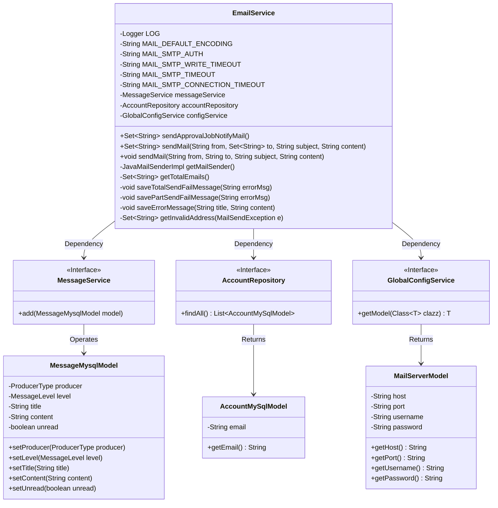
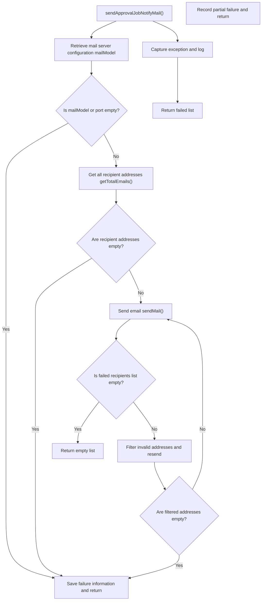
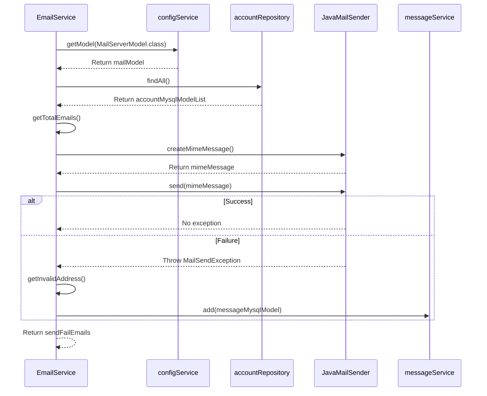

# Basic Information

|      |      |
|------|------|
| Name | EmailService |
| Language | .java |
| Code Path | WeFe/serving/serving-service/src/main/java/com/welab/wefe/serving/service/service/EmailService.java |
| Package Name | com.welab.wefe.serving.service.service |
| Dependencies | ['com.welab.wefe.common.util.StringUtil', 'com.welab.wefe.common.wefe.enums.MessageLevel', 'com.welab.wefe.common.wefe.enums.ProducerType', 'com.welab.wefe.serving.service.database.entity.AccountMySqlModel', 'com.welab.wefe.serving.service.database.entity.MessageMysqlModel', 'com.welab.wefe.serving.service.database.repository.AccountRepository', 'com.welab.wefe.serving.service.dto.globalconfig.MailServerModel', 'com.welab.wefe.serving.service.service.globalconfig.GlobalConfigService', 'org.apache.commons.collections4.CollectionUtils', 'org.apache.commons.lang3.StringUtils', 'org.slf4j.Logger', 'org.slf4j.LoggerFactory', 'org.springframework.beans.factory.annotation.Autowired', 'org.springframework.mail.MailSendException', 'org.springframework.mail.javamail.JavaMailSenderImpl', 'org.springframework.mail.javamail.MimeMessageHelper', 'org.springframework.stereotype.Service', 'javax.mail.Address', 'javax.mail.SendFailedException', 'javax.mail.internet.MimeMessage', 'java.util.HashSet', 'java.util.List', 'java.util.Properties', 'java.util.Set'] |
| Brief Description | The EmailService class provides email sending functionality, supporting batch sending and error handling, including invalid address filtering and retry mechanisms, with dependencies on configuration services and account data. |

# Description

The EmailService is a service class designed for sending emails, encompassing functionalities for dispatching approval task notifications and regular emails. It retrieves mail server information through configuration, supports both batch and individual email sending, handles send failures, and logs error messages. The service class includes features such as obtaining mail senders, validating mail server configurations, filtering invalid recipient addresses, and saving failed send attempts to a database. Email transmission supports the SMTP protocol, with configured parameters like timeout and encoding, while also managing exception scenarios.

# Class Summary

| Name   | Type  | Description |
|-------|------|-------------|
| EmailService | class | The EmailService class implements email sending functionality, including SMTP configuration, exception handling, and retry mechanisms, supporting batch sending and failed address logging. |

## Class EmailService

|      |      |
|------|------|
| Access Modifier | @Service;public |
| Type | class |
| Name | EmailService |
| Description | The EmailService class implements email sending functionality, including SMTP configuration, exception handling, and retry mechanisms, supporting batch sending and failed address logging. |

### UML Class Diagram

Class Diagram Description:
The diagram illustrates the core structure of EmailService and its dependencies. As the main class, EmailService autowires three interfaces - MessageService, AccountRepository, and GlobalConfigService - for message processing, account data access, and configuration management respectively. MailServerModel stores mail server configurations, while AccountMySqlModel and MessageMysqlModel are data model classes. The diagram clearly demonstrates Spring's dependency injection pattern and the collaboration between service layer and persistence layer, showcasing the complete email sending workflow from configuration retrieval, address collection to exception handling.

### Internal Method Call Graph

This code implements an email service class, primarily designed to send approval task notification emails. The flowchart illustrates the logical flow of the main method sendApprovalJobNotifyMail(), including configuration checks, recipient retrieval, email sending, and failure handling steps. The sequence diagram details the interaction process between classes and external services, covering configuration retrieval, account information query, email creation, and the complete email sending workflow. The code particularly emphasizes exception handling and failure scenario recording, including invalid address filtering and retry mechanisms.

### Field List

| Name  | Type  | Description |
|-------|-------|------|
| MAIL_SMTP_AUTH = "true" | String | Define the constant string MAIL_SMTP_AUTH with the value "true", used for SMTP authentication configuration. |
| MAIL_SMTP_TIMEOUT = "30000" | String | Define a static constant for the email SMTP timeout duration as 30000 milliseconds. |
| configService | GlobalConfigService | Using @Autowired to automatically inject the GlobalConfigService instance configService. |
| MAIL_DEFAULT_ENCODING = "UTF-8" | String | Define the constant string MAIL_DEFAULT_ENCODING with the value in UTF-8 encoding format. |
| LOG = LoggerFactory.getLogger(this.getClass()) | Logger | A protected and immutable log object LOG is defined in the class for recording log information of the current class. |
| accountRepository | AccountRepository | Using @Autowired to automatically inject an instance of AccountRepository. |
| MAIL_SMTP_WRITE_TIMEOUT = "30000" | String | Define a static constant for the email SMTP write timeout of 30000 milliseconds. |
| messageService | MessageService | Automatically inject the MessageService instance. |
| MAIL_SMTP_CONNECTION_TIMEOUT = "30000" | String | Define a static constant for the SMTP mail connection timeout set to 30000 milliseconds. |

### Method List

| Name  | Type  | Description |
|-------|-------|------|
| sendApprovalJobNotifyMail | Set<String> | Method to send approval emails, check email server settings and recipients, handle failed sending attempts and retry invalid addresses, return the collection of failed email addresses. |
| sendMail | Set<String> | The Java method `sendMail` sends emails via `JavaMailSender`, handles invalid address exceptions, and returns a collection of invalid recipients. |
| getTotalEmails | Set<String> | This method retrieves the email addresses of all accounts from the database, filters out null values, and stores them in a Set collection with an initial capacity of 16 before returning. |
| getMailSender | JavaMailSenderImpl | Obtain the mail sender instance, verify the configuration validity, then set parameters such as host, port, username, and password, and configure SMTP properties and SSL encryption. |
| sendMail | void | Method for sending emails: Use JavaMailSender to send emails with subject and content, handle exceptions, and log error messages. |
| saveTotalSendFailMessage | void | The method `saveTotalSendFailMessage` is used to save error messages when the approval task email fails to send, and it calls `saveErrorMessage` to record the error details. |
| savePartSendFailMessage | void | The method `savePartSendFailMessage` is used to save error messages for partially failed approval task emails, and it calls `saveErrorMessage` to record the error details. |
| saveErrorMessage | void | The method `saveErrorMessage` stores error information in the database, including the title, content, producer type as `board`, level as `error`, and unread status, while logging the error when it occurs. |
| getInvalidAddress | Set<String> | Extract invalid addresses from email sending exceptions, store them in a collection, and return. |

