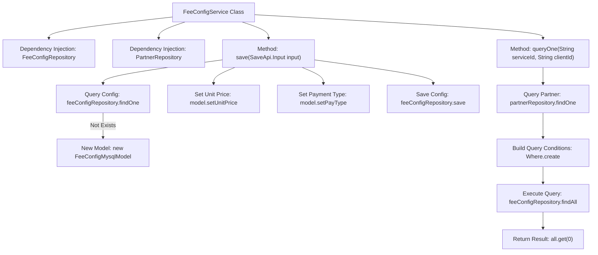

# Basic Information

|      |      |
|------|------|
| Name | FeeConfigService |
| Language | .java |
| Code Path | WeFe/serving/serving-service/src/main/java/com/welab/wefe/serving/service/service/FeeConfigService.java |
| Package Name | com.welab.wefe.serving.service.service |
| Dependencies | ['java.util.List', 'com.welab.wefe.serving.service.database.entity.PartnerMysqlModel', 'com.welab.wefe.serving.service.database.repository.PartnerRepository', 'org.springframework.beans.factory.annotation.Autowired', 'org.springframework.data.jpa.domain.Specification', 'org.springframework.stereotype.Service', 'com.welab.wefe.common.data.mysql.Where', 'com.welab.wefe.common.data.mysql.enums.OrderBy', 'com.welab.wefe.common.util.StringUtil', 'com.welab.wefe.serving.service.api.feeconfig.SaveApi', 'com.welab.wefe.serving.service.database.entity.FeeConfigMysqlModel', 'com.welab.wefe.serving.service.database.repository.FeeConfigRepository'] |
| Brief Description | The FeeConfigService class provides functionality for saving and querying billing configurations. It operates on the database through FeeConfigRepository and PartnerRepository, supporting updating or creating configurations by ID, as well as querying the latest configurations by service ID and customer ID. |

# Description

FeeConfigService is a service class that includes functionalities for saving and querying billing configurations. It interacts with the database through FeeConfigRepository and PartnerRepository. The save method updates or creates a FeeConfigMysqlModel based on input parameters, supporting the setting of unit prices and payment types. The queryOne method retrieves the latest billing configuration by service ID and customer ID, using Specification to construct query conditions and returning the first record sorted in descending order by creation time.

# Class Summary

| Name   | Type  | Description |
|-------|------|-------------|
| FeeConfigService | class | The FeeConfigService class provides functionality for saving and querying billing configurations. It operates on the database through FeeConfigRepository and PartnerRepository, supporting updating or creating configurations by ID, as well as querying the latest configurations based on service ID and customer ID. |


## Class FeeConfigService

|      |      |
|------|------|
| Access Modifier | @Service;public |
| Type | class |
| Name | FeeConfigService |
| Description | The FeeConfigService class provides functionality for saving and querying billing configurations. It operates on the database through FeeConfigRepository and PartnerRepository, supporting updating or creating configurations by ID, as well as querying the latest configurations based on service ID and customer ID. |


### UML Class Diagram

```mermaid
classDiagram
    class FeeConfigService {
        -FeeConfigRepository feeConfigRepository
        -PartnerRepository partnerRepository
        +save(SaveApi$Input input) FeeConfigMysqlModel
        +queryOne(String serviceId, String clientId) FeeConfigMysqlModel
    }

    class FeeConfigRepository {
        <<Interface>>
        +findOne(String field, String value, Class~T~ clazz) T
        +save(FeeConfigMysqlModel model) FeeConfigMysqlModel
        +findAll(Specification~T~ spec) List~T~
    }

    class PartnerRepository {
        <<Interface>>
        +findOne(String field, String value, Class~T~ clazz) T
    }

    class FeeConfigMysqlModel {
        +setUnitPrice(BigDecimal unitPrice)
        +setPayType(String payType)
    }

    class PartnerMysqlModel {
        -String id
    }

    class SaveApi$Input {
        -String id
        -BigDecimal unitPrice
        -String payType
        +getId() String
        +getUnitPrice() BigDecimal
        +getPayType() String
    }

    class Where {
        +create() WhereBuilder
    }

    class WhereBuilder {
        +equal(String field, Object value) WhereBuilder
        +orderBy(String field, OrderBy order) WhereBuilder
        +build(Class~T~ clazz) Specification~T~
    }

    class OrderBy {
        <<Enumeration>>
        asc
        desc
    }

    FeeConfigService --> FeeConfigRepository : depends
    FeeConfigService --> PartnerRepository : depends
    FeeConfigService --> SaveApi$Input : uses
    FeeConfigService --> FeeConfigMysqlModel : operates
    FeeConfigService --> PartnerMysqlModel : queries
    FeeConfigService --> Where : uses
    Where --> WhereBuilder : creates
    WhereBuilder --> Specification : generates
```

This diagram illustrates the core class relationships of the billing configuration service. FeeConfigService acts as the service class, relying on FeeConfigRepository and PartnerRepository for data operations, and using Where to construct query conditions. Key functionalities include saving configurations (receiving parameters via SaveApi.Input) and querying the latest configurations (based on serviceId and clientId). The class diagram encompasses entity classes, input parameter classes, repository interfaces, and query builder utility classes, forming a complete configuration management workflow.


### Internal Method Call Graph



The flowchart illustrates two core methods of FeeConfigService: save() for saving/updating billing configurations (queries existing config, creates new if absent, updates fields, then saves); queryOne() retrieves latest billing rules by serviceId and clientId (validates partner info first, builds query conditions to fetch results). It shows the end-to-end process from parameter validation to database operations, including conditional branches and dependency call relationships.

### Field List

| Name  | Type  | Description |
|-------|-------|------|
| partnerRepository | PartnerRepository | Using @Autowired to automatically inject an instance of PartnerRepository. |
| feeConfigRepository | FeeConfigRepository | Automatically inject the FeeConfigRepository instance. |

### Method List

| Name  | Type  | Description |
|-------|-------|------|
| save | FeeConfigMysqlModel | Save cost configuration information: Look up or create a new model based on the input ID, then update the unit price and payment type before saving to the database. |
| queryOne | FeeConfigMysqlModel | Query the latest billing rule configuration for the specified service ID and customer ID. Return null if no results are found. |


