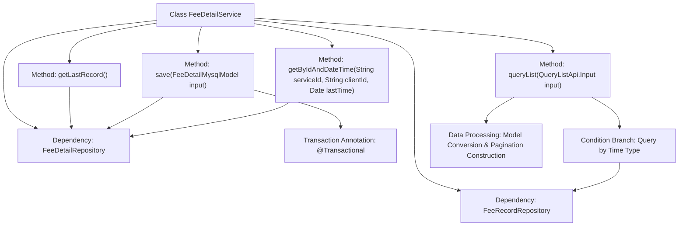

# Basic Information

|      |      |
|------|------|
| Name | FeeDetailService |
| Language | .java |
| Code Path | WeFe/serving/serving-service/src/main/java/com/welab/wefe/serving/service/service/FeeDetailService.java |
| Package Name | com.welab.wefe.serving.service.service |
| Dependencies | ['java.util.ArrayList', 'java.util.Date', 'java.util.List', 'org.springframework.beans.BeanUtils', 'org.springframework.beans.factory.annotation.Autowired', 'org.springframework.data.jpa.domain.Specification', 'org.springframework.stereotype.Service', 'org.springframework.transaction.annotation.Transactional', 'com.welab.wefe.common.data.mysql.Where', 'com.welab.wefe.common.web.util.ModelMapper', 'com.welab.wefe.serving.service.api.feedetail.QueryListApi', 'com.welab.wefe.serving.service.database.entity.FeeDetailMysqlModel', 'com.welab.wefe.serving.service.database.entity.FeeDetailOutputModel', 'com.welab.wefe.serving.service.database.repository.FeeDetailRepository', 'com.welab.wefe.serving.service.database.repository.FeeRecordRepository', 'com.welab.wefe.serving.service.dto.PagingOutput', 'com.welab.wefe.serving.service.enums.QueryDateTypeEnum'] |
| Brief Description | The FeeDetailService class provides fee detail operations, including retrieving the latest records, saving data, paginated querying of lists, and conditional queries. It supports hourly, daily, monthly, and yearly statistics, using transactions to ensure data consistency. |

# Description

FeeDetailService is a Spring service class responsible for handling fee detail-related operations. It relies on FeeRecordRepository and FeeDetailRepository for data access. Key functionalities include: retrieving the last record, saving fee details (with transaction rollback support), paginated querying of fee lists (supporting hourly, daily, monthly, and yearly time granularities), and querying details by service ID, client ID, and time. The query feature dynamically constructs SQL conditions based on input parameters and returns paginated results. The save operation checks whether a record exists—creating a new one if absent or updating attributes if present.

# Class Summary

| Name   | Type  | Description |
|-------|------|-------------|
| FeeDetailService | class | The FeeDetailService provides fee detail operations: retrieving the latest record, saving details, paginated query lists (supporting hourly/daily/monthly/yearly statistics), and querying by ID and time. Transactions are used to ensure data consistency. |


## Class FeeDetailService

|      |      |
|------|------|
| Access Modifier | @Service;public |
| Type | class |
| Name | FeeDetailService |
| Description | The FeeDetailService provides fee detail operations: retrieving the latest record, saving details, paginated query lists (supporting hourly/daily/monthly/yearly statistics), and querying by ID and time. Transactions are used to ensure data consistency. |


### UML Class Diagram

```mermaid
classDiagram
    class FeeDetailService {
        -FeeRecordRepository feeRecordRepository
        -FeeDetailRepository feeDetailRepository
        +getLastRecord() FeeDetailMysqlModel
        +save(FeeDetailMysqlModel input) void
        +queryList(QueryListApi~Input~ input) PagingOutput~QueryListApi~Output~~
        +getByIdAndDateTime(String serviceId, String clientId, Date lastTime) FeeDetailMysqlModel
    }

    class FeeRecordRepository {
        <<Interface>>
        +queryList(String clientName, String serviceName, String serviceType, String format, Date startTime, Date endTime, Integer offset, Integer limit) List~FeeDetailOutputModel~
        +count(String clientName, String serviceName, String serviceType, String format, Date startTime, Date endTime) Integer
    }

    class FeeDetailRepository {
        <<Interface>>
        +getLastRecord() FeeDetailMysqlModel
        +findOne(String field, Object value, Class~T~ clazz) T
        +save(FeeDetailMysqlModel model) void
        +findOne(Specification~T~ spec) Optional~T~
    }

    class FeeDetailMysqlModel {
        // Data model class
    }

    class QueryListApi {
        <<Interface>>
        class Input {
            // Query input parameters
        }
        class Output {
            // Query output results
        }
    }

    class PagingOutput~T~ {
        // Pagination wrapper class
    }

    class FeeDetailOutputModel {
        // Fee detail output model
    }

    FeeDetailService --> FeeRecordRepository : Dependency
    FeeDetailService --> FeeDetailRepository : Dependency
    FeeDetailService --> FeeDetailMysqlModel : Operates
    FeeDetailService --> QueryListApi : Uses
    FeeDetailService --> PagingOutput : Returns
    QueryListApi.Output --> FeeDetailOutputModel : Maps
```

This diagram illustrates the core FeeDetailService class and its dependencies. As a service class, it accesses data through FeeRecordRepository and FeeDetailRepository to handle operations such as querying and saving fee details. The class diagram consists of 6 main components: 1 service class, 2 repository interfaces, and 3 data model classes, clearly demonstrating the collaboration between the service layer and persistence layer. The query logic involves complex pagination processing and multi-granularity time condition judgments.


### Internal Method Call Graph



This code represents the FeeDetailService class, which primarily handles CRUD operations and complex queries for fee details. It implements data access through Autowired-injected repositories, providing functionalities such as retrieving the latest record, saving data, paginated queries, and conditional queries. The save method uses transactions to ensure data consistency, while the queryList method performs grouped statistical queries based on different time granularities (hour/day/month/year). Finally, it converts results into API output format and constructs paginated responses. The entire workflow demonstrates a complete chain from data access to business logic processing.

### Field List

| Name  | Type  | Description |
|-------|-------|------|
| feeDetailRepository | FeeDetailRepository | Automatically injects an instance of FeeDetailRepository. |
| feeRecordRepository | FeeRecordRepository | Automatically inject fee record repository instance. |

### Method List

| Name  | Type  | Description |
|-------|-------|------|
| getByIdAndDateTime | FeeDetailMysqlModel | Query fee details based on service ID, customer ID, and creation time. Return null if no results are found. |
| queryList | PagingOutput<QueryListApi.Output> | The method queries the cost record list based on input parameters, supporting grouped statistics by hour, day, month, or year, and returns paginated results. If no date type parameter is provided, it defaults to grouping by hour. The query results, after model conversion, include service type and payment type, ultimately returning the total record count and paginated data list. |
| getLastRecord | FeeDetailMysqlModel | The method to obtain the latest fee record is to call the repository interface and return the last piece of data. |
| save | void | A save method with transaction rollback: updates if the ID exists, otherwise creates a new record, copies attributes, sets the creation time, and finally saves. |


