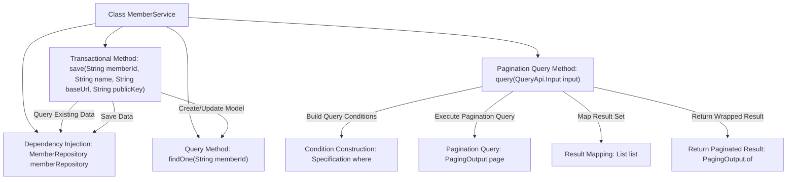

# Basic Information

|      |      |
|------|------|
| Name | MemberService |
| Language | .java |
| Code Path | WeFe/serving/serving-service/src/main/java/com/welab/wefe/serving/service/service/MemberService.java |
| Package Name | com.welab.wefe.serving.service.service |
| Dependencies | ['com.welab.wefe.common.data.mysql.Where', 'com.welab.wefe.common.web.util.ModelMapper', 'com.welab.wefe.serving.service.api.member.QueryApi', 'com.welab.wefe.serving.service.database.entity.MemberMySqlModel', 'com.welab.wefe.serving.service.database.repository.MemberRepository', 'com.welab.wefe.serving.service.dto.PagingOutput', 'org.apache.commons.lang3.StringUtils', 'org.springframework.beans.factory.annotation.Autowired', 'org.springframework.data.jpa.domain.Specification', 'org.springframework.stereotype.Service', 'org.springframework.transaction.annotation.Transactional', 'java.util.List', 'java.util.stream.Collectors'] |
| Brief Description | The MemberService class provides member data operations: saving member information (updating if it exists), querying by ID, and paginated queries (with support for conditional filtering). It uses transactions to ensure data consistency and automatically injects MemberRepository for database interactions. |

# Description

The code defines a Spring service class named `MemberService`, primarily providing CRUD functionality for member data. The class interacts with the database through the auto-injected `MemberRepository`. Core methods include:  
- The `save` method saves member information, determining whether to insert or update based on `memberId`, and filters `publicKey` containing specific characters.  
- The `findOne` method queries a single member by `memberId`.  
- The `query` method implements paginated queries, supporting exact matching by `memberId` and fuzzy queries by `name`, with results mapped to output objects via `ModelMapper` and returned in pages.  
All database operations adhere to JPA specifications, and the `save` method includes a transactional annotation to ensure rollback on exceptions.

# Class Summary

| Name   | Type  | Description |
|-------|------|-------------|
| MemberService | class | The MemberService class provides member data operations: saving member information (updating if it exists), querying by ID, and paginated queries (supporting filtering by ID and name). It uses transactions to ensure data consistency and automatically injects MemberRepository for database interactions. |


## Class MemberService

|      |      |
|------|------|
| Access Modifier | @Service;public |
| Type | class |
| Name | MemberService |
| Description | The MemberService class provides member data operations: saving member information (updating if it exists), querying by ID, and paginated queries (supporting filtering by ID and name). It uses transactions to ensure data consistency and automatically injects MemberRepository for database interactions. |


### UML Class Diagram

```mermaid
classDiagram
    class MemberService {
        -MemberRepository memberRepository
        +save(String memberId, String name, String baseUrl, String publicKey) void
        +findOne(String memberId) MemberMySqlModel
        +query(QueryApi$Input input) PagingOutput~QueryApi$Output~
    }

    class MemberRepository {
        <<Interface>>
        +findOne(String field, String value, Class~T~ clazz) T
        +save(MemberMySqlModel model) void
        +paging(Specification~MemberMySqlModel~ where, QueryApi$Input input) PagingOutput~MemberMySqlModel~
    }

    class MemberMySqlModel {
        -String memberId
        -String name
        -String api
        -String publicKey
        +setMemberId(String memberId) void
        +setName(String name) void
        +setApi(String api) void
        +setPublicKey(String publicKey) void
    }

    class QueryApi {
        class Input {
            +getMemberId() String
            +getName() String
        }
        class Output
    }

    class PagingOutput~T~ {
        +getList() List~T~
        +getTotal() long
        +of(long total, List~T~ list) PagingOutput~T~
    }

    class Specification~T~ {
        <<Interface>>
    }

    class Where {
        +create() WhereBuilder
    }

    class WhereBuilder {
        +equal(String field, String value) WhereBuilder
        +contains(String field, String value) WhereBuilder
        +build(Class~T~ clazz) Specification~T~
    }

    class ModelMapper {
        +map(Object source, Class~D~ destinationClass) D
    }

    MemberService --> MemberRepository : depends
    MemberService --> MemberMySqlModel : operates
    MemberService --> QueryApi : uses
    MemberService --> PagingOutput : returns
    MemberRepository --> MemberMySqlModel : operates
    QueryApi --> Input
    QueryApi --> Output
    Where --> WhereBuilder : creates
    WhereBuilder --> Specification : generates
    MemberService --> ModelMapper : converts
```

This code demonstrates a member service system, with the MemberService class at its core, performing data persistence operations through MemberRepository. Key functionalities include member information saving (with transaction management), single-record querying, and paginated queries. Paginated queries utilize Where to construct dynamic query conditions and employ ModelMapper for model conversion. The class diagram clearly illustrates the relationship between the service layer and persistence layer, as well as the collaboration among DTOs, model classes, and utility classes, showcasing a typical Spring Data JPA application pattern.


### Internal Method Call Graph



The flowchart describes the core functional flow of the MemberService class. The save method queries and updates member data via memberRepository, including null checks and sensitive information filtering; findOne provides simple queries; the query method implements complex paginated queries, dynamically constructs conditions through Where, executes pagination, and maps result types. All database operations are performed through the injected memberRepository, demonstrating clear separation of responsibilities.

### Field List

| Name  | Type  | Description |
|-------|-------|------|
| memberRepository | MemberRepository | Automatically inject the MemberRepository member repository instance. |

### Method List

| Name  | Type  | Description |
|-------|-------|------|
| save | void | The method `save` is used to save member information. It creates a new record if the member does not exist or updates the existing one. The fields include member ID, name, API address, and public key (updated when not hidden). Transaction errors trigger a rollback. |
| findOne | MemberMySqlModel | Find the member data with the specified ID by calling the findOne method of the repository to return a MemberMySqlModel object. |
| query | PagingOutput<QueryApi.Output> | This method queries member data based on input conditions and returns paginated results. By constructing query conditions (memberId equality, name inclusion), it retrieves data from the database in pages, converts it into the specified output format, and returns the result. |


