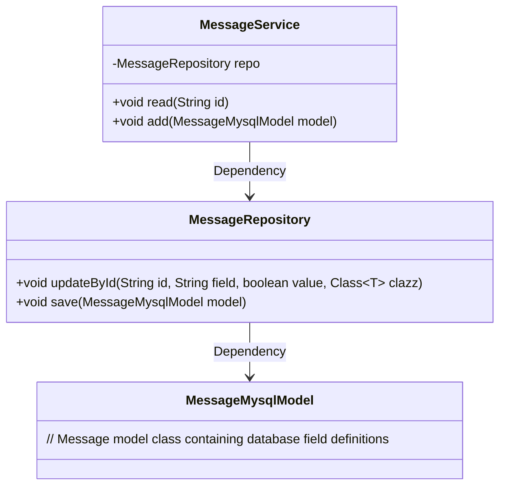
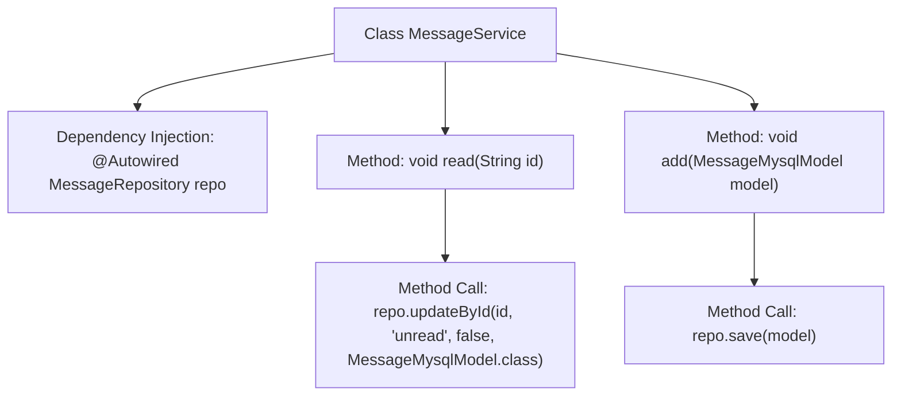

# Basic Information

|      |      |
|------|------|
| Name | MessageService |
| Language | .java |
| Code Path | WeFe/serving/serving-service/src/main/java/com/welab/wefe/serving/service/service/MessageService.java |
| Package Name | com.welab.wefe.serving.service.service |
| Dependencies | ['org.springframework.beans.factory.annotation.Autowired', 'org.springframework.stereotype.Service', 'com.welab.wefe.serving.service.database.entity.MessageMysqlModel', 'com.welab.wefe.serving.service.database.repository.MessageRepository'] |
| Brief Description | The message service class includes functionalities for reading and adding messages. Reading a message updates its status to "read" via ID, while adding a message directly saves the model to the database. It relies on the message repository for data operations. |

# Description

The content describes a service class named MessageService, identified as a Spring service component using the @Service annotation. The class automatically injects the MessageRepository dependency via @Autowired. It provides two core methods: the read method accepts a string id parameter and calls the repository's updateById method to update the status of the specified message to "read"; the add method accepts a MessageMysqlModel object parameter and calls the repository's save method to store the message data. The entire class focuses on message reading and creation operations, with database interactions implemented through the injected repository.

# Class Summary

| Name   | Type  | Description |
|-------|------|-------------|
| MessageService | class | Message service class, which includes functions for reading and adding messages, operates on the database using a repository. |

## Class MessageService

|      |      |
|------|------|
| Access Modifier | @Service;public |
| Type | class |
| Name | MessageService |
| Description | Message service class, which includes functions for reading and adding messages, operates on the database using a repository. |

### UML Class Diagram

This class diagram illustrates the core structure of the message service module. The MessageService, as the service layer, relies on MessageRepository for database operations, providing message reading (read) and adding (add) functionalities. The MessageRepository encapsulates update (updateById) and save (save) methods to manipulate the MessageMysqlModel entity class. The overall design follows the classic three-tier architecture, complying with Spring's dependency injection specifications.

### Internal Method Call Graph

This flowchart illustrates the structure of the MessageService class and its method invocation relationships. The class injects a MessageRepository instance via @Autowired, providing two core methods: read() and add(). The read() method calls the repository's updateById() to mark a specified message ID as read, while add() invokes the repository's save() method to store the message model. The diagram clearly demonstrates the hierarchical relationships from class to attributes and then to method calls, reflecting the interaction logic between the Spring service layer and data layer.

### Field List

| Name  | Type  | Description |
|-------|-------|------|
| repo | MessageRepository | Automatically inject the MessageRepository instance into the repo variable. |

### Method List

| Name  | Type  | Description |
|-------|-------|------|
| read | void | The method `read` takes a string `id`, calls the `updateById` method of the `repo`, and updates the `unread` field of the `MessageMysqlModel` record with the specified `id` to `false`. |
| add | void | The method `add` takes a `MessageMysqlModel` parameter and calls `repo.save` to store the data. |

