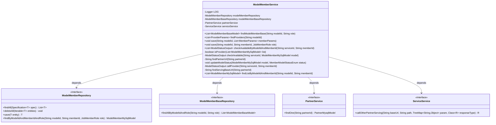
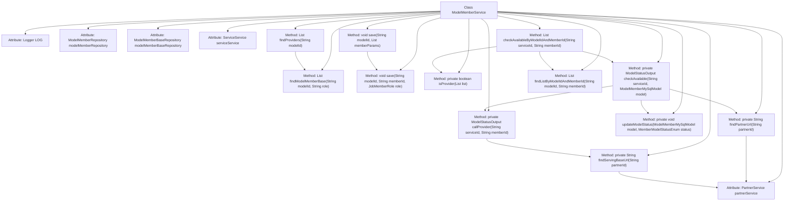

# Basic Information

|      |      |
|------|------|
| Name | ModelMemberService |
| Language | .java |
| Code Path | WeFe/serving/serving-service/src/main/java/com/welab/wefe/serving/service/service/ModelMemberService.java |
| Package Name | com.welab.wefe.serving.service.service |
| Dependencies | ['com.google.common.collect.Lists', 'com.welab.wefe.common.data.mysql.Where', 'com.welab.wefe.common.exception.StatusCodeWithException', 'com.welab.wefe.common.web.util.ModelMapper', 'com.welab.wefe.common.wefe.enums.JobMemberRole', 'com.welab.wefe.serving.sdk.dto.ProviderParams', 'com.welab.wefe.serving.service.database.entity.ModelMemberBaseModel', 'com.welab.wefe.serving.service.database.entity.ModelMemberMySqlModel', 'com.welab.wefe.serving.service.database.entity.PartnerMysqlModel', 'com.welab.wefe.serving.service.database.repository.ModelMemberBaseRepository', 'com.welab.wefe.serving.service.database.repository.ModelMemberRepository', 'com.welab.wefe.serving.service.dto.MemberParams', 'com.welab.wefe.serving.service.dto.ModelStatusOutput', 'com.welab.wefe.serving.service.enums.MemberModelStatusEnum', 'org.slf4j.Logger', 'org.slf4j.LoggerFactory', 'org.springframework.beans.factory.annotation.Autowired', 'org.springframework.data.jpa.domain.Specification', 'org.springframework.stereotype.Service', 'java.util.Date', 'java.util.List', 'java.util.TreeMap', 'java.util.stream.Collectors'] |
| Brief Description | The ModelMemberService class provides model member management functionalities, including querying, saving member information, checking service availability, and invoking partner services. It relies on components such as ModelMemberRepository and PartnerService to implement core business logic. |

# Description

The code describes a Spring service class named `ModelMemberService`, primarily used for managing model member-related operations. This class includes the following core functionalities: querying basic model member information by `modelId` and `role`; retrieving partner information; saving model member data; and checking member availability status based on `modelId` and `memberId`. The service relies on `ModelMemberRepository` and `ModelMemberBaseRepository` for data persistence and integrates `PartnerService` and `ServiceService` to handle partner-related operations. Key methods encompass the data update logic when saving member information and the process of checking member status via HTTP calls to partner services. Exception handling logs partner service disconnections and returns an offline status.

# Class Summary

| Name   | Type  | Description |
|-------|------|-------------|
| ModelMemberService | class | The ModelMemberService class provides model member management functionalities, including querying, saving member information, checking service availability, invoking partner service interfaces, and other operations. It relies on components such as ModelMemberRepository and PartnerService to implement core business logic. |

## Class ModelMemberService

|      |      |
|------|------|
| Access Modifier | @Service;public |
| Type | class |
| Name | ModelMemberService |
| Description | The ModelMemberService class provides model member management functionalities, including querying, saving member information, checking service availability, invoking partner service interfaces, and other operations. It relies on components such as ModelMemberRepository and PartnerService to implement core business logic. |

### UML Class Diagram

This class diagram illustrates the core structure and dependencies of ModelMemberService. The service primarily handles model member management, including querying, saving, and status checking functionalities. It relies on four key interfaces: ModelMemberRepository (for database operations), ModelMemberBaseRepository (for basic member queries), PartnerService (for partner services), and ServiceService (for remote service invocations). The service contains 12 methods categorized into public APIs (e.g., findProviders/save) and private helper methods (e.g., isProvider/callProvider), combining these dependencies to implement complete business logic. The diagram clearly demonstrates a typical Spring service layer architecture, where the service class utilizes multiple Repository and Service interfaces through dependency injection.

### Internal Method Call Graph

This code illustrates a Spring service class ModelMemberService, primarily handling business logic related to model members. The class contains multiple methods involving member queries, saving operations, status checks, etc. Core processes include: querying data through repositories, invoking external services for status verification, and updating member statuses. There exists a multi-layered calling relationship between methods, such as checkAvailableByModelIdAndMemberId invoking multiple private methods to complete status checks and updates. The overall design reflects a layered architecture philosophy, separating data access, business logic, and external service invocations.

### Field List

| Name  | Type  | Description |
|-------|-------|------|
| modelMemberBaseRepository | ModelMemberBaseRepository | The code snippet uses @Autowired to automatically inject an instance of ModelMemberBaseRepository. |
| LOG = LoggerFactory.getLogger(getClass()) | Logger | Define a protected static log object LOG in the class for recording logs of the current class. |
| modelMemberRepository | ModelMemberRepository | Automatically inject the ModelMemberRepository instance. |
| serviceService | ServiceService | Using @Autowired to automatically inject the ServiceService instance. |
| partnerService | PartnerService | Use @Autowired to automatically inject an instance of PartnerService. |

### Method List

| Name  | Type  | Description |
|-------|-------|------|
| findProviders | List<ProviderParams> | This method retrieves the provider member list by model ID and maps it to a list of ProviderParams objects for return. |
| isProvider | boolean | Check if the current user exists in the list as a member with the role of provider. |
| findModelMemberBase | List<ModelMemberBaseModel> | The method `findModelMemberBase` queries a list of `ModelMemberBaseModel` based on `modelId` and `role`, and returns the result by invoking the repository's `findAllByModelIdAndRole` method. |
| save | void | This method deletes all associated members based on the modelId and then saves the new member list. |
| checkAvailable | ModelStatusOutput | Check service availability and update status: Call the vendor API to retrieve the status, set the partner URL, update the model status, and return the result. |
| updateModelStatus | void | Method for updating model status: Set the status, update the time, and save to the database. |
| findPartnerUrl | String | Query the partner URL by partnerId, return an empty string if not found. |
| save | void | This method saves the model member information. If it does not exist, it creates a new one and sets the ID and role, then stores it in the database. |
| checkAvailableByModelIdAndMemberId | List<ModelStatusOutput> | This method checks availability based on the model ID and member ID. If the list is a provider, it returns empty; otherwise, it filters out non-current members and non-recommender roles, checks availability, and returns the result list. |
| callProvider | ModelStatusOutput | Check the model status by calling the partner service, and return the offline status upon failure. |
| findServingBaseUrl | String | The method queries partner information by partnerId and returns its service base URL. |
| findListByModelIdAndMemberId | List<ModelMemberMySqlModel> | Method to query model member list based on model ID and member ID. Use the condition builder to create query conditions and return matching results. |

