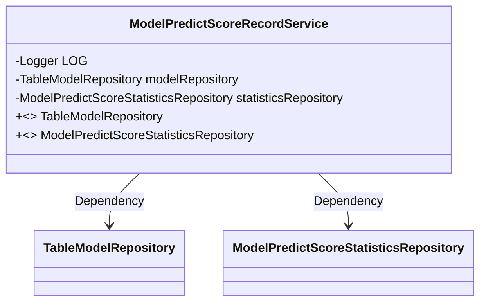
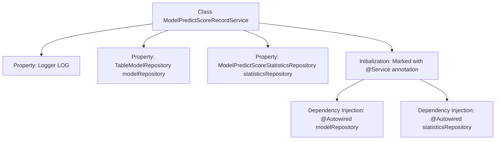

# Basic Information

|      |      |
|------|------|
| Name | ModelPredictScoreRecordService |
| Language | .java |
| Code Path | WeFe/serving/serving-service/src/main/java/com/welab/wefe/serving/service/service/ModelPredictScoreRecordService.java |
| Package Name | com.welab.wefe.serving.service.service |
| Dependencies | ['com.welab.wefe.serving.service.database.repository.ModelPredictScoreStatisticsRepository', 'com.welab.wefe.serving.service.database.repository.TableModelRepository', 'org.slf4j.Logger', 'org.slf4j.LoggerFactory', 'org.springframework.beans.factory.annotation.Autowired', 'org.springframework.stereotype.Service'] |
| Brief Description | Service class `ModelPredictScoreRecordService`, containing a logger, with auto-injected model repository and predict score statistics repository. |

# Description

This is a Spring service class named ModelPredictScoreRecordService, which includes two auto-wired repository components: TableModelRepository and ModelPredictScoreStatisticsRepository. The class defines a protected logger LOG for recording log information. It is annotated with @Service to identify it as a Spring service component, but the specific business method implementations are not shown.

# Class Summary

| Name   | Type  | Description |
|-------|------|-------------|
| ModelPredictScoreRecordService | class | The service class includes logging and two auto-injected models along with a statistics repository. |

## Class ModelPredictScoreRecordService

|      |      |
|------|------|
| Access Modifier | @Service;public |
| Type | class |
| Name | ModelPredictScoreRecordService |
| Description | The service class includes logging and two auto-injected models along with a statistics repository. |

### UML Class Diagram

This class diagram depicts a Spring service class ModelPredictScoreRecordService, which contains two privately dependency-injected repository interfaces (TableModelRepository and ModelPredictScoreStatisticsRepository) along with a logger. The @Service annotation indicates it is a Spring service component, while the @Autowired annotation implements dependency injection for the two repository interfaces. The diagram clearly illustrates the dependency relationships between the service class and the two repository interfaces, adhering to the dependency injection design pattern of the Spring framework.

### Internal Method Call Graph

This flowchart illustrates the core structure of the Spring service class ModelPredictScoreRecordService. The class is managed by the Spring container through the @Service annotation, containing one Logger property and two JPA repository interfaces (TableModelRepository and ModelPredictScoreStatisticsRepository) that are automatically injected via @Autowired. The diagram clearly presents the relationship between class members and Spring dependency injection, with no business methods included, indicating the current code snippet only completes basic dependency configuration.

### Field List

| Name  | Type  | Description |
|-------|-------|------|
| modelRepository | TableModelRepository | The code snippet uses @Autowired to automatically inject an instance of TableModelRepository. |
| LOG = LoggerFactory.getLogger(getClass()) | Logger | Declare a protected final logger object LOG, initialized with the current class name. |
| statisticsRepository | ModelPredictScoreStatisticsRepository | Use @Autowired to automatically inject an instance of ModelPredictScoreStatisticsRepository. |

### Method List

| Name  | Type  | Description |
|-------|-------|------|

