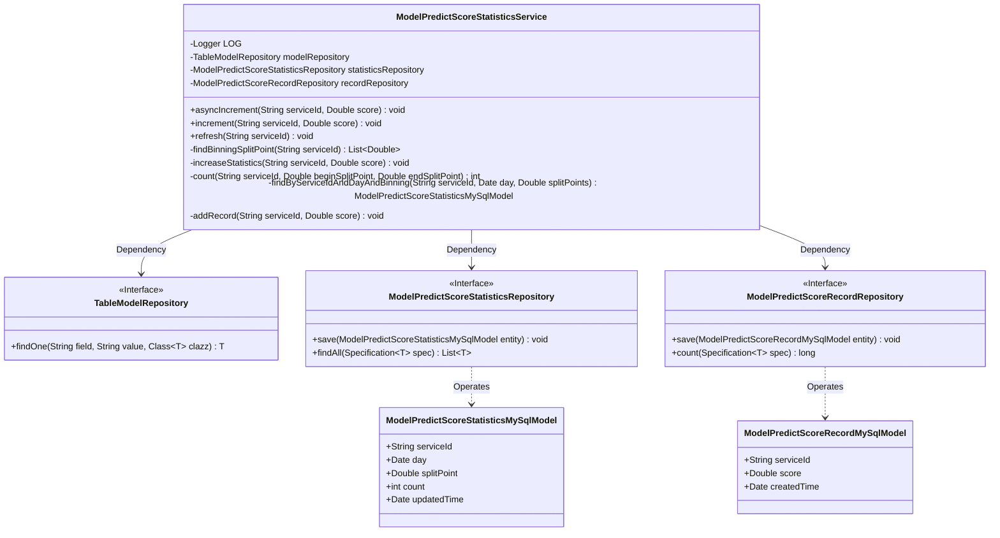
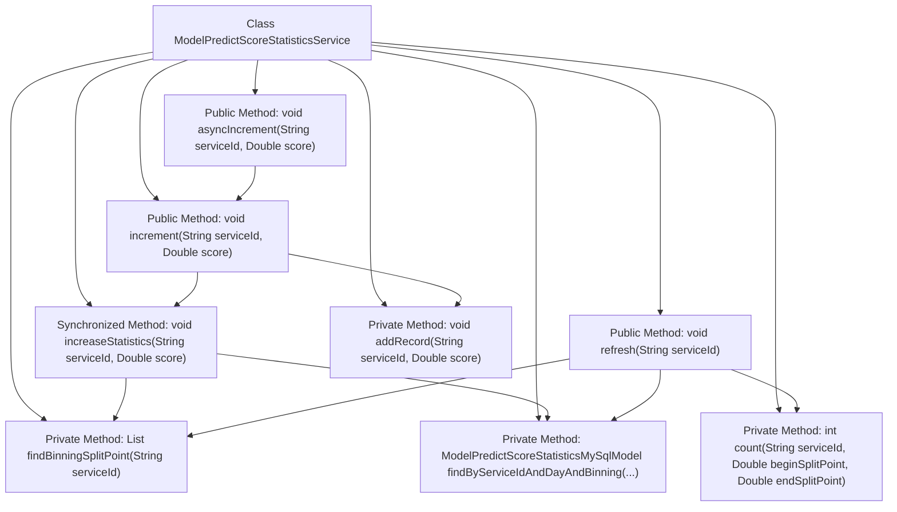
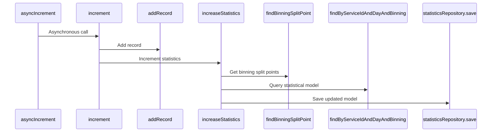

# Basic Information

|      |      |
|------|------|
| Name | ModelPredictScoreStatisticsService |
| Language | .java |
| Code Path | WeFe/serving/serving-service/src/main/java/com/welab/wefe/serving/service/service/ModelPredictScoreStatisticsService.java |
| Package Name | com.welab.wefe.serving.service.service |
| Dependencies | ['com.welab.wefe.common.CommonThreadPool', 'com.welab.wefe.common.data.mysql.Where', 'com.welab.wefe.common.util.DateUtil', 'com.welab.wefe.common.util.JObject', 'com.welab.wefe.serving.service.database.entity.ModelPredictScoreRecordMySqlModel', 'com.welab.wefe.serving.service.database.entity.ModelPredictScoreStatisticsMySqlModel', 'com.welab.wefe.serving.service.database.entity.TableModelMySqlModel', 'com.welab.wefe.serving.service.database.repository.ModelPredictScoreRecordRepository', 'com.welab.wefe.serving.service.database.repository.ModelPredictScoreStatisticsRepository', 'com.welab.wefe.serving.service.database.repository.TableModelRepository', 'org.slf4j.Logger', 'org.slf4j.LoggerFactory', 'org.springframework.beans.factory.annotation.Autowired', 'org.springframework.data.jpa.domain.Specification', 'org.springframework.stereotype.Service', 'java.util.Date', 'java.util.List', 'java.util.stream.Collectors'] |
| Brief Description | This service class is used for model prediction score statistics, including asynchronous incremental updates, score recording, and statistics by binning points, achieving data persistence through multi-repository operations. |

# Description

This service class is used for managing the statistics and recording of model prediction scores. Its main functions include: obtaining score binning split points via the `findBinningSplitPoint` method; asynchronously or synchronously incrementing score records and updating statistics using the `asyncIncrement` and `increment` methods; updating the count of the corresponding bin based on the score value with the `increaseStatistics` method; recalculating and refreshing the statistical counts of all bins with the `refresh` method; counting the number of records within a specified bin range using the `count` method; querying statistical information for a specific bin with the `findByServiceIdAndDayAndBinning` method; and saving score records with the `addRecord` method. It involves three repository classes for handling model, statistical, and record data respectively.

# Class Summary

| Name   | Type  | Description |
|-------|------|-------------|
| ModelPredictScoreStatisticsService | class | This service class is used for model prediction score statistics, including asynchronous addition of score records, synchronous updating of statistical information, and refreshing statistics. It categorizes and counts scores through binning points and records daily score distribution. |

## Class ModelPredictScoreStatisticsService

|      |      |
|------|------|
| Access Modifier | @Service;public |
| Type | class |
| Name | ModelPredictScoreStatisticsService |
| Description | This service class is used for model prediction score statistics, including asynchronous addition of score records, synchronous updating of statistical information, and refreshing statistics. It categorizes and counts scores through binning points and records daily score distribution. |

### UML Class Diagram

This code implements a model prediction score statistics service, with core functionalities including asynchronous incremental score updates, statistics refresh, and prediction score recording. The service interacts with the database through three repository interfaces (TableModelRepository, ModelPredictScoreStatisticsRepository, ModelPredictScoreRecordRepository), operating on two entity classes (ModelPredictScoreStatisticsMySqlModel and ModelPredictScoreRecordMySqlModel). The core logic involves score binning processing, statistical counting, and record persistence, utilizing thread pools for asynchronous operations while ensuring thread safety of statistical data through synchronized methods.

### Internal Method Call Graph

This code represents a statistical service class primarily designed for processing binned statistics of model prediction scores. Core functionalities include asynchronous incremental updates of statistical data, refreshing statistical data, and recording individual scores. The findBinningSplitPoint method retrieves binning split points, the increaseStatistics method performs thread-safe statistical updates, and multiple repositories interact with the database. The flowchart illustrates the calling relationships between class methods, while the sequence diagram details the execution flow of the asyncIncrement method.

### Field List

| Name  | Type  | Description |
|-------|-------|------|
| statisticsRepository | ModelPredictScoreStatisticsRepository | Automatic injection model prediction score statistics repository instance. |
| LOG = LoggerFactory.getLogger(getClass()) | Logger | Define a protected final log object LOG, initialized with the current class name. |
| recordRepository | ModelPredictScoreRecordRepository | Using @Autowired to automatically inject an instance of ModelPredictScoreRecordRepository. |
| modelRepository | TableModelRepository | Using @Autowired to automatically inject an instance of TableModelRepository. |

### Method List

| Name  | Type  | Description |
|-------|-------|------|
| increaseStatistics | void | The private synchronized method `increaseStatistics` updates statistics based on score intervals: it locates the segmentation point for the `serviceId`, matches the interval containing the score, creates or updates the corresponding statistical model, increments the count by 1, and saves it. |
| refresh | void | This method refreshes statistical information based on the service ID, calculates bin split points, iterates through each split point, queries or creates a model instance, sets the service ID, split point, and current date, counts the specified range, and saves the results. |
| increment | void | The method `increment` receives a service ID and score, calls `addRecord` to log the data, and invokes `increaseStatistics` to update the statistics. |
| asyncIncrement | void | Asynchronously execute incremental operations by invoking the increment method via a thread pool, with parameters serviceId and score. |
| findBinningSplitPoint | List<Double> | This method queries the model data by service ID, extracts the binning results of the score distribution, converts the bin keys into a list of double-precision values, and returns them sorted. |
| count | int | This method counts the number of records for a specified service ID within the current day where the score falls between beginSplitPoint and endSplitPoint. |
| findByServiceIdAndDayAndBinning | ModelPredictScoreStatisticsMySqlModel | This method queries the database using the service ID, date, and binning point, returning the first matching record, or null if no results are found. |
| addRecord | void | The private method `addRecord` takes a service ID and a score, creates a database record, and saves it. |

