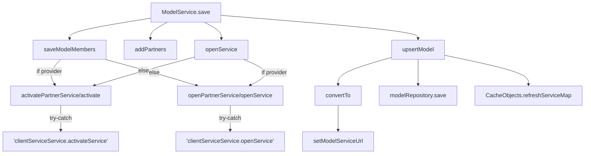
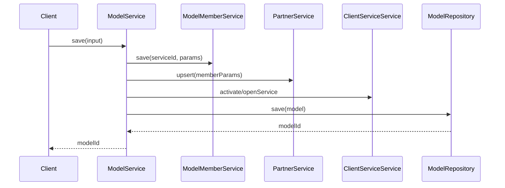

# Basic Information

|      |      |
|------|------|
| Name | ModelService |
| Language | .java |
| Code Path | WeFe/serving/serving-service/src/main/java/com/welab/wefe/serving/service/service/ModelService.java |
| Package Name | com.welab.wefe.serving.service.service |
| Dependencies | ['com.welab.wefe.common.StatusCode', 'com.welab.wefe.common.data.mysql.Where', 'com.welab.wefe.common.exception.StatusCodeWithException', 'com.welab.wefe.common.web.util.CurrentAccountUtil', 'com.welab.wefe.common.web.util.ModelMapper', 'com.welab.wefe.common.wefe.enums.JobMemberRole', 'com.welab.wefe.common.wefe.enums.PredictFeatureDataSource', 'com.welab.wefe.serving.service.api.model.EnableApi', 'com.welab.wefe.serving.service.api.model.QueryApi', 'com.welab.wefe.serving.service.api.model.SaveModelApi', 'com.welab.wefe.serving.service.database.entity.ModelMemberMySqlModel', 'com.welab.wefe.serving.service.database.entity.TableModelMySqlModel', 'com.welab.wefe.serving.service.database.repository.ModelMemberRepository', 'com.welab.wefe.serving.service.database.repository.TableModelRepository', 'com.welab.wefe.serving.service.dto.MemberParams', 'com.welab.wefe.serving.service.dto.ModelStatusOutput', 'com.welab.wefe.serving.service.dto.PagingOutput', 'com.welab.wefe.serving.service.enums.MemberModelStatusEnum', 'com.welab.wefe.serving.service.enums.ServiceTypeEnum', 'com.welab.wefe.serving.service.manager.ModelManager', 'org.slf4j.Logger', 'org.slf4j.LoggerFactory', 'org.springframework.beans.BeanUtils', 'org.springframework.beans.factory.annotation.Autowired', 'org.springframework.data.jpa.domain.Specification', 'org.springframework.stereotype.Service', 'org.springframework.transaction.annotation.Transactional', 'java.util.Date', 'java.util.List', 'java.util.stream.Collectors'] |
| Brief Description | The ModelService class provides model management functionalities, including saving, querying, enabling/disabling models, handling member and partner relationships, supporting machine learning service types, and incorporating transaction management and error handling. |

# Description

The code describes a Spring service class named `ModelService`, primarily used for managing machine learning model services. It includes functionalities such as saving models, updating configurations, querying models, and enabling/disabling models. The service implements business logic by injecting multiple dependency components (e.g., `ModelMemberService`, `PartnerService`, etc.), supporting transaction processing and exception rollback. Key operations include saving model member information, adding partners, activating or enabling services, and updating model configurations. The query functionality supports pagination and conditional filtering, and provides an interface for model availability checks. The code also involves detailed handling of URL concatenation, role permission validation, and data source configuration.

# Class Summary

| Name   | Type  | Description |
|-------|------|-------------|
| ModelService | class | The ModelService class provides model management functionalities, including saving models, updating configurations, querying models, enabling/disabling models, and checking model availability. It supports partner management and member role handling, involving database operations and API calls. |


## Class ModelService

|      |      |
|------|------|
| Access Modifier | @Service;public |
| Type | class |
| Name | ModelService |
| Description | The ModelService class provides model management functionalities, including saving models, updating configurations, querying models, enabling/disabling models, and checking model availability. It supports partner management and member role handling, involving database operations and API calls. |


### UML Class Diagram

```mermaid
classDiagram
    class ModelService {
        -Logger LOG
        -String API_PREFIX_2
        -String API_PREFIX_1
        -TableModelRepository modelRepository
        -ModelMemberService modelMemberService
        -PartnerService partnerService
        -ClientServiceService clientServiceService
        -ModelMemberRepository modelMemberRepository
        +String save(SaveModelApi$Input input)
        +TableModelMySqlModel findOne(String serviceId)
        +List~ModelMemberMySqlModel~ findByModelIdAndMemberId(String modelId, String memberId)
        +ModelMemberMySqlModel findByModelIdAndMemberIdAndRole(String modelId, String memberId, JobMemberRole myRole)
        +PagingOutput~QueryApi$Output~ query(QueryApi$Input input)
        +void enable(EnableApi$Input input)
        +ModelStatusOutput checkAvailable(String modelId)
        +void updateConfig(String serviceId, String serviceName, PredictFeatureDataSource featureSource, String dataSourceId, String sqlScript, String sqlConditionField)
        -void addPartners(SaveModelApi$Input input)
        -void saveModelMembers(SaveModelApi$Input input)
        -String upsertModel(SaveModelApi$Input input)
        -TableModelMySqlModel convertTo(SaveModelApi$Input input, TableModelMySqlModel model)
        -void openService(SaveModelApi$Input input)
        -void activatePartnerService(String serviceId, String modelName, List~MemberParams~ memberParams)
        -void activate(String serviceId, String name, MemberParams x)
        -String setModelServiceUrl(String serviceId)
        -void openPartnerService(String modelId, String modelName, List~MemberParams~ memberParams)
        -void openService(String modelId, String name, MemberParams x)
        -List~QueryApi$Output~ bulidOutputs(PagingOutput~TableModelMySqlModel~ page, PagingOutput~ModelMemberMySqlModel~ memberPage)
        -QueryApi$Output setRole(PagingOutput~ModelMemberMySqlModel~ memberPage, TableModelMySqlModel TableModelMySqlModel)
        -PagingOutput~ModelMemberMySqlModel~ queryModelMembers(QueryApi$Input input)
        -Specification~ModelMemberMySqlModel~ buildQueryMemberParam()
        -PagingOutput~TableModelMySqlModel~ queryModels(QueryApi$Input input)
        -Specification~TableModelMySqlModel~ buildQueryModelParam(QueryApi$Input input)
        -MemberModelStatusEnum getAvailableStatus(String modelId)
    }

    class TableModelRepository {
        +TableModelMySqlModel findOne(String field, String value, Class~TableModelMySqlModel~ clazz)
        +void save(TableModelMySqlModel model)
        +PagingOutput~TableModelMySqlModel~ paging(Specification~TableModelMySqlModel~ where, QueryApi$Input input)
        +void updateById(String id, String field, boolean value, Class~TableModelMySqlModel~ clazz)
    }

    class ModelMemberService {
        +void save(String serviceId, String memberId, JobMemberRole role)
        +void save(String serviceId, List~MemberParams~ memberParams)
    }

    class PartnerService {
        +void upsert(List~MemberParams~ memberParams)
    }

    class ClientServiceService {
        +void activateService(String serviceId, String name, String memberId, String privateKey, String publicKey, String secretKeyType, String url, ServiceTypeEnum serviceType)
        +void openService(String modelId, String name, String url, String memberId, String publicKey, ServiceTypeEnum serviceType, String secretKeyType)
        +void updateAllByServiceId(String serviceId, String name, String url, String serviceType)
    }

    class ModelMemberRepository {
        +List~ModelMemberMySqlModel~ findByModelIdAndMemberId(String modelId, String memberId)
        +ModelMemberMySqlModel findByModelIdAndMemberIdAndRole(String modelId, String memberId, JobMemberRole role)
        +PagingOutput~ModelMemberMySqlModel~ paging(Specification~ModelMemberMySqlModel~ where, QueryApi$Input input)
    }

    class SaveModelApi {
        class Input {
            -String serviceId
            -JobMemberRole myRole
            -List~MemberParams~ memberParams
            // ...other fields
        }
    }

    class QueryApi {
        class Input {
            -String modelId
            -String name
            -String algorithm
            -String flType
            -String creator
            // ...other fields
        }
        class Output {
            -JobMemberRole myRole
            // ...other fields
        }
    }

    class EnableApi {
        class Input {
            -String id
            -boolean enable
        }
    }

    class ModelStatusOutput {
        +static ModelStatusOutput of(String memberId, String memberName, MemberModelStatusEnum status)
    }

    class MemberParams {
        -String memberId
        -JobMemberRole role
        -String publicKey
        -String secretKeyType
    }

    class TableModelMySqlModel {
        -String serviceId
        -String name
        -String url
        -String serviceType
        -String createdBy
        -Date updatedTime
        -String updatedBy
        -PredictFeatureDataSource featureSource
        -String dataSourceId
        -String sqlScript
        -String sqlConditionField
        // ...other fields
    }

    class ModelMemberMySqlModel {
        -String modelId
        -String memberId
        -JobMemberRole role
        // ...other fields
    }

    ModelService --> TableModelRepository : depends
    ModelService --> ModelMemberService : depends
    ModelService --> PartnerService : depends
    ModelService --> ClientServiceService : depends
    ModelService --> ModelMemberRepository : depends
    ModelService --> SaveModelApi$Input : uses
    ModelService --> QueryApi$Input : uses
    ModelService --> QueryApi$Output : generates
    ModelService --> EnableApi$Input : uses
    ModelService --> ModelStatusOutput : generates
    ModelService --> MemberParams : uses
    ModelService --> TableModelMySqlModel : operates
    ModelService --> ModelMemberMySqlModel : operates
```

This code demonstrates a model service class `ModelService` responsible for core functionalities such as creating, querying, updating, and checking the status of machine learning models. The class integrates multiple Repository and Service components through dependency injection, including model repositories, member services, partner services, and client services. Key features include saving model data, managing model member relationships, handling partner services, querying model information, and updating model configurations. The class diagram clearly illustrates the relationships between `ModelService` and its dependent components, as well as the various input and output data types it processes.


### Internal Method Call Graph





The flowchart depicts the complete execution process of the ModelService.save() method, including key steps such as member saving, partner processing, service activation/opening, and model persistence. It handles logic differences between roles (provider/promoter) through conditional branches, ultimately achieving full lifecycle management of model services. The sequence diagram illustrates cross-service invocation interactions, highlighting collaboration relationships between core components.

### Field List

| Name  | Type  | Description |
|-------|-------|------|
| clientServiceService | ClientServiceService | Using @Autowired to automatically inject an instance of ClientServiceService. |
| LOG = LoggerFactory.getLogger(getClass()) | Logger | Create a logger instance for the current class. |
| API_PREFIX_2 = "predict/" | String | Private constant API prefix string "predict/" |
| partnerService | PartnerService | Automatically inject the PartnerService instance. |
| modelRepository | TableModelRepository | Automatically inject the TableModelRepository instance into the modelRepository variable. |
| modelMemberRepository | ModelMemberRepository | Automatically inject the ModelMemberRepository instance. |
| API_PREFIX_1 = "/api/" | String | Private constant string API_PREFIX_1 with value "/api/" |
| modelMemberService | ModelMemberService | Using @Autowired to automatically inject an instance of ModelMemberService. |

### Method List

| Name  | Type  | Description |
|-------|-------|------|
| openService | void | The method `openService` invokes `clientServiceService.openService` to activate the model service, with parameters including `modelId`, `name`, API prefix, `memberId`, public key, service type, and key type. Error logs are recorded in case of failure. |
| openService | void | Invoke different service methods based on roles: providers call openPartnerService, otherwise call activatePartnerService. |
| setModelServiceUrl | String | This method generates the model service URL based on the service ID, with the format being the API prefix plus the service ID. |
| setRole | QueryApi.Output | The method `setRole` takes the member page and table model as input, filters matching model IDs through stream processing, sets the output role, and returns it. |
| findOne | TableModelMySqlModel | This method queries and returns the corresponding TableModelMySqlModel object by serviceId, implemented by calling the findOne method of modelRepository. |
| findByModelIdAndMemberId | List<ModelMemberMySqlModel> | Query the member list by model ID and member ID, implemented by calling the repository layer. |
| convertTo | TableModelMySqlModel | Copy the input object properties to the model, then return the model after setting the URL and service type. |
| addPartners | void | The method `addPartners` takes input parameters and invokes the `upsert` method of `partnerService` to process the member parameters. |
| queryModelMembers | PagingOutput<ModelMemberMySqlModel> | Querying model member methods: After constructing query conditions, call the pagination interface to return member data. |
| activatePartnerService | void | This method activates partner services, filters the member parameters for the provider role, and activates them one by one. The parameters include service ID, model name, and a list of member parameters. |
| openPartnerService | void | This method filters member parameters based on roles and calls the openService method for eligible members. |
| upsertModel | String | The method `upsertModel` creates or updates a model based on the input. If the model does not exist, it creates a new one and sets the creator; otherwise, it updates the model information and sets the modifier and timestamp. After saving, it refreshes the cache and returns the model ID. |
| activate | void | Private method activation service, invoking clientServiceService.activateService with parameters such as service ID, name, member ID, and secret key, while catching exceptions and logging them. |
| save | String | The transactional method saves model data, including members, partners, and services, ultimately updating or inserting the model. Rolls back on exceptions. |
| findByModelIdAndMemberIdAndRole | ModelMemberMySqlModel | Query member information based on model ID, member ID, and role, then call the repository interface to return the result. |
| query | PagingOutput<QueryApi.Output> | The method takes input parameters, queries the model and member data, merges the results, and returns paginated output, including the total count and a list of results. |
| bulidOutputs | List<QueryApi.Output> | This method merges and processes two sets of paginated data, associates the table model data with the member model through streaming operations, generates an output list, and returns it. |
| buildQueryMemberParam | Specification<ModelMemberMySqlModel> | Build a private method for querying member parameters, using Specification to create a conditional query containing memberId, and return the query object. |
| saveModelMembers | void | The method saves model members based on the role: when the role is provider, it saves the service ID, member ID, and role; otherwise, it saves the service ID and member parameters. |
| queryModels | PagingOutput<TableModelMySqlModel> | The private method `queryModels` constructs query conditions based on input parameters, performs paginated queries through `modelRepository`, and returns the results. |
| buildQueryModelParam | Specification<TableModelMySqlModel> | Build a Specification for querying model parameters, including fuzzy matching for modelId and name, and exact matching for algorithm, flType, and createdBy. |
| enable | void | The method `enable` updates the model state based on input parameters, first modifying the database record by ID, then querying the model and refreshing the enabled status in the service. |
| checkAvailable | ModelStatusOutput | Check model availability and return an output object containing member IDs, names, and model statuses. |
| getAvailableStatus | MemberModelStatusEnum | Method to check model availability status: Query the ModelManager based on modelId, which returns either "available" or "unavailable" status, with "unavailable" being the default return value in case of exceptions. |
| updateConfig | void | Update configurations using transactions, set model attributes based on the data source type, save and synchronize related service information. Throw an exception if the model does not exist. |


