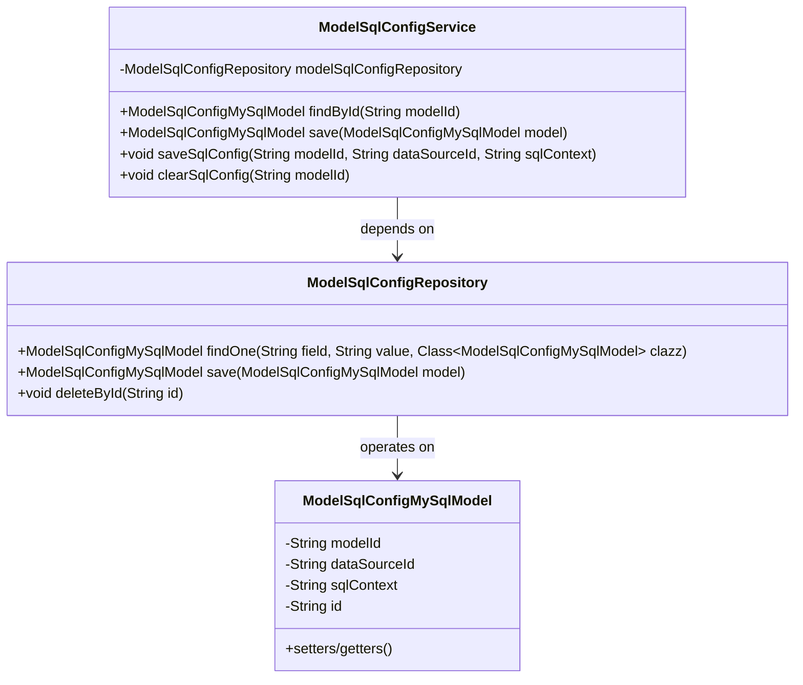
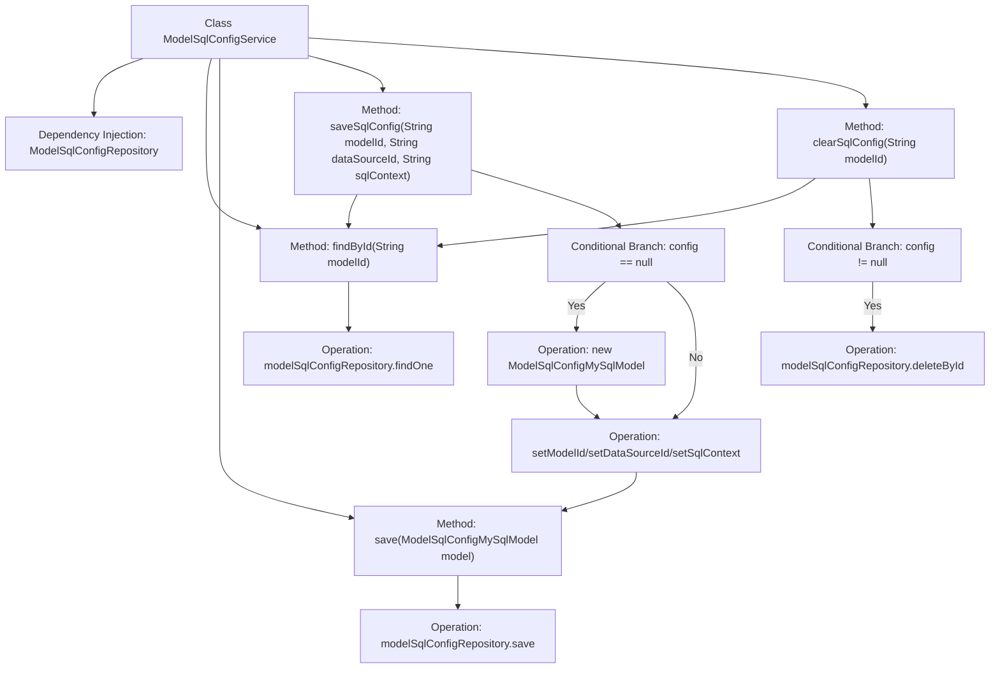

# Basic Information

|      |      |
|------|------|
| Name | ModelSqlConfigService |
| Language | .java |
| Code Path | WeFe/serving/serving-service/src/main/java/com/welab/wefe/serving/service/service/ModelSqlConfigService.java |
| Package Name | com.welab.wefe.serving.service.service |
| Dependencies | ['com.welab.wefe.serving.service.database.entity.ModelSqlConfigMySqlModel', 'com.welab.wefe.serving.service.database.repository.ModelSqlConfigRepository', 'org.springframework.beans.factory.annotation.Autowired', 'org.springframework.stereotype.Service'] |
| Brief Description | The ModelSqlConfigService class provides CRUD functionality for model SQL configurations, including querying by ID, saving configurations, updating or creating configurations, and clearing configurations. It relies on ModelSqlConfigRepository for database operations. |

# Description

The code defines a service class named ModelSqlConfigService, which is used to manage model SQL configurations. It interacts with the database through ModelSqlConfigRepository and provides four core functions: querying configurations by modelId, saving configuration objects, updating or creating SQL configurations (including data source ID and SQL content) for a specified modelId, and clearing configurations for a specified modelId. The service implements data persistence operations by autowiring the dependent repository.

# Class Summary

| Name   | Type  | Description |
|-------|------|-------------|
| ModelSqlConfigService | class | The ModelSqlConfigService class provides CRUD (Create, Read, Update, Delete) functionality for model SQL configurations, including querying by ID, saving configurations, updating or creating configurations, and clearing configurations. It relies on ModelSqlConfigRepository to interact with the database. |

## Class ModelSqlConfigService

|      |      |
|------|------|
| Access Modifier | @Service;public |
| Type | class |
| Name | ModelSqlConfigService |
| Description | The ModelSqlConfigService class provides CRUD (Create, Read, Update, Delete) functionality for model SQL configurations, including querying by ID, saving configurations, updating or creating configurations, and clearing configurations. It relies on ModelSqlConfigRepository to interact with the database. |

### UML Class Diagram

This class diagram illustrates the relationship between ModelSqlConfigService, ModelSqlConfigRepository, and ModelSqlConfigMySqlModel. As a service class, ModelSqlConfigService utilizes ModelSqlConfigRepository through dependency injection to perform database operations, including finding, saving, and deleting instances of ModelSqlConfigMySqlModel. ModelSqlConfigMySqlModel is a data entity class containing attributes such as model ID, data source ID, SQL content, and primary key ID. The overall structure reflects a typical interaction pattern between the Spring service layer and persistence layer.

### Internal Method Call Graph

The flowchart depicts the core logic flow of the ModelSqlConfigService class. This class operates MySQL configuration data through Repository, including functions for querying, saving, updating, and clearing configurations. Key processes include: searching for configurations by modelId, creating a new configuration object if none exists; updating configuration properties before saving; and querying before deletion when clearing configurations. All operations revolve around the ModelSqlConfigMySqlModel entity, interacting with the database via Repository.

### Field List

| Name  | Type  | Description |
|-------|-------|------|
| modelSqlConfigRepository | ModelSqlConfigRepository | Automatically inject the ModelSqlConfigRepository instance. |

### Method List

| Name  | Type  | Description |
|-------|-------|------|
| findById | ModelSqlConfigMySqlModel | This method queries the database using the modelId and returns the matching ModelSqlConfigMySqlModel object. |
| saveSqlConfig | void | Save SQL configuration: Look up the configuration by modelId, create a new one if it does not exist, then set the parameters and save. |
| clearSqlConfig | void | This method is used to clear the SQL configuration for a specified modelId. It first checks whether the configuration exists, and if it does, it deletes it via the repository. |
| save | ModelSqlConfigMySqlModel | Save MySQL configuration model to database. |

