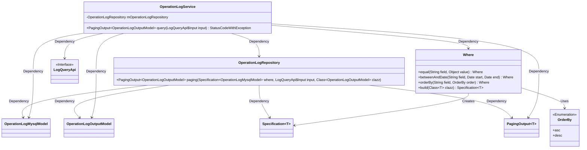
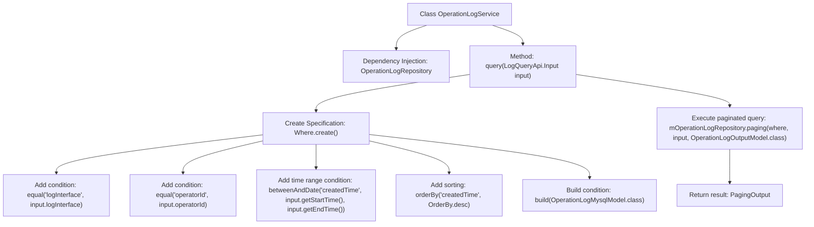

# Basic Information

|      |      |
|------|------|
| Name | OperationLogService |
| Language | .java |
| Code Path | WeFe/serving/serving-service/src/main/java/com/welab/wefe/serving/service/service/OperationLogService.java |
| Package Name | com.welab.wefe.serving.service.service |
| Dependencies | ['com.welab.wefe.common.data.mysql.Where', 'com.welab.wefe.common.data.mysql.enums.OrderBy', 'com.welab.wefe.common.exception.StatusCodeWithException', 'com.welab.wefe.serving.service.api.operation.LogQueryApi', 'com.welab.wefe.serving.service.database.entity.OperationLogMysqlModel', 'com.welab.wefe.serving.service.database.repository.OperationLogRepository', 'com.welab.wefe.serving.service.dto.OperationLogOutputModel', 'com.welab.wefe.serving.service.dto.PagingOutput', 'org.springframework.beans.factory.annotation.Autowired', 'org.springframework.data.jpa.domain.Specification', 'org.springframework.stereotype.Service'] |
| Brief Description | Operation log service class, which queries logs based on input conditions, supports pagination, interface, operator ID, and time range filtering, with results sorted in descending order by time. |

# Description

OperationLogService is a service class used for querying operation logs. It relies on OperationLogRepository for database operations. The query method accepts a LogQueryApi.Input parameter, constructs query conditions including filtering by interface name and operator ID, as well as sorting by time range. The query results are returned in paginated form as OperationLogOutputModel objects. The method may throw a StatusCodeWithException.

# Class Summary

| Name   | Type  | Description |
|-------|------|-------------|
| OperationLogService | class | OperationLogService provides the functionality to query operation logs, supporting filtering by interface, operator ID, and time range, with results paginated and returned in descending order of creation time. |

## Class OperationLogService

|      |      |
|------|------|
| Access Modifier | @Service;public |
| Type | class |
| Name | OperationLogService |
| Description | OperationLogService provides the functionality to query operation logs, supporting filtering by interface, operator ID, and time range, with results paginated and returned in descending order of creation time. |

### UML Class Diagram

This code illustrates an operation log query service, with OperationLogService as the core class that performs paginated queries through OperationLogRepository using the Where builder to construct query conditions. The class diagram clearly depicts relationships between components: the service layer depends on the repository layer and query condition builder, the repository handles concrete data queries and pagination operations, while the Where class is responsible for building complex query specifications. The design exemplifies layered architecture and the application of the specification pattern.

### Internal Method Call Graph

This code flowchart illustrates the core query process of the OperationLogService class. The service obtains a log repository instance via dependency injection, constructs a multi-condition query specification including interface name, operator ID, and time range in the query method, and finally retrieves results through the repository's pagination method. The entire process demonstrates the complete chain from condition assembly to database query, with the Where builder pattern clearly showing the logical hierarchy of dynamic condition combination.

### Field List

| Name  | Type  | Description |
|-------|-------|------|
| mOperationLogRepository | OperationLogRepository | Using @Autowired to automatically inject an instance of OperationLogRepository. |

### Method List

| Name  | Type  | Description |
|-------|-------|------|
| query | PagingOutput<OperationLogOutputModel> | Query operation log method, filter logs based on input conditions including interface, operator ID, and time range, and return results in descending order of creation time with pagination. |

