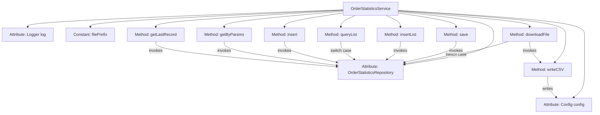

# Basic Information

|      |      |
|------|------|
| Name | OrderStatisticsService |
| Language | .java |
| Code Path | WeFe/serving/serving-service/src/main/java/com/welab/wefe/serving/service/service/OrderStatisticsService.java |
| Package Name | com.welab.wefe.serving.service.service |
| Dependencies | ['com.alibaba.fastjson.JSON', 'com.welab.wefe.common.data.mysql.Where', 'com.welab.wefe.common.util.DateUtil', 'com.welab.wefe.common.util.StringUtil', 'com.welab.wefe.common.web.util.ModelMapper', 'com.welab.wefe.serving.service.api.orderstatistics.DownloadApi', 'com.welab.wefe.serving.service.api.orderstatistics.QueryListApi', 'com.welab.wefe.serving.service.api.orderstatistics.SaveApi', 'com.welab.wefe.serving.service.config.Config', 'com.welab.wefe.serving.service.database.entity.OrderStatisticsMysqlModel', 'com.welab.wefe.serving.service.database.repository.OrderStatisticsRepository', 'com.welab.wefe.serving.service.dto.OrderStatisticsInput', 'com.welab.wefe.serving.service.dto.PagingOutput', 'com.welab.wefe.serving.service.enums.DateTypeEnum', 'de.siegmar.fastcsv.writer.CsvWriter', 'de.siegmar.fastcsv.writer.LineDelimiter', 'de.siegmar.fastcsv.writer.QuoteStrategy', 'org.slf4j.Logger', 'org.slf4j.LoggerFactory', 'org.springframework.beans.factory.annotation.Autowired', 'org.springframework.data.jpa.domain.Specification', 'org.springframework.stereotype.Service', 'org.springframework.transaction.annotation.Transactional', 'java.io', 'java.nio.charset.StandardCharsets', 'java.util.ArrayList', 'java.util.Date', 'java.util.List', 'java.util.Map'] |
| Brief Description | Order statistics service class, providing the functionality to query order data grouped by different time granularities (month, day, hour, minute) and export to CSV, supporting CRUD operations and batch processing. Includes data persistence and file handling logic. |

# Description

The OrderStatisticsService is a service class that handles order statistics data, including functions such as data querying, exporting, and saving. Key methods include: querying and grouping statistics data by time granularity (month, day, hour, minute) and exporting to CSV files; saving and batch-inserting statistical records; paginated querying of statistical lists; querying statistical records by conditions; and retrieving the last record. The service uses a Repository to interact with the database, supports transaction processing, and includes logging functionality.

# Class Summary

| Name   | Type  | Description |
|-------|------|-------------|
| OrderStatisticsService | class | Order statistics service class, providing grouped query, save, and CSV export functions by different time granularities, supporting transaction operations and paginated queries. |


## Class OrderStatisticsService

|      |      |
|------|------|
| Access Modifier | @Service;public |
| Type | class |
| Name | OrderStatisticsService |
| Description | Order statistics service class, providing grouped query, save, and CSV export functions by different time granularities, supporting transaction operations and paginated queries. |


### UML Class Diagram

```mermaid
classDiagram
    class OrderStatisticsService {
        -Logger log
        -OrderStatisticsRepository orderStatisticsRepository
        -Config config
        -String filePrefix
        +File downloadFile(DownloadApi~Input~ input)
        +File writeCSV(List~QueryListApi~Output~~ dataList, String fileName) throws IOException
        +void save(SaveApi~Input~ input)
        +void insertList(List~OrderStatisticsMysqlModel~ list)
        +PagingOutput~QueryListApi~Output~~ queryList(QueryListApi~Input~ input)
        +void insert(OrderStatisticsMysqlModel model)
        +List~OrderStatisticsMysqlModel~ getByParams(OrderStatisticsInput input)
        +OrderStatisticsMysqlModel getLastRecord()
    }

    class OrderStatisticsRepository {
        <<Interface>>
        +List~Map~String,Object~~ groupByMonth(String serviceId, String serviceName, String requestPartnerId, String requestPartnerName, String responsePartnerId, String responsePartnerName, Date startTime, Date endTime)
        +List~Map~String,Object~~ groupByDay(...)
        +List~Map~String,Object~~ groupByHour(...)
        +List~Map~String,Object~~ groupByMinute(...)
        +OrderStatisticsMysqlModel findOne(String field, Object value, Class~OrderStatisticsMysqlModel~ clazz)
        +void save(OrderStatisticsMysqlModel model)
        +void saveAll(List~OrderStatisticsMysqlModel~ list)
        +List~OrderStatisticsMysqlModel~ findAll(Specification~OrderStatisticsMysqlModel~ spec)
        +OrderStatisticsMysqlModel getLastRecord()
    }

    class Config {
        +String getFileBasePath()
    }

    class DownloadApi {
        <<Interface>>
        class Input {
            +String getStatisticalGranularity()
            +String getServiceId()
            // ...Other getter methods
        }
    }

    class QueryListApi {
        <<Interface>>
        class Input {
            +String getStatisticalGranularity()
            // ...Other getter methods
        }
        class Output {
            +String getServiceId()
            // ...Other getter methods
        }
    }

    class SaveApi {
        <<Interface>>
        class Input {
            +String getId()
            +void setId(String id)
            // ...Other methods
        }
    }

    class OrderStatisticsMysqlModel {
        +String getId()
        +void setUpdatedBy(String updatedBy)
        +void setUpdatedTime(Date date)
        // ...Other attributes and methods
    }

    class OrderStatisticsInput {
        +String getServiceId()
        +Date getStartTime()
        // ...Other getter methods
    }

    OrderStatisticsService --> OrderStatisticsRepository : Dependency
    OrderStatisticsService --> Config : Dependency
    OrderStatisticsService --> DownloadApi~Input~ : Uses
    OrderStatisticsService --> QueryListApi~Input~ : Uses
    OrderStatisticsService --> QueryListApi~Output~ : Uses
    OrderStatisticsService --> SaveApi~Input~ : Uses
    OrderStatisticsService --> OrderStatisticsMysqlModel : Operates
    OrderStatisticsService --> OrderStatisticsInput : Uses
```

Class Diagram Description: This diagram illustrates the core structure of the Order Statistics Service (OrderStatisticsService), which accesses data through OrderStatisticsRepository and relies on Config for configuration information. The service provides various functionalities including multi-granularity statistical queries (downloadFile), data persistence (save/insert), paginated queries (queryList), and handles multiple input/output types (DownloadApi.Input/QueryListApi.Output, etc.). It interacts with the OrderStatisticsMysqlModel entity class. The overall design follows a layered architecture with interface isolation for concrete implementations.


### Internal Method Call Graph



This code represents an order statistics service class, whose main functionalities include downloading statistical files, saving data, querying lists, etc. The flowchart shows that this class relies on OrderStatisticsRepository for database operations and provides grouped data queries with various statistical granularities (month/day/hour/minute). The core method downloadFile selects different time-granularity statistical methods based on input parameters and converts the results into CSV files; the writeCSV method handles the actual file writing operations; other methods such as save/queryList manage CRUD operations. All database operations are performed through OrderStatisticsRepository, demonstrating a clear layered architecture.

### Field List

| Name  | Type  | Description |
|-------|-------|------|
| orderStatisticsRepository | OrderStatisticsRepository | Automatically inject order statistics warehouse instance. |
| log = LoggerFactory.getLogger(OrderStatisticsService.class) | Logger | Define a logger instance for the OrderStatisticsService class. |
| config | Config | Using @Autowired to automatically inject an instance of the Config configuration class. |
| filePrefix = "order_statistics/" | String | Order statistics file path prefix |

### Method List

| Name  | Type  | Description |
|-------|-------|------|
| queryList | PagingOutput<QueryListApi.Output> | The method `queryList` invokes different grouped queries based on the input time granularity (month/day/hour/minute) and returns paginated statistical results. By default, it groups by minute and logs a record if no match is found. The results are converted to JSON and returned as paginated output. |
| downloadFile | File | The method aggregates order data based on input parameters according to different time granularities and generates a CSV file for return. It supports four statistical modes: monthly, daily, hourly, and minutely, returning null in case of exceptions. |
| writeCSV | File | The method writes the data list to a CSV file, including service, requester, responder information, and statistics, supports custom filenames, and ensures UTF-8 encoding and directory existence. |
| insertList | void | Using Spring's @Transactional annotation to ensure method transactional behavior, rolling back on exceptions, and batch inserting order statistics data into the database. |
| save | void | The method `save` accepts input parameters, queries or creates an order statistics model, maps and updates fields, then saves them. |
| insert | void | Java Method: Save order statistics model using transaction annotation, rollback on exception. |
| getByParams | List<OrderStatisticsMysqlModel> | This method queries order statistics based on input parameters, including service ID, requester ID, responder ID, minute count, and creation time range, returning a list of matching statistical results. |
| getLastRecord | OrderStatisticsMysqlModel | Get the last record of order statistics. |


