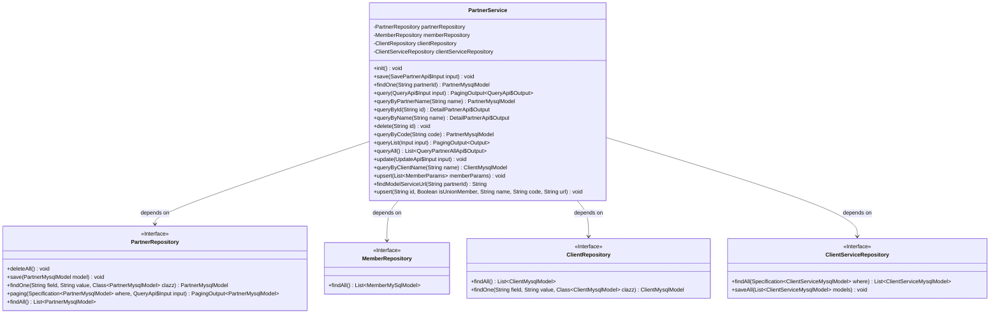

# Basic Information

|      |      |
|------|------|
| Name | PartnerService |
| Language | .java |
| Code Path | WeFe/serving/serving-service/src/main/java/com/welab/wefe/serving/service/service/PartnerService.java |
| Package Name | com.welab.wefe.serving.service.service |
| Dependencies | ['java.util.Date', 'java.util.List', 'java.util.UUID', 'java.util.stream.Collectors', 'org.apache.commons.collections.CollectionUtils', 'org.apache.commons.lang3.StringUtils', 'org.springframework.beans.factory.annotation.Autowired', 'org.springframework.data.jpa.domain.Specification', 'org.springframework.stereotype.Service', 'org.springframework.transaction.annotation.Transactional', 'com.welab.wefe.common.StatusCode', 'com.welab.wefe.common.data.mysql.Where', 'com.welab.wefe.common.exception.StatusCodeWithException', 'com.welab.wefe.common.web.util.CurrentAccountUtil', 'com.welab.wefe.common.web.util.ModelMapper', 'com.welab.wefe.serving.service.api.member.QueryApi', 'com.welab.wefe.serving.service.api.partner.DetailPartnerApi', 'com.welab.wefe.serving.service.api.partner.QueryPartnerAllApi', 'com.welab.wefe.serving.service.api.partner.QueryPartnerListApi', 'com.welab.wefe.serving.service.api.partner.QueryPartnerListApi.Input', 'com.welab.wefe.serving.service.api.partner.QueryPartnerListApi.Output', 'com.welab.wefe.serving.service.api.partner.SavePartnerApi', 'com.welab.wefe.serving.service.database.entity.ClientMysqlModel', 'com.welab.wefe.serving.service.database.entity.ClientServiceMysqlModel', 'com.welab.wefe.serving.service.database.entity.MemberMySqlModel', 'com.welab.wefe.serving.service.database.entity.PartnerMysqlModel', 'com.welab.wefe.serving.service.database.repository.ClientRepository', 'com.welab.wefe.serving.service.database.repository.ClientServiceRepository', 'com.welab.wefe.serving.service.database.repository.MemberRepository', 'com.welab.wefe.serving.service.database.repository.PartnerRepository', 'com.welab.wefe.serving.service.dto.MemberParams', 'com.welab.wefe.serving.service.dto.PagingOutput', 'com.welab.wefe.serving.service.enums.ClientStatusEnum'] |
| Brief Description | The PartnerService class provides partner management functionalities, including data initialization, CRUD operations, paginated queries, and batch operations. Key methods: `init` for data initialization, `save` for partner creation, `query` for paginated queries, `update` for information updates, `delete` for logical deletion, and `upsert` for batch insertions or updates. It supports transaction handling and returns exception status codes. |

# Description

PartnerService is a service class responsible for managing data operations related to partners. It incorporates data access components such as PartnerRepository, MemberRepository, ClientRepository, and ClientServiceRepository through dependency injection. Its primary functions include initializing partner data, saving partner information, querying partner details, paginated querying of partner lists, and updating or deleting partner information. The service methods utilize transaction management to ensure data consistency and handle various business logic, such as uniqueness validation and status updates. Additionally, it provides an update mechanism synchronized with the client service table to maintain data consistency. The service supports multiple query methods, including queries by name, code, or ID, and offers batch insertion and update functionalities.

# Class Summary

| Name   | Type  | Description |
|-------|------|-------------|
| PartnerService | class | The PartnerService class provides partner management functionalities, including data initialization, saving, querying, updating, and deletion operations. It supports paginated queries, batch processing, and status management, involving member and customer data mapping. |

## Class PartnerService

|      |      |
|------|------|
| Access Modifier | @Service;public |
| Type | class |
| Name | PartnerService |
| Description | The PartnerService class provides partner management functionalities, including data initialization, saving, querying, updating, and deletion operations. It supports paginated queries, batch processing, and status management, involving member and customer data mapping. |

### UML Class Diagram

This code demonstrates a PartnerService class that manages partner data by dependency-injecting four different Repository interfaces. Key functionalities include initializing data, saving, querying, updating, and deleting partner information, as well as operations related to client services. The class diagram clearly illustrates the dependency relationships between the service class and each Repository, along with the critical methods defined by each Repository interface.

### Internal Method Call Graph

This code defines a Spring service class named PartnerService, primarily used for managing partner data. The class interacts with databases through multiple repositories, providing functionalities such as initializing data, saving, querying, updating, and deleting partner information. It includes complex operations like transaction handling, data mapping, and paginated queries, while also addressing various business logic and exception scenarios. Core methods include init() for data initialization, save() for storing partner information, the query() series for data retrieval, and update() for information updates.

### Field List

| Name  | Type  | Description |
|-------|-------|------|
| partnerRepository | PartnerRepository | Use @Autowired to automatically inject an instance of PartnerRepository. |
| clientServiceRepository | ClientServiceRepository | Using @Autowired to automatically inject an instance of ClientServiceRepository. |
| memberRepository | MemberRepository | Automatically inject the MemberRepository instance. |
| clientRepository | ClientRepository | Automatically inject the ClientRepository instance. |

### Method List

| Name  | Type  | Description |
|-------|-------|------|
| findModelServiceUrl | String | The method queries the PartnerMysqlModel object via partnerId, returns its servingBaseUrl if it exists, otherwise returns an empty string. |
| queryList | PagingOutput<Output> | This method queries the partner list based on input conditions, uses fuzzy matching for names, and returns paginated mapped result data. |
| queryByCode | PartnerMysqlModel | This method queries the PartnerMysqlModel using code, constructs query conditions with Where, and returns matching results or null. |
| delete | void | Delete the partner data with the specified ID, set its status to deleted, and update the modification time. |
| queryAll | List<QueryPartnerAllApi.Output> | Query all partner data and convert it into an output list. |
| upsert | void | This method batch updates or inserts member data, iterates through the parameter list, calls the upsert method for each member, and handles any potential exceptions. |
| queryByName | DetailPartnerApi.Output | The method `queryByName` retrieves partners by name and returns the mapped output object. |
| save | void | The method `save` is used to store partner information. It checks whether the `code` and `name` already exist, and throws an exception if they do. If the `id` is empty, a UUID is generated; otherwise, the existing record is updated. Finally, the partner data is saved to the database. |
| upsert | void | This method is used to insert or update partner data. It determines whether to create a new record or update an existing one based on the ID, sets various attributes, and then saves them to the database. It includes fields such as name, code, URL, and handles creator information. |
| findOne | PartnerMysqlModel | This method queries and returns a PartnerMysqlModel object by partnerId, implemented by calling the findOne method of partnerRepository. |
| queryByPartnerName | PartnerMysqlModel | The method `queryByPartnerName` queries a partner by name and returns a `PartnerMysqlModel` object. It calls the `findOne` method of `partnerRepository`, with the parameters being the field name, the name, and the model class. |
| init | void | This method initializes partner data using a transaction, first clearing existing data, then retrieving data from the member and customer tables, converting it into the partner model, setting respective attributes, and finally saving it. |
| query | PagingOutput<QueryApi.Output> | This method queries partner data based on input conditions and returns paginated results. First, it constructs query conditions, then retrieves paginated data from the database, and finally maps the results to the output type before returning them. |
| queryById | DetailPartnerApi.Output | This method retrieves partner information by ID, maps the data obtained from the database to the API output format, and returns it. |
| queryByClientName | ClientMysqlModel | The method `queryByClientName` queries `ClientMysqlModel` using the `name` parameter and returns the result by invoking the `findOne` method of `clientRepository`. |
| update | void | Update partner information, including fields such as name and email, and synchronize the updates to the associated customer service table. If the data does not exist, an exception should be thrown. |

