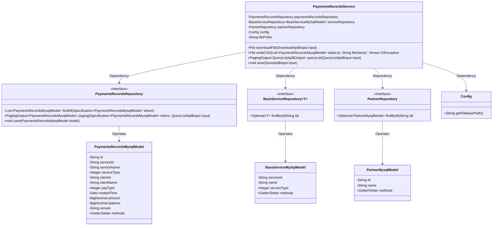

# Basic Information

|      |      |
|------|------|
| Name | PaymentsRecordsService |
| Language | .java |
| Code Path | WeFe/serving/serving-service/src/main/java/com/welab/wefe/serving/service/service/PaymentsRecordsService.java |
| Package Name | com.welab.wefe.serving.service.service |
| Dependencies | ['com.welab.wefe.common.data.mysql.Where', 'com.welab.wefe.common.data.mysql.enums.OrderBy', 'com.welab.wefe.common.util.DateUtil', 'com.welab.wefe.common.util.StringUtil', 'com.welab.wefe.common.web.util.ModelMapper', 'com.welab.wefe.serving.service.api.paymentsrecords.DownloadApi', 'com.welab.wefe.serving.service.api.paymentsrecords.QueryListApi', 'com.welab.wefe.serving.service.api.paymentsrecords.SaveApi', 'com.welab.wefe.serving.service.config.Config', 'com.welab.wefe.serving.service.database.entity.BaseServiceMySqlModel', 'com.welab.wefe.serving.service.database.entity.PartnerMysqlModel', 'com.welab.wefe.serving.service.database.entity.PaymentsRecordsMysqlModel', 'com.welab.wefe.serving.service.database.repository.BaseServiceRepository', 'com.welab.wefe.serving.service.database.repository.PartnerRepository', 'com.welab.wefe.serving.service.database.repository.PaymentsRecordsRepository', 'com.welab.wefe.serving.service.dto.PagingOutput', 'com.welab.wefe.serving.service.enums.PaymentsTypeEnum', 'com.welab.wefe.serving.service.enums.ServiceTypeEnum', 'de.siegmar.fastcsv.writer.CsvWriter', 'de.siegmar.fastcsv.writer.LineDelimiter', 'de.siegmar.fastcsv.writer.QuoteStrategy', 'org.springframework.beans.factory.annotation.Autowired', 'org.springframework.data.jpa.domain.Specification', 'org.springframework.stereotype.Service', 'java.io', 'java.math.BigDecimal', 'java.nio.charset.StandardCharsets', 'java.util.ArrayList', 'java.util.List', 'java.util.Optional'] |
| Brief Description | Payment Record Service Class, includes functionalities for downloading CSV files, querying lists, and saving records, involving operations related to services, clients, and amounts. |

# Description

PaymentsRecordsService is a service class that handles payment records, comprising four main functions. The downloadFile method filters payment records based on input criteria and generates a CSV file containing fields such as ID, service information, customer information, income/expense type, time, and amount. The queryList method retrieves a paginated list of payment records and converts the output format. The save method stores new payment records and updates the balance according to the income/expense type—recharges increase the balance, while expenses decrease it. The service relies on PaymentsRecordsRepository, BaseServiceRepository, PartnerRepository, and Config for data operations and configuration management.

# Class Summary

| Name   | Type  | Description |
|-------|------|-------------|
| PaymentsRecordsService | class | Payment Record Service Class, includes functionalities for downloading CSV files, querying lists, and saving records, involving processing of services, clients, and payment types, with support for balance calculation. |

## Class PaymentsRecordsService

|      |      |
|------|------|
| Access Modifier | @Service;public |
| Type | class |
| Name | PaymentsRecordsService |
| Description | Payment Record Service Class, includes functionalities for downloading CSV files, querying lists, and saving records, involving processing of services, clients, and payment types, with support for balance calculation. |

### UML Class Diagram

This code demonstrates a payment records service class (PaymentsRecordsService) and its related dependencies. The class primarily provides three core functionalities: 1) Downloading payment records CSV files (downloadFile) 2) Querying payment records lists (queryList) 3) Saving payment records (save). It relies on four external components: Payment Records Repository (PaymentsRecordsRepository), Base Service Repository (BaseServiceRepository), Partner Repository (PartnerRepository), and Config class. The service class operates three main data models through repository interfaces: Payment Records Model (PaymentsRecordsMysqlModel), Base Service Model (BaseServiceMySqlModel), and Partner Model (PartnerMysqlModel). The overall design follows dependency injection and interface segregation principles.

### Internal Method Call Graph

```mermaid
graph TD
    A["Class PaymentsRecordsService"]
    B["Attribute: PaymentsRecordsRepository paymentsRecordsRepository"]
    C["Attribute: BaseServiceRepository<BaseServiceMySqlModel> serviceRepository"]
    D["Attribute: PartnerRepository partnerRepository"]
    E["Attribute: Config config"]
    F["Constant: String filePrefix = 'payments_records/'"]
    G["Method: File downloadFile(DownloadApi.Input input)"]
    H["Method: File writeCSV(List<PaymentsRecordsMysqlModel> dataList, String fileName)"]
    I["Method: PagingOutput<QueryListApi.Output> queryList(QueryListApi.Input input)"]
    J["Method: void save(SaveApi.Input input)"]

    A --> B
    A --> C
    A --> D
    A --> E
    A --> F
    A --> G
    A --> H
    A --> I
    A --> J

    G --> H1["Build query Specification"]
    G --> H2["Call paymentsRecordsRepository.findAll"]
    G --> H3["Call writeCSV to generate CSV file"]
    H --> H4["Create CsvWriter for headers"]
    H --> H5["Iterate data to write CSV content"]
    H --> H6["Create directory and write BOM header"]
    I --> I1["Build pagination query conditions"]
    I --> I2["Call paymentsRecordsRepository.paging"]
    I --> I3["Map results to Output object"]
    J --> J1["Create PaymentsRecordsMysqlModel"]
    J --> J2["Query service info and set attributes"]
    J --> J3["Query client info and set attributes"]
    J --> J4["Balance calculation logic"]
    J --> J5["Call paymentsRecordsRepository.save"]
```

This flowchart illustrates the complete structure of the PaymentsRecordsService class, featuring four core methods: file download (downloadFile), CSV writing (writeCSV), paginated query (queryList), and record saving (save). Each method details its internal processing flow, particularly highlighting the complex balance calculation logic in save method, result mapping in queryList method, and the collaborative CSV generation process between downloadFile and writeCSV. The class interacts with databases through multiple repositories, demonstrating comprehensive payment record management functionality.

### Field List

| Name  | Type  | Description |
|-------|-------|------|
| partnerRepository | PartnerRepository | Use @Autowired to automatically inject an instance of PartnerRepository. |
| serviceRepository | BaseServiceRepository<BaseServiceMySqlModel> | Use @Autowired to automatically inject an instance of BaseServiceRepository with the generic type BaseServiceMySqlModel. |
| config | Config | Automatically inject the Config configuration object. |
| filePrefix = "payments_records/" | String | Define a private static constant filePrefix with the value "payments_records/". |
| paymentsRecordsRepository | PaymentsRecordsRepository | Automatically inject payment record repository instance. |

### Method List

| Name  | Type  | Description |
|-------|-------|------|
| save | void | The method `save` receives input parameters, creates a payment record model, and sets the remarks, amount, and payment type. It queries associated information based on the service ID and customer ID and assigns it to the model. It checks for historical records, updates the balance (increased for top-ups, decreased for expenses), and finally saves the model. |
| writeCSV | File | The method writes the payment record list to a CSV file, including a header row and data rows, supports Chinese and UTF-8 encoding, automatically creates directories, and returns the file object. |
| downloadFile | File | The method queries payment records based on input conditions, generates a CSV file, and returns it. The query conditions include service name, customer name, time range, payment type, and service type, sorted in descending order by creation time. Returns null if generation fails. |
| queryList | PagingOutput<QueryListApi.Output> | This method queries a list of payment records based on input conditions, including time range, customer name, service name, payment type, and service type, and sorts them in descending order by creation time. The query results are converted into the output format and returned as paginated data. |

