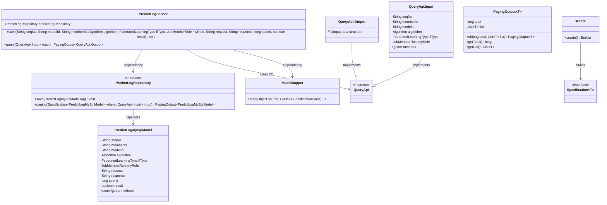
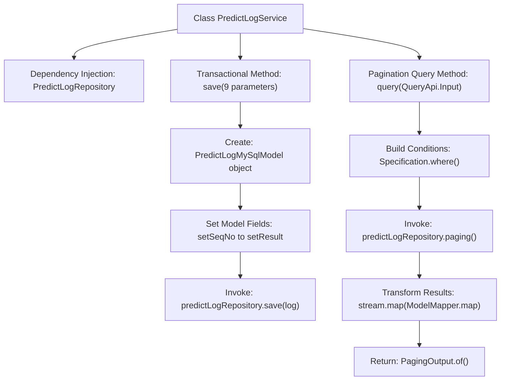
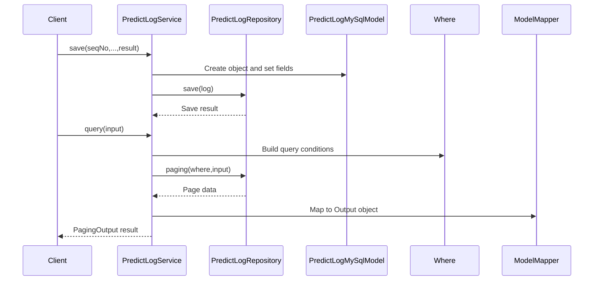

# Basic Information

|      |      |
|------|------|
| Name | PredictLogService |
| Language | .java |
| Code Path | WeFe/serving/serving-service/src/main/java/com/welab/wefe/serving/service/service/PredictLogService.java |
| Package Name | com.welab.wefe.serving.service.service |
| Dependencies | ['com.welab.wefe.common.data.mysql.Where', 'com.welab.wefe.common.web.util.ModelMapper', 'com.welab.wefe.common.wefe.enums.Algorithm', 'com.welab.wefe.common.wefe.enums.FederatedLearningType', 'com.welab.wefe.common.wefe.enums.JobMemberRole', 'com.welab.wefe.serving.service.api.logger.QueryApi', 'com.welab.wefe.serving.service.database.entity.PredictLogMySqlModel', 'com.welab.wefe.serving.service.database.repository.PredictLogRepository', 'com.welab.wefe.serving.service.dto.PagingOutput', 'org.springframework.beans.factory.annotation.Autowired', 'org.springframework.data.jpa.domain.Specification', 'org.springframework.stereotype.Service', 'org.springframework.transaction.annotation.Transactional', 'java.util.List', 'java.util.stream.Collectors'] |
| Brief Description | The `PredictLogService` class provides functionality for saving prediction logs and paginated queries. The save method accepts multiple parameters and stores them in the database, while the query method supports multi-condition filtering and returns paginated results. |

# Description

PredictLogService is a service class that includes functionalities for saving prediction logs and querying logs with pagination. The save method accepts parameters such as serial number, model ID, member ID, algorithm type, federated learning type, role, request, response, time consumption, and result, constructs a log object, and stores it in the database. The query method builds a query specification based on input conditions, executes a paginated query, and maps the results into a list of output objects for return. The entire service class employs transaction management to ensure data consistency.

# Class Summary

| Name   | Type  | Description |
|-------|------|-------------|
| PredictLogService | class | The PredictLogService class provides functionality for saving prediction logs and paginated queries, supporting transaction rollback and conditional filtering. |

## Class PredictLogService

|      |      |
|------|------|
| Access Modifier | @Service;public |
| Type | class |
| Name | PredictLogService |
| Description | The PredictLogService class provides functionality for saving prediction logs and paginated queries, supporting transaction rollback and conditional filtering. |

### UML Class Diagram

This code demonstrates a prediction logging service system, with the core being the `PredictLogService` class. It achieves data persistence through the `PredictLogRepository` interface, supporting log saving and paginated query functionalities. The service class utilizes Spring's `@Service` and transaction annotations, employs `ModelMapper` for object conversion, and implements query functionality using the Specification pattern to construct dynamic query conditions, returning paginated results. The system design reflects a layered architecture philosophy, with clear responsibilities for each component, achieving loose coupling through interfaces and generics.

### Internal Method Call Graph

Flowchart Description: This flowchart illustrates the core functionalities of the PredictLogService class, featuring two main methods: 1) The save method creates a PredictLogMySqlModel object, sets its fields, and invokes the repository layer for persistence; 2) The query method constructs dynamic query conditions, performs paginated queries, and maps results to DTO objects for return. The sequence diagram details the interaction process between the service layer, repository layer, and model objects when clients call these methods.

Target language code: en

### Field List

| Name  | Type  | Description |
|-------|-------|------|
| predictLogRepository | PredictLogRepository | The code snippet uses @Autowired to automatically inject an instance of PredictLogRepository. |

### Method List

| Name  | Type  | Description |
|-------|-------|------|
| save | void | Save method with transaction rollback, records prediction log information to the database, including serial number, member ID, model ID, algorithm type, federated learning type, role, request, response, time consumption, and result. |
| query | PagingOutput<QueryApi.Output> | This method queries prediction logs based on input conditions and returns paginated results. By constructing query conditions, it retrieves data from the database, maps it to the output format, and preserves pagination information. |

