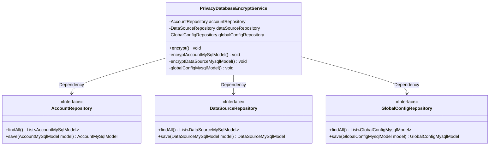
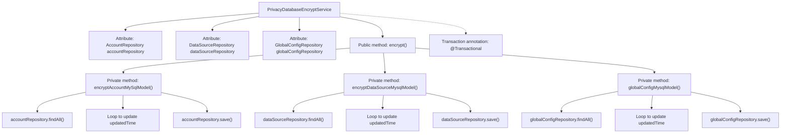

# Basic Information

|      |      |
|------|------|
| Name | PrivacyDatabaseEncryptService |
| Language | .java |
| Code Path | WeFe/serving/serving-service/src/main/java/com/welab/wefe/serving/service/service/PrivacyDatabaseEncryptService.java |
| Package Name | com.welab.wefe.serving.service.service |
| Dependencies | ['com.welab.wefe.serving.service.database.entity.AccountMySqlModel', 'com.welab.wefe.serving.service.database.entity.DataSourceMySqlModel', 'com.welab.wefe.serving.service.database.entity.GlobalConfigMysqlModel', 'com.welab.wefe.serving.service.database.repository.AccountRepository', 'com.welab.wefe.serving.service.database.repository.DataSourceRepository', 'com.welab.wefe.serving.service.database.repository.GlobalConfigRepository', 'org.springframework.beans.factory.annotation.Autowired', 'org.springframework.stereotype.Service', 'org.springframework.transaction.annotation.Transactional', 'org.springframework.util.CollectionUtils', 'java.util.Date', 'java.util.List'] |
| Brief Description | The `PrivacyDatabaseEncryptService` class is used to encrypt private data in the database by updating the modification timestamps of the `Account`, `DataSource`, and `GlobalConfig` models and saving them. Transactions are employed to ensure operational integrity. |

# Description

The PrivacyDatabaseEncryptService is a Spring service class designed to encrypt sensitive data in databases. It obtains three repository instances—AccountRepository, DataSourceRepository, and GlobalConfigRepository—through dependency injection. The service provides an encrypt method, annotated with @Transactional to ensure transactional integrity with rollback on exceptions. This method sequentially invokes three private methods: encryptAccountMySqlModel, encryptDataSourceMysqlModel, and globalConfigMysqlModel. Each method retrieves all records from its respective repository, and if the records are non-empty, updates the updatedTime field of each record to the current time before saving. The entire process implements batch timestamp updates for account, data source, and global configuration data.

# Class Summary

| Name   | Type  | Description |
|-------|------|-------------|
| PrivacyDatabaseEncryptService | class | Service class PrivacyDatabaseEncryptService, which encrypts account, data source, and global configuration data through transaction processing, updates the timestamps of each model, and saves them. |

## Class PrivacyDatabaseEncryptService

|      |      |
|------|------|
| Access Modifier | @Service;public |
| Type | class |
| Name | PrivacyDatabaseEncryptService |
| Description | Service class PrivacyDatabaseEncryptService, which encrypts account, data source, and global configuration data through transaction processing, updates the timestamps of each model, and saves them. |

### UML Class Diagram

This code demonstrates a Spring service class `PrivacyDatabaseEncryptService` that handles encryption operations for different types of database models through three private methods. The class depends on three JPA repository interfaces (`AccountRepository`, `DataSourceRepository`, and `GlobalConfigRepository`) to fetch and save data. Its primary functionality is to batch update the `updatedTime` field of these models, with all operations executed within a single transaction that rolls back on exceptions. The class diagram clearly illustrates the dependency relationships between the service class and repository interfaces, along with the method signatures of each interface.

### Internal Method Call Graph

This flowchart illustrates the structure and method invocation relationships of the PrivacyDatabaseEncryptService class. The class implements transaction management through the @Transactional annotation and contains three private methods for handling encryption operations on different entities: encryptAccountMySqlModel() updates account data, encryptDataSourceMysqlModel() updates data source data, and globalConfigMysqlModel() updates global configuration data. Each method follows the same pattern: retrieving data lists from corresponding repositories, iterating to update the last modified time, and then saving back to the database. The public method encrypt() serves as the entry point to uniformly invoke these three private methods.

### Field List

| Name  | Type  | Description |
|-------|-------|------|
| globalConfigRepository | GlobalConfigRepository | Using @Autowired to automatically inject an instance of GlobalConfigRepository. |
| dataSourceRepository | DataSourceRepository | Automatically inject the DataSourceRepository instance. |
| accountRepository | AccountRepository | Using @Autowired to automatically inject an instance of AccountRepository. |

### Method List

| Name  | Type  | Description |
|-------|-------|------|
| encryptDataSourceMysqlModel | void | This method is used to encrypt MySQL data source models, iterating through all data sources and updating the time to the current date, then saving them to the database. |
| globalConfigMysqlModel | void | The method retrieves the global configuration list from the database and returns if it is empty; otherwise, it iterates through the list, updates the modification time of each record to the current time, and saves it. |
| encryptAccountMySqlModel | void | Encrypt the MySQL account model data, update the timestamp to the current date, and save. |
| encrypt | void | A method annotated with transaction includes three encryption operations: account, data source, and global configuration model, with rollback on exception. |

