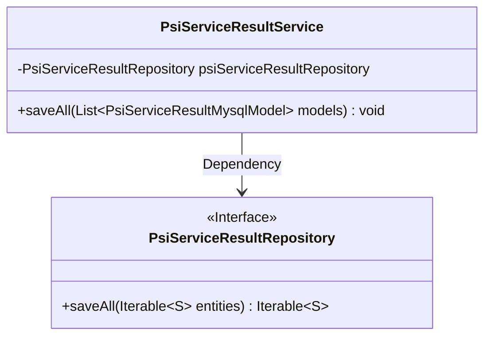
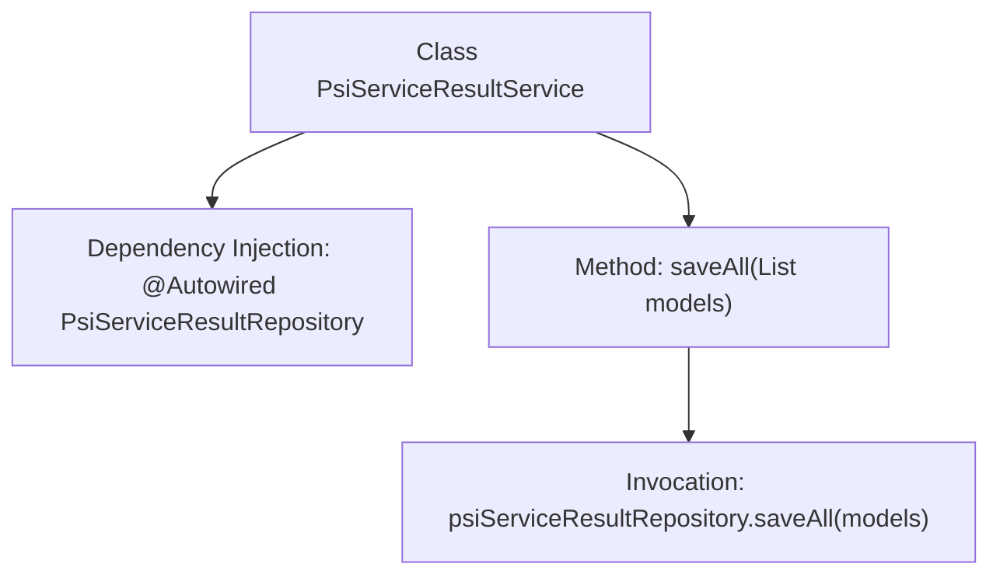

# Basic Information

|      |      |
|------|------|
| Name | PsiServiceResultService |
| Language | .java |
| Code Path | WeFe/serving/serving-service/src/main/java/com/welab/wefe/serving/service/service/PsiServiceResultService.java |
| Package Name | com.welab.wefe.serving.service.service |
| Dependencies | ['java.util.List', 'org.springframework.beans.factory.annotation.Autowired', 'org.springframework.stereotype.Service', 'com.welab.wefe.serving.service.database.entity.PsiServiceResultMysqlModel', 'com.welab.wefe.serving.service.database.repository.PsiServiceResultRepository'] |
| Brief Description | The PsiServiceResultService class batch-saves a list of PsiServiceResultMysqlModel data via the auto-injected PsiServiceResultRepository. |

# Description

The content describes a Spring service class named PsiServiceResultService. This class automatically injects a PsiServiceResultRepository dependency via the @Autowired annotation. It provides a saveAll method, which accepts a list of PsiServiceResultMysqlModel objects and uses the injected repository to batch-save these model data into the database. The entire class focuses on handling data persistence operations related to PSI service results.

# Class Summary

| Name   | Type  | Description |
|-------|------|-------------|
| PsiServiceResultService | class | This is a Spring service class designed for batch saving PSI service result data to a database, implementing the storage functionality through an auto-injected repository interface. |

## Class PsiServiceResultService

|      |      |
|------|------|
| Access Modifier | @Service;public |
| Type | class |
| Name | PsiServiceResultService |
| Description | This is a Spring service class designed for batch saving PSI service result data to a database, implementing the storage functionality through an auto-injected repository interface. |

### UML Class Diagram

Class Diagram Description: This diagram illustrates the dependency relationship between the PsiServiceResultService class and the PsiServiceResultRepository interface. The service class implements batch data saving functionality through the auto-injected repository interface, where PsiServiceResultRepository, as a Spring Data JPA interface, provides the standard saveAll method for persisting entity collections. This design adheres to the layered architecture pattern, achieving decoupling between business logic and data access.

### Internal Method Call Graph

This flowchart illustrates the structure and key method invocation relationships of the PsiServiceResultService class. The class automatically injects the PsiServiceResultRepository dependency via @Autowired, with its core method saveAll directly invoking the repository's batch save operation upon receiving a list of models. The diagram clearly presents the unidirectional call chain from the service layer to the persistence layer, exemplifying the typical layered architecture pattern of Spring Boot service components.

### Field List

| Name  | Type  | Description |
|-------|-------|------|
| psiServiceResultRepository | PsiServiceResultRepository | Automatically inject the PsiServiceResultRepository instance. |

### Method List

| Name  | Type  | Description |
|-------|-------|------|
| saveAll | void | Save all PSI service result models to the database. |

