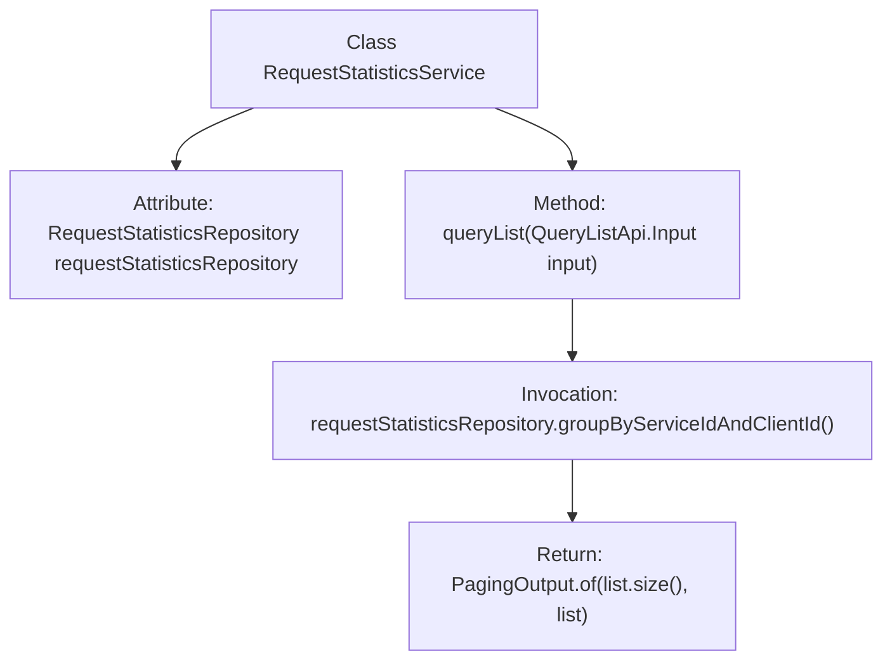

# Basic Information

|      |      |
|------|------|
| Name | RequestStatisticsService |
| Language | .java |
| Code Path | WeFe/serving/serving-service/src/main/java/com/welab/wefe/serving/service/service/RequestStatisticsService.java |
| Package Name | com.welab.wefe.serving.service.service |
| Dependencies | ['com.welab.wefe.serving.service.api.requeststatistics.QueryListApi', 'com.welab.wefe.serving.service.database.entity.RequestStatisticsMysqlModel', 'com.welab.wefe.serving.service.database.repository.RequestStatisticsRepository', 'com.welab.wefe.serving.service.dto.PagingOutput', 'org.springframework.beans.factory.annotation.Autowired', 'org.springframework.stereotype.Service', 'java.util.List'] |
| Brief Description | The RequestStatisticsService class queries the request statistics list grouped by service ID and client ID through the RequestStatisticsRepository and returns paginated results. |

# Description

This code snippet defines a service class named RequestStatisticsService, which handles query functionality for request statistics. The class interacts with the database through the auto-injected RequestStatisticsRepository. It primarily provides a queryList method that accepts input parameters including service ID, client ID, start time, and end time. By invoking the repository's groupByServiceIdAndClientId method, it queries statistics within the specified time range grouped by service ID and client ID, and returns the results in paginated form. The return type is PagingOutput, containing the query result list and total count.

# Class Summary

| Name   | Type  | Description |
|-------|------|-------------|
| RequestStatisticsService | class | The RequestStatisticsService class queries the list of request statistics grouped by service ID and client ID through RequestStatisticsRepository and returns paginated results. |


## Class RequestStatisticsService

|      |      |
|------|------|
| Access Modifier | @Service;public |
| Type | class |
| Name | RequestStatisticsService |
| Description | The RequestStatisticsService class queries the list of request statistics grouped by service ID and client ID through RequestStatisticsRepository and returns paginated results. |


### UML Class Diagram

```mermaid
classDiagram
    class RequestStatisticsService {
        -RequestStatisticsRepository requestStatisticsRepository
        +PagingOutput~RequestStatisticsMysqlModel~ queryList(QueryListApi$Input input)
    }

    class RequestStatisticsRepository {
        <<Interface>>
        +List~RequestStatisticsMysqlModel~ groupByServiceIdAndClientId(String serviceId, String clientId, Date startTime, Date endTime)
    }

    class PagingOutput~T~ {
        +int total
        +List~T~ data
        +static PagingOutput~T~ of(int total, List~T~ data)
    }

    class RequestStatisticsMysqlModel {
        // Data model class for storing request statistics
    }

    class QueryListApi {
        // Contains Input inner class
    }

    class QueryListApi$Input {
        +String serviceId
        +String clientId
        +Date startTime
        +Date endTime
    }

    RequestStatisticsService --> RequestStatisticsRepository : Dependency
    RequestStatisticsService --> PagingOutput : Dependency
    RequestStatisticsService --> RequestStatisticsMysqlModel : Dependency
    RequestStatisticsService --> QueryListApi$Input : Dependency
    RequestStatisticsRepository --> RequestStatisticsMysqlModel : Dependency
    PagingOutput --> RequestStatisticsMysqlModel : Generic association
```

This code demonstrates a request statistics service system, with the RequestStatisticsService class at its core. It retrieves data through the RequestStatisticsRepository interface and returns paginated statistical results. The class diagram consists of 5 main components: the service class relies on the repository interface for data queries, uses the generic PagingOutput class to encapsulate paginated results, the RequestStatisticsMysqlModel data model stores statistical information, and QueryListApi.Input serves as the query parameter wrapper class. These components form a complete data query chain through clear dependency relationships, reflecting design principles of layered architecture and interface segregation.


### Internal Method Call Graph



This code flowchart illustrates the structure of the RequestStatisticsService class and its key method invocation relationships. The class injects the RequestStatisticsRepository dependency via @Autowired. Its core method queryList takes input parameters, invokes the repository's grouping query method to retrieve a data list, and finally encapsulates the result as a paginated output object for return. The flow clearly demonstrates the data processing chain from parameter input to result output, reflecting a typical Spring service-layer data query pattern.

### Field List

| Name  | Type  | Description |
|-------|-------|------|
| requestStatisticsRepository | RequestStatisticsRepository | Using @Autowired to automatically inject an instance of RequestStatisticsRepository. |

### Method List

| Name  | Type  | Description |
|-------|-------|------|
| queryList | PagingOutput<RequestStatisticsMysqlModel> | The method `queryList` retrieves a paginated list of request statistics grouped by service ID and client ID based on the input parameters. |


