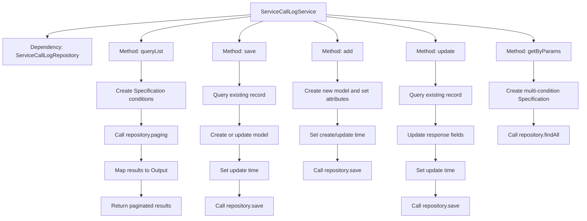

# Basic Information

|      |      |
|------|------|
| Name | ServiceCallLogService |
| Language | .java |
| Code Path | WeFe/serving/serving-service/src/main/java/com/welab/wefe/serving/service/service/ServiceCallLogService.java |
| Package Name | com.welab.wefe.serving.service.service |
| Dependencies | ['com.alibaba.fastjson.JSON', 'com.welab.wefe.common.data.mysql.Where', 'com.welab.wefe.common.data.mysql.enums.OrderBy', 'com.welab.wefe.common.web.util.ModelMapper', 'com.welab.wefe.serving.service.api.servicecalllog.QueryListApi', 'com.welab.wefe.serving.service.database.entity.ServiceCallLogMysqlModel', 'com.welab.wefe.serving.service.database.repository.ServiceCallLogRepository', 'com.welab.wefe.serving.service.dto.PagingOutput', 'com.welab.wefe.serving.service.dto.ServiceCallLogInput', 'com.welab.wefe.serving.service.utils.ServiceUtil', 'org.springframework.beans.factory.annotation.Autowired', 'org.springframework.data.jpa.domain.Specification', 'org.springframework.stereotype.Service', 'java.util.ArrayList', 'java.util.Date', 'java.util.List'] |
| Brief Description | The ServiceCallLogService provides functionalities for log querying, saving, adding, and updating. It supports conditional paginated queries, is compatible with add/update operations, and can retrieve log lists based on parameters. |

# Description

ServiceCallLogService is a service class responsible for handling operations related to service call logs. Its main functionalities include: querying log lists and returning them in paginated form, enabling flexible queries by constructing Specifications with conditions; saving log records, supporting both create and update operations; adding new log entries with configured request parameters; updating log records by supplementing response information; and querying log lists based on various parameter combinations, including time range filtering. All operations interact with the database through ServiceCallLogRepository, while handling logic such as model mapping and field truncation.

# Class Summary

| Name   | Type  | Description |
|-------|------|-------------|
| ServiceCallLogService | class | The ServiceCallLogService provides functionalities for log querying, saving, adding, and updating, supporting paginated queries and conditional filtering to handle service call records. |


## Class ServiceCallLogService

|      |      |
|------|------|
| Access Modifier | @Service;public |
| Type | class |
| Name | ServiceCallLogService |
| Description | The ServiceCallLogService provides functionalities for log querying, saving, adding, and updating, supporting paginated queries and conditional filtering to handle service call records. |


### UML Class Diagram

```mermaid
classDiagram
    class ServiceCallLogService {
        -ServiceCallLogRepository serviceCallLogRepository
        +PagingOutput~QueryListApi.Output~ queryList(QueryListApi.Input input)
        +void save(ServiceCallLogMysqlModel input)
        +ServiceCallLogMysqlModel add(String orderId, int callByMe, String requestPartnerId, String requestPartnerName, String serviceId, String serviceName, Integer serviceType, String requestId, String requestData, String requestIp)
        +ServiceCallLogMysqlModel update(String callLogId, String responsePartnerId, String responsePartnerName, String responseId, String responseData, int responseCode, String responseStatus, Long spendTime)
        +List~ServiceCallLogMysqlModel~ getByParams(ServiceCallLogInput input)
    }

    class ServiceCallLogRepository {
        <<Interface>>
        +PagingOutput~ServiceCallLogMysqlModel~ paging(Specification~ServiceCallLogMysqlModel~ where, QueryListApi.Input input)
        +ServiceCallLogMysqlModel findOne(String field, String value, Class~ServiceCallLogMysqlModel~ clazz)
        +ServiceCallLogMysqlModel save(ServiceCallLogMysqlModel model)
        +List~ServiceCallLogMysqlModel~ findAll(Specification~ServiceCallLogMysqlModel~ where)
    }

    class ServiceCallLogMysqlModel {
        // Data model class containing log-related fields
    }

    class QueryListApi {
        class Input {
            // Query input parameters
        }
        class Output {
            // Query output results
        }
    }

    class ServiceCallLogInput {
        // Log query parameter class
    }

    class Where {
        <<Interface>>
        +static Builder create()
    }

    class ModelMapper {
        <<Interface>>
        +static ~T~ map(Object source, Class~T~ targetClass)
    }

    ServiceCallLogService --> ServiceCallLogRepository : Dependency
    ServiceCallLogService --> ModelMapper : Dependency
    ServiceCallLogService --> Where : Dependency
    QueryListApi.Output <-- ServiceCallLogService : Returns
    ServiceCallLogInput <-- ServiceCallLogService : Parameter
    ServiceCallLogMysqlModel <-- ServiceCallLogService : Operates
```

This class diagram illustrates the core structure of a service call logging system. The ServiceCallLogService acts as the central service class, performing data persistence operations through ServiceCallLogRepository, utilizing ModelMapper for object mapping, and leveraging Where to construct query conditions. Key functionalities include paginated log queries, saving/updating log records, and retrieving logs by criteria. It involves multiple data transfer objects such as ServiceCallLogMysqlModel and QueryListApi.Input/Output, forming a comprehensive log management module.


### Internal Method Call Graph



This code represents a service call log service class, primarily containing five core methods: queryList for paginated log queries, save for saving/updating logs, add for creating new logs, update for modifying response data, and getByParams for multi-criteria log retrieval. All methods interact with the database through ServiceCallLogRepository, handling complete audit fields like creation/update timestamps, and utilize Specification for dynamic query construction. The update method truncates response data to prevent oversized entries in the database.

### Field List

| Name  | Type  | Description |
|-------|-------|------|
| serviceCallLogRepository | ServiceCallLogRepository | Automatically inject the service call log repository instance. |

### Method List

| Name  | Type  | Description |
|-------|-------|------|
| queryList | PagingOutput<QueryListApi.Output> | The method `queryList` retrieves a paginated list of service invocation logs based on input parameters, supporting filtering by `serviceId` and `orderId`, sorted in ascending order by creation time. |
| update | ServiceCallLogMysqlModel | Update service call log: Query the log by ID, update response information (partner ID, name, response ID, data, status code, time consumption, etc.), save it, and return the updated log object. |
| add | ServiceCallLogMysqlModel | This method creates and saves a service call log record, which includes fields such as order ID, caller, requester information, service information, request data, and IP address, while automatically setting responder information and timestamps. |
| save | void | This method saves or updates the service call log based on the input parameters. If the log does not exist, it creates a new one; if it exists, it updates the log. Finally, it sets the updater and timestamp before saving. |
| getByParams | List<ServiceCallLogMysqlModel> | The method queries service call logs based on input parameters, including conditions such as order ID, caller, request/responder ID, service ID, request/response ID, and time range, returning a list of matching results. |


