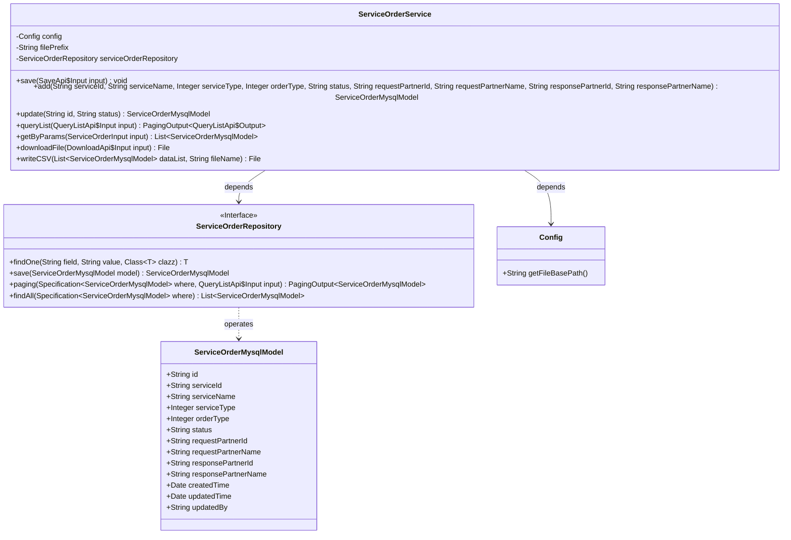
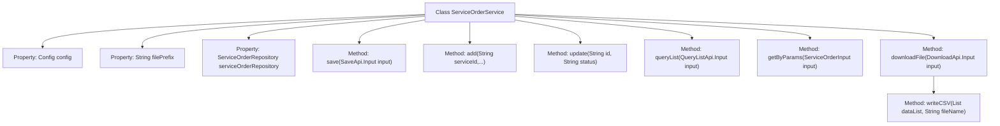
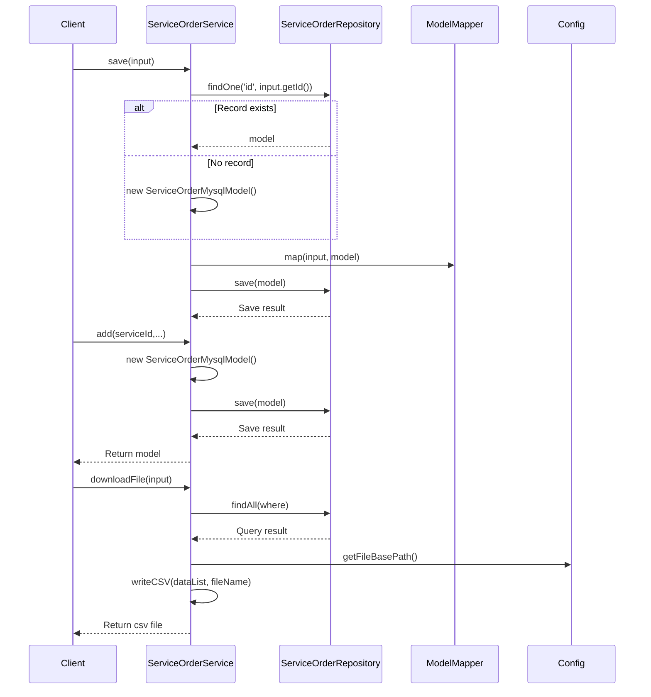

# Basic Information

|      |      |
|------|------|
| Name | ServiceOrderService |
| Language | .java |
| Code Path | WeFe/serving/serving-service/src/main/java/com/welab/wefe/serving/service/service/ServiceOrderService.java |
| Package Name | com.welab.wefe.serving.service.service |
| Dependencies | ['com.welab.wefe.common.data.mysql.Where', 'com.welab.wefe.common.data.mysql.enums.OrderBy', 'com.welab.wefe.common.util.DateUtil', 'com.welab.wefe.common.web.util.ModelMapper', 'com.welab.wefe.serving.service.api.serviceorder.DownloadApi', 'com.welab.wefe.serving.service.api.serviceorder.QueryListApi', 'com.welab.wefe.serving.service.api.serviceorder.SaveApi', 'com.welab.wefe.serving.service.config.Config', 'com.welab.wefe.serving.service.database.entity.ServiceCallLogMysqlModel', 'com.welab.wefe.serving.service.database.entity.ServiceOrderMysqlModel', 'com.welab.wefe.serving.service.database.repository.ServiceOrderRepository', 'com.welab.wefe.serving.service.dto.PagingOutput', 'com.welab.wefe.serving.service.dto.ServiceOrderInput', 'com.welab.wefe.serving.service.enums.CallByMeEnum', 'com.welab.wefe.serving.service.enums.ServiceOrderEnum', 'com.welab.wefe.serving.service.enums.ServiceTypeEnum', 'de.siegmar.fastcsv.writer.CsvWriter', 'de.siegmar.fastcsv.writer.LineDelimiter', 'de.siegmar.fastcsv.writer.QuoteStrategy', 'org.apache.commons.lang3.StringUtils', 'org.springframework.beans.factory.annotation.Autowired', 'org.springframework.data.jpa.domain.Specification', 'org.springframework.stereotype.Service', 'java.io', 'java.nio.charset.StandardCharsets', 'java.util.ArrayList', 'java.util.Date', 'java.util.List'] |
| Brief Description | The ServiceOrderService class provides order management functionalities, including saving, adding, updating, querying lists, and exporting CSV files. It supports filtering orders based on conditions, handling order status changes, and mapping data to CSV format for download. |

# Description

ServiceOrderService is a service class that provides functionalities for adding, deleting, modifying, and querying orders, as well as exporting files. It includes methods such as saving orders, adding new orders, updating order statuses, querying order lists, retrieving order lists based on parameters, and exporting CSV files. The query feature supports multi-condition filtering, such as service ID, name, type, status, partner information, and time range. When exporting a CSV file, it generates a CSV file containing detailed order information and saves it to the specified path.

# Class Summary

| Name   | Type  | Description |
|-------|------|-------------|
| ServiceOrderService | class | Service Order Service class, including methods for saving, adding, and updating orders, supporting conditional query lists and CSV file export functionality. |

## Class ServiceOrderService

|      |      |
|------|------|
| Access Modifier | @Service;public |
| Type | class |
| Name | ServiceOrderService |
| Description | Service Order Service class, including methods for saving, adding, and updating orders, supporting conditional query lists and CSV file export functionality. |

### UML Class Diagram

This code demonstrates the core service classes of a service order management system, including functionalities for order CRUD operations and file export. The ServiceOrderService acts as the primary business class, interacting with the database through ServiceOrderRepository to manipulate ServiceOrderMysqlModel entity data. The class diagram clearly illustrates dependency relationships between components: the service class depends on the configuration class and repository interface, while the repository interface operates on the entity model class. The system provides comprehensive CRUD operations, supports complex query condition construction, and can export query results as CSV files.

### Internal Method Call Graph

This flowchart illustrates the structure of the ServiceOrderService class and its main method invocation relationships. The class contains 4 core methods (save/add/update/queryList) and 2 auxiliary methods (getByParams/downloadFile), with writeCSV being the core implementation of the download functionality. The sequence diagram highlights the invocation flows of three key methods (save, add, and downloadFile), involving interactions with Repository, model mapping, and file operations as core business logic. All methods revolve around CRUD operations for service orders, demonstrating a complete data processing lifecycle.

### Field List

| Name  | Type  | Description |
|-------|-------|------|
| serviceOrderRepository | ServiceOrderRepository | Automatically inject service order repository instance. |
| filePrefix = "service_order/" | String | Define a string constant filePrefix with the value "service_order/" |
| config | Config | Automatically inject Config configuration instances. |

### Method List

| Name  | Type  | Description |
|-------|-------|------|
| save | void | This method saves or updates a service order based on the input parameters. If the order does not exist, it creates a new one; if it exists, it updates the existing order. It maps the input data to the model, sets the updater and timestamp, and finally saves the order. |
| downloadFile | File | The method queries service order data based on input conditions, generates a CSV file with the current date, and returns it. Returns null if an error occurs. |
| queryList | PagingOutput<QueryListApi.Output> | Query the service order list, filter based on input conditions, and return paginated results. |
| update | ServiceOrderMysqlModel | Method for updating service order status: Locate the order by ID, update its status and modification time if it exists, then save and return the updated order object. |
| getByParams | List<ServiceOrderMysqlModel> | Query the service order list based on input parameters, including conditions such as service ID, name, partner information, status, type, and creation/update time range. |
| add | ServiceOrderMysqlModel | Create and save a service order model, including service ID, name, type, order type, status, request and response partner information, and finally return the saved model. |
| writeCSV | File | Write a list of data to a CSV file, including order and service information, supporting custom file names and paths, ensuring UTF-8 encoding and directory existence. |

