# Basic Information

|      |      |
|------|------|
| Name | ServiceService |
| Language | .java |
| Code Path | WeFe/serving/serving-service/src/main/java/com/welab/wefe/serving/service/service/ServiceService.java |
| Package Name | com.welab.wefe.serving.service.service |
| Dependencies | ['java.io.File', 'java.io.FileOutputStream', 'java.io.IOException', 'java.nio.file.Path', 'java.nio.file.Paths', 'java.text.SimpleDateFormat', 'java.util.ArrayList', 'java.util.Arrays', 'java.util.Date', 'java.util.HashMap', 'java.util.HashSet', 'java.util.List', 'java.util.Map', 'java.util.Map.Entry', 'java.util.Optional', 'java.util.Queue', 'java.util.TreeMap', 'java.util.UUID', 'java.util.concurrent.BlockingQueue', 'java.util.concurrent.ConcurrentHashMap', 'java.util.concurrent.ExecutorService', 'java.util.concurrent.Executors', 'java.util.concurrent.LinkedBlockingQueue', 'java.util.concurrent.TimeUnit', 'java.util.stream.Collectors', 'org.apache.commons.collections.CollectionUtils', 'org.apache.commons.collections4.MapUtils', 'org.apache.commons.io.FileUtils', 'org.apache.commons.lang3.SerializationUtils', 'org.apache.commons.lang3.StringUtils', 'org.apache.commons.text.StringSubstitutor', 'org.slf4j.Logger', 'org.slf4j.LoggerFactory', 'org.springframework.beans.factory.annotation.Autowired', 'org.springframework.data.jpa.domain.Specification', 'org.springframework.stereotype.Service', 'org.springframework.transaction.annotation.Transactional', 'com.alibaba.fastjson.JSON', 'com.alibaba.fastjson.JSONArray', 'com.alibaba.fastjson.JSONObject', 'com.google.common.cache.Cache', 'com.google.common.cache.CacheBuilder', 'com.welab.wefe.common.CommonThreadPool', 'com.welab.wefe.common.StatusCode', 'com.welab.wefe.common.data.mysql.Where', 'com.welab.wefe.common.data.mysql.enums.OrderBy', 'com.welab.wefe.common.exception.StatusCodeWithException', 'com.welab.wefe.common.http.HttpRequest', 'com.welab.wefe.common.http.HttpResponse', 'com.welab.wefe.common.jdbc.base.DatabaseType', 'com.welab.wefe.common.util.FileUtil', 'com.welab.wefe.common.util.JObject', 'com.welab.wefe.common.web.util.CurrentAccountUtil', 'com.welab.wefe.common.web.util.ModelMapper', 'com.welab.wefe.common.wefe.enums.Algorithm', 'com.welab.wefe.common.wefe.enums.FederatedLearningType', 'com.welab.wefe.common.wefe.enums.JobMemberRole', 'com.welab.wefe.serving.sdk.model.xgboost.XgboostDecisionTreeModel', 'com.welab.wefe.serving.sdk.model.xgboost.XgboostModel', 'com.welab.wefe.serving.sdk.model.xgboost.XgboostNodeModel', 'com.welab.wefe.serving.service.api.service.AddApi', 'com.welab.wefe.serving.service.api.service.DetailApi', 'com.welab.wefe.serving.service.api.service.QueryApi', 'com.welab.wefe.serving.service.api.service.QueryOneApi', 'com.welab.wefe.serving.service.api.service.RouteApi', 'com.welab.wefe.serving.service.api.service.ServiceSQLTestApi.Output', 'com.welab.wefe.serving.service.api.service.UpdateApi.Input', 'com.welab.wefe.serving.service.config.Config', 'com.welab.wefe.serving.service.database.entity.AccountMySqlModel', 'com.welab.wefe.serving.service.database.entity.BaseServiceMySqlModel', 'com.welab.wefe.serving.service.database.entity.ClientServiceMysqlModel', 'com.welab.wefe.serving.service.database.entity.DataSourceMySqlModel', 'com.welab.wefe.serving.service.database.entity.ModelMemberMySqlModel', 'com.welab.wefe.serving.service.database.entity.PartnerMysqlModel', 'com.welab.wefe.serving.service.database.entity.ServiceCallLogMysqlModel', 'com.welab.wefe.serving.service.database.entity.ServiceOrderMysqlModel', 'com.welab.wefe.serving.service.database.entity.TableModelMySqlModel', 'com.welab.wefe.serving.service.database.entity.TableServiceMySqlModel', 'com.welab.wefe.serving.service.database.repository.AccountRepository', 'com.welab.wefe.serving.service.database.repository.BaseServiceRepository', 'com.welab.wefe.serving.service.database.repository.ModelMemberRepository', 'com.welab.wefe.serving.service.database.repository.TableModelRepository', 'com.welab.wefe.serving.service.database.repository.TableServiceRepository', 'com.welab.wefe.serving.service.dto.ModelSqlConfigOutput', 'com.welab.wefe.serving.service.dto.ModelStatusOutput', 'com.welab.wefe.serving.service.dto.PagingOutput', 'com.welab.wefe.serving.service.dto.ServiceDetailOutput', 'com.welab.wefe.serving.service.dto.TreeNode', 'com.welab.wefe.serving.service.dto.TreeNodeData', 'com.welab.wefe.serving.service.enums.CallByMeEnum', 'com.welab.wefe.serving.service.enums.ServiceOrderEnum', 'com.welab.wefe.serving.service.enums.ServiceResultEnum', 'com.welab.wefe.serving.service.enums.ServiceStatusEnum', 'com.welab.wefe.serving.service.enums.ServiceTypeEnum', 'com.welab.wefe.serving.service.manager.FeatureManager', 'com.welab.wefe.serving.service.manager.ModelManager', 'com.welab.wefe.serving.service.service_processor.AbstractServiceProcessor', 'com.welab.wefe.serving.service.service_processor.ServiceProcessorUtils', 'com.welab.wefe.serving.service.utils.ServiceUtil', 'com.welab.wefe.serving.service.utils.SignUtils', 'com.welab.wefe.serving.service.utils.ZipUtils', 'com.welab.wefe.serving.service.utils.component.ScoreCardComponentUtil'] |
| Brief Description | The `ServiceService` class is a service management component that provides functionalities such as service CRUD operations, status management, invocation execution, and SDK export. Key features include: service detail query, paginated query, service creation and update, activation/deactivation operations, service invocation log recording, SQL testing, IP whitelist validation, multi-threaded processing, and XGBoost model parsing. It injects multiple repository and service dependencies via `@Autowired`, supporting transaction management and caching mechanisms. |

# Description

The code is a Java service class named ServiceService, primarily featuring functionalities such as service management, model management, data source operations, and service invocation logging. The class defines multiple auto-injected Repository and Service dependencies for handling database operations and business logic. Core methods include service detail query (detail), service saving (saveService), service updating (updateService), service activation/deactivation (onlineService/offlineService), SQL testing (sqlTest), and service invocation (executeService). It also encompasses paginated queries (query), SDK exporting (exportSdk), and partner service invocation (callOtherPartnerServing). The class employs a caching mechanism (CacheBuilder) to optimize performance and handles distinct logic for various service types (PSI, PIR, etc.). For logging, it implements comprehensive call chain tracing, recording request parameters, response results, execution time, and other relevant information.

# Class Summary

| Name   | Type  | Description |
|-------|------|-------------|
| ServiceService | class | The ServiceService class is a service management component, whose main functionalities include: service detail query, CRUD operations, online/offline operations, SQL testing, permission validation, logging, and SDK export. It supports multiple service types (such as PSI, PIR, etc.), integrates caching, multi-threading, and transaction management, and relies on multiple Repository classes and service classes to implement business logic. |


## Class ServiceService

|      |      |
|------|------|
| Access Modifier | @Service;public |
| Type | class |
| Name | ServiceService |
| Description | The ServiceService class is a service management component, whose main functionalities include: service detail query, CRUD operations, online/offline operations, SQL testing, permission validation, logging, and SDK export. It supports multiple service types (such as PSI, PIR, etc.), integrates caching, multi-threading, and transaction management, and relies on multiple Repository classes and service classes to implement business logic. |


### UML Class Diagram

```mermaid
classDiagram
    class ServiceService {
        -Cache~String, Object~ caches
        -Logger LOG
        -String SERVICE_PRE_URL
        -int threads
        +detail(DetailApi$Input input) DetailApi$Output
        +saveService(AddApi$Input input) AddApi$Output
        +updateService(Input input) AddApi$Output
        +executeService(RouteApi$Input input) JObject
        // ...Other public methods...
    }

    class <<Interface>> BaseServiceRepository~T~ {
        <<Interface>>
        +findOne(String field, String value, Class~T~ clazz) T
        +paging(Specification~T~ spec, QueryApi$Input input) PagingOutput~T~
    }

    class TableServiceRepository {
        +findById(String id) Optional~TableServiceMySqlModel~
        +save(TableServiceMySqlModel entity)
    }

    class DataSourceService {
        +getDataSourceById(String id) DataSourceMySqlModel
        +queryList(DataSourceMySqlModel model, String sql, List~String~ fields) List~Map~String,String~~
    }

    class PartnerService {
        +queryByCode(String code) PartnerMysqlModel
    }

    ServiceService --> BaseServiceRepository : <<Dependency>>\nUses base service repository
    ServiceService --> TableServiceRepository : <<Dependency>>\nUses table service repository
    ServiceService --> DataSourceService : <<Dependency>>\nData source operations
    ServiceService --> PartnerService : <<Dependency>>\nPartner query
    BaseServiceRepository <|.. TableServiceRepository : Implements
```

This code implements a complex service management system with functionalities including service detail query, CRUD operations, permission validation, and logging. The core class ServiceService relies on multiple repository interfaces (e.g., BaseServiceRepository) and data services (e.g., DataSourceService) to execute business logic. It employs a caching mechanism (CacheBuilder) to optimize performance and ensures data consistency through transaction management (@Transactional). The system supports multiple service types (PSI/PIR/SA, etc.), features a complete permission control chain and audit logging system, and provides SDK export functionality for easy client integration.


### Internal Method Call Graph

```mermaid
graph TD
    A["Class ServiceService"]
    B["Property: Cache<String, Object> caches"]
    C["Property: Logger LOG"]
    D["Property: String SERVICE_PRE_URL"]
    E["Property: Multiple @Autowired repositories and services"]
    F["Method: detail(DetailApi.Input input)"]
    G["Method: detailModel(Optional<TableModelMySqlModel>)"]
    H["Method: detailService(Optional<TableServiceMySqlModel>)"]
    I["Method: displayServiceQueryParams(TableServiceMySqlModel)"]
    J["Method: findMyRoles(String modelId)"]
    K["Method: checkModelStatus(String modelId)"]
    L["Method: xgboost(JObject, FederatedLearningType)"]
    M["Method: recursive(Map<Integer, TreeNode>, TreeNode)"]
    N["Method: saveService(AddApi.Input)"]
    O["Method: generateIdsTable(TableServiceMySqlModel)"]
    P["Method: generateMySqlIdsTable(DataSourceMySqlModel, JSONObject)"]
    Q["Method: query(QueryApi.Input)"]
    R["Method: updateService(Input)"]
    S["Method: offlineService(String)"]
    T["Method: onlineService(String)"]
    U["Method: sqlTest(ServiceSQLTestApi.Input)"]
    V["Method: showSql(ServiceShowSQLApi.Input)"]
    W["Method: check(RouteApi.Input, BaseServiceMySqlModel)"]
    X["Method: isIpWhiteList(RouteApi.Input, ClientServiceMysqlModel)"]
    Y["Method: executeService(RouteApi.Input)"]
    Z["Method: log(RouteApi.Input, long, BaseServiceMySqlModel, JObject, ServiceResultEnum, String)"]
    AA["Method: createOrder(BaseServiceMySqlModel, RouteApi.Input, ServiceOrderEnum)"]
    AB["Method: callLog(RouteApi.Input, String, String, JObject, Integer, String, long)"]
    AC["Method: exportSdk(String)"]
    AD["Method: modelServiceSdk(String)"]
    AE["Method: mpcServiceSdk(String)"]
    AF["Method: fillReadmeFile(TableServiceMySqlModel, File)"]
    AG["Method: queryById(QueryOneApi.Input)"]
    AH["Method: callOtherPartnerServing(String, String, TreeMap<String, Object>, Class<T>)"]
    AI["Method: getErrorMessage(HttpResponse)"]

    A --> B
    A --> C
    A --> D
    A --> E
    A --> F
    F -->|Conditional branch| G
    F -->|Conditional branch| H
    A --> I
    A --> J
    A --> K
    A --> L
    L --> M
    A --> N
    N --> O
    O --> P
    A --> Q
    A --> R
    A --> S
    A --> T
    A --> U
    A --> V
    A --> W
    W --> X
    A --> Y
    Y --> Z
    Z --> AA
    Z --> AB
    A --> AC
    AC --> AD
    AC --> AE
    AE --> AF
    A --> AG
    A --> AH
    AH --> AI
```



This code represents a complex service class primarily handling various service-related operations, including service detail queries, model detail processing, service saving and updating, service status management, SQL testing, service invocation execution, logging, and SDK exporting. The code employs multiple design patterns and technologies such as caching, multithreading, recursion, and mapping transformations, demonstrating a highly modular and extensible design philosophy.

### Field List

| Name  | Type  | Description |
|-------|-------|------|
| serviceCallLogService | ServiceCallLogService | The code snippet uses the @Autowired annotation to automatically inject an instance of ServiceCallLogService. |
| threads = Math.max(Runtime.getRuntime().availableProcessors(), 4) | int | Set the number of threads to the maximum value between the CPU core count and 4. |
| baseServiceRepository | BaseServiceRepository<BaseServiceMySqlModel> | Automatically injects a BaseServiceRepository instance with the generic type BaseServiceMySqlModel. |
| caches = CacheBuilder.newBuilder()            .expireAfterAccess(10, TimeUnit.MINUTES).build() | Cache<String, Object> | Using CacheBuilder to create a cache, setting automatic expiration after 10 minutes of no access. |
| unionServiceService | UnionServiceService | Automatically inject the UnionServiceService service instance. |
| accountRepository | AccountRepository | Using @Autowired to automatically inject an instance of AccountRepository. |
| clientServiceService | ClientServiceService | Using @Autowired to automatically inject an instance of ClientServiceService. |
| serviceOrderService | ServiceOrderService | Automatically inject the ServiceOrderService instance. |
| dataSourceService | DataSourceService | Automatically inject the DataSourceService instance. |
| SERVICE_PRE_URL = "api/" | String | The static constant SERVICE_PRE_URL is defined as "api/", serving as the service prefix URL. |
| LOG = LoggerFactory.getLogger(this.getClass()) | Logger | The class defines a protected and immutable logger instance for logging output within the current class. |
| modelMemberRepository | ModelMemberRepository | Automatically inject the ModelMemberRepository instance. |
| config | Config | Automatically inject Config configuration instance. |
| modelMemberService | ModelMemberService | Automatically inject the ModelMemberService instance. |
| modelRepository | TableModelRepository | Use @Autowired to automatically inject an instance of TableModelRepository. |
| partnerService | PartnerService | Use @Autowired to automatically inject an instance of PartnerService. |
| serviceRepository | TableServiceRepository | Automatically inject the TableServiceRepository instance. |

### Method List

| Name  | Type  | Description |
|-------|-------|------|
| check | JObject | Check service status, client permissions, and IP whitelist, then return error messages or pass verification. |
| isIpWhiteList | boolean | Check if the client IP is in the service whitelist, supporting wildcard * and comma separation. |
| offlineService | void | The method offlineService deactivates a service by ID: checks data existence and status, updates the status to 0. If it is not a model service, it calls unionServiceService.offline2Union; otherwise, it refreshes the model status to disabled. |
| detail | com.welab.wefe.serving.service.api.service.DetailApi.Output | The method `detail` processes service or model detail queries based on the input type: if the type is less than 7, it queries the service table and returns the details; otherwise, it queries the model table, returning the details if they exist, or throws the exception "data not found" if they do not. |
| findById | TableServiceMySqlModel | Query service data by ID, call the findOne method of the repository, and return a TableServiceMySqlModel object. |
| exportSdk | File | The method `exportSdk` searches for the service model based on the `serviceId`. If not found, it throws an exception. If the service type is 7, it calls `modelServiceSdk`; otherwise, it returns the file by calling `mpcServiceSdk`. |
| executeService | JObject | The method executeService handles service requests: checks parameters, invokes the corresponding processor for execution, and returns the result. In case of failure, it logs the error, ultimately records the log, and returns the status code and response ID. |
| sqlTest | Output | The method sqlTest takes input parameters, parses the data source, generates an SQL query, executes it, and returns the result. The process includes data source parsing, SQL generation, query execution, and result encapsulation. |
| updateService | com.welab.wefe.serving.service.api.service.AddApi.Output | Updating service logic: Check service existence, status, and name/URL conflicts, update service information and handle PSI type-specific logic, then synchronize federated services and client services. |
| createOrder | String | Order creation method: Generates an order based on input parameters and service status, associates partner information, sets the caller identifier, and returns the order ID. |
| recursive | void | Recursively traverse the binary tree, setting the left and right subtrees as the children of the current node. If the node is a leaf node, return. Use a Map to store node relationships. |
| showSql | com.welab.wefe.serving.service.api.service.ServiceShowSQLApi.Output | The method `showSql` takes input parameters, parses the data source ID, queries the database model, generates SQL statements, and returns the result. |
| detailService | com.welab.wefe.serving.service.api.service.DetailApi.Output | The method `detailService` converts `TableServiceMySqlModel` into `DetailApi.Output`, processes fields such as data source, query parameters, and service configuration, and returns the result after generating preview information. |
| getModelStatus | List<ModelStatusOutput> | This method determines whether to check the model status based on the user role and federated learning type. If the user role is promoter and the federated learning type is not horizontal, it returns the model status check result; otherwise, it returns null. |
| query | PagingOutput<QueryApi.Output> | The method `query` filters service data based on input conditions, associates account information, and transforms the output format. |
| generateMySqlIdsTable | String | Method for generating MySQL ID table: Clone the data source model, concatenate table names, extract key fields, asynchronously create the table after verifying the data source is non-empty, then batch-insert computed IDs, and finally return the table name. |
| generateIdsTable | String | This method generates or retrieves the ID table name based on the service type and data source type. If it is not a PSI service, it directly returns null; if the data source is MySQL, it first deletes the old table and then generates a new one; for other data sources, it directly uses the original table name. |
| detailModel | com.welab.wefe.serving.service.api.service.DetailApi.Output | The method `detailModel` converts `TableModelMySqlModel` into `DetailApi.Output`, then returns it after setting model parameters, roles, SQL configurations, processors, XGBoost trees, status, scorecard information, and preview data. |
| callLog | void | Record service call logs, including request and response data, partner information, response status, and time consumption, and save them to the database. |
| modelServiceSdk | File | Method to generate an SDK zip package for the specified service ID: check if the file exists and return it directly; otherwise, query the model data, process the file list, generate the ZIP, and finally clean up temporary files before returning the result. |
| onlineService | void | The method `onlineService` enables a service based on its ID. It checks for data existence and status, then updates the status to 1. For non-model services, it processes PSI-type data and joins the federated service, while model services refresh their enabled status. |
| saveService | com.welab.wefe.serving.service.api.service.AddApi.Output | This method is used to save service information, check for duplicate names and URLs, map input data to the model, and set the creation/update time. For PSI-type services, it generates primary key data and returns an output object containing the ID, parameters, and URL after saving. |
| xgboost | List<TreeNode> | This method parses the parameters of the XGBoost model and constructs a list of tree structure nodes. It traverses each tree, processes node data (features, leaf node identifiers, left and right child nodes, etc.), and recursively builds the complete tree structure before returning. |
| log | void | This method logs service call details, including order creation status (success or failure), generates an order ID, and invokes the logging function by passing input parameters, order ID, response ID, result, status code, message, and start time. |
| checkModelStatus | List<ModelStatusOutput> | Methods to check the status of specified models: Call the service layer interface to query availability based on model IDs and return a status list. |
| displayServiceQueryParams | String | The method processes query parameters based on the service type: for PSI type, it returns the data source's key_calc_rules; for other types, it parses queryParamsConfig or directly returns queryParams, returning an empty string for null values. |
| mpcServiceSdk | File | Return the corresponding SDK file package based on the service type, including jar and sample code, and finally package it as a zip for return. |
| fillReadmeFile | void | The method `fillReadmeFile` generates the content of the readme file based on the `model`. If the `model` is not empty, it populates the template with information such as URLs and parameters and writes it to the file; otherwise, it writes the default content. |
| queryById | ServiceDetailOutput | Query service details by ID. If it is a model service, return model data; otherwise, return service data. Throw an exception if no data is found. |
| callOtherPartnerServing | T | General method for invoking partner services: check if the URL is not empty, then concatenate the URI, send a signed POST request, verify that the response status and data code are 0, return the parsed data object, and throw an exception if it fails. |
| getErrorMessage | String | The method returns error messages based on the HTTP response: it prioritizes using the message in the response, and if empty, extracts the "message" field from the JSON response body. |
| findMyRoles | List<JobMemberRole> | This method queries the current user's role list by model ID, retrieves member information from the database, extracts the roles, and returns them. |


