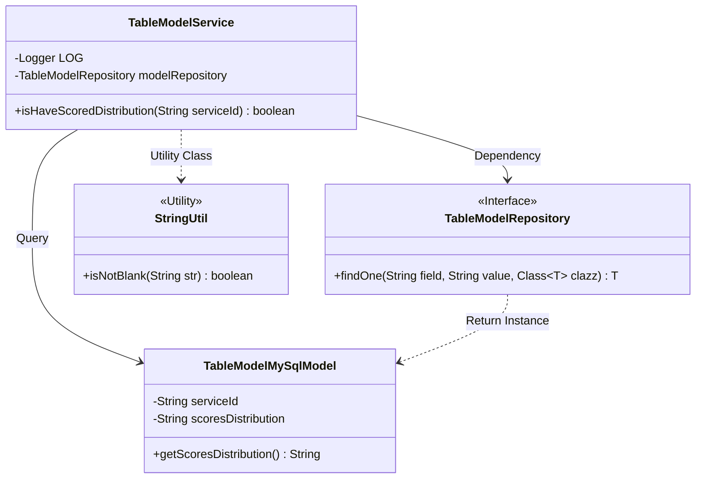
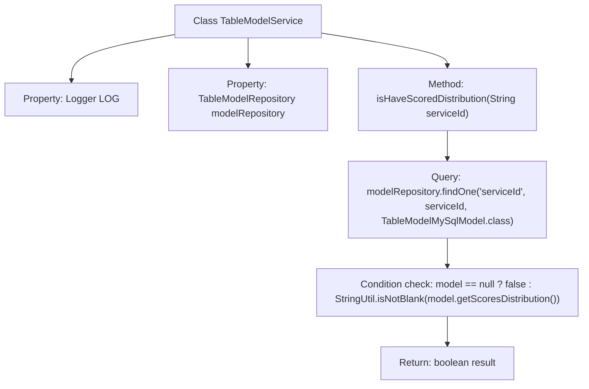

# Basic Information

|      |      |
|------|------|
| Name | TableModelService |
| Language | .java |
| Code Path | WeFe/serving/serving-service/src/main/java/com/welab/wefe/serving/service/service/TableModelService.java |
| Package Name | com.welab.wefe.serving.service.service |
| Dependencies | ['com.welab.wefe.common.util.StringUtil', 'com.welab.wefe.serving.service.database.entity.TableModelMySqlModel', 'com.welab.wefe.serving.service.database.repository.TableModelRepository', 'org.slf4j.Logger', 'org.slf4j.LoggerFactory', 'org.springframework.beans.factory.annotation.Autowired', 'org.springframework.stereotype.Service'] |
| Brief Description | This is a Spring service class that includes logging and database query functionality to check whether there is rating distribution data for a specified service ID. It queries the database using an auto-injected repository class and returns a boolean result. |

# Description

This is a Spring service class named TableModelService, which includes a logger and an auto-injected TableModelRepository. It primarily provides an isHaveScoredDistribution method that queries TableModelMySqlModel by serviceId and checks whether its scoresDistribution field is non-null. If the record does not exist or the field is empty, it returns false; otherwise, it returns true.

# Class Summary

| Name   | Type  | Description |
|-------|------|-------------|
| TableModelService | class | TableModelService checks whether the model corresponding to the specified serviceId has score distribution data. |

## Class TableModelService

|      |      |
|------|------|
| Access Modifier | @Service;public |
| Type | class |
| Name | TableModelService |
| Description | TableModelService checks whether the model corresponding to the specified serviceId has score distribution data. |

### UML Class Diagram

This code illustrates a Spring service class TableModelService, which queries the database through the dependency-injected TableModelRepository interface and checks whether the scoresDistribution field in the TableModelMySqlModel object is empty. The class diagram clearly presents the relationship between the service layer and the persistence layer, as well as the auxiliary role of the utility class StringUtil, demonstrating the collaboration between components in a layered architecture.

### Internal Method Call Graph

This flowchart illustrates the core logic of Spring service class TableModelService. The service queries the database model via modelRepository to determine whether the specified serviceId corresponds to an existing model containing valid score distribution data. The process involves three key components: dependency injection, database query, and null-safe validation, ultimately returning a boolean verification result.

### Field List

| Name  | Type  | Description |
|-------|-------|------|
| modelRepository | TableModelRepository | Automatically inject the TableModelRepository instance. |
| LOG = LoggerFactory.getLogger(getClass()) | Logger | Create a logger instance for the current class. |

### Method List

| Name  | Type  | Description |
|-------|-------|------|
| isHaveScoredDistribution | boolean | Check if the specified service ID has score distribution data. Return true if the model exists and the score distribution is non-empty; otherwise, return false. |

