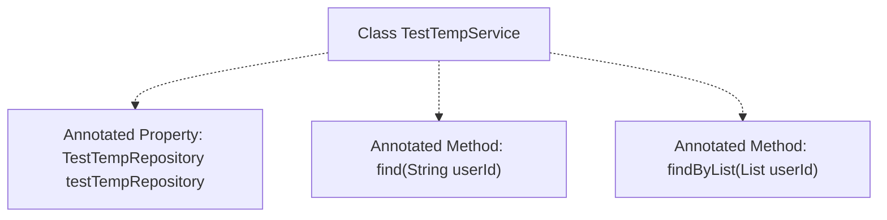

# Basic Information

|      |      |
|------|------|
| Name | TestTempService |
| Language | .java |
| Code Path | WeFe/serving/serving-service/src/main/java/com/welab/wefe/serving/service/service/TestTempService.java |
| Package Name | com.welab.wefe.serving.service.service |
| Dependencies | ['org.springframework.stereotype.Service'] |
| Brief Description | This is a Spring service class TestTempService, containing commented-out database query methods for retrieving data by user ID or batch querying. |

# Description

This code snippet demonstrates a Spring service class named TestTempService, currently in an unimplemented state. The class contains two commented-out methods: the find method was originally intended to query a single TestTempMysqlModel object by user ID, while the findByList method was designed to query a list of strings by a list of user IDs. Both methods rely on TestTempRepository for data access, but the relevant autowiring annotations and method implementations have been commented out. The entire service class is currently an empty implementation, preserving potential design concepts for the data access layer interface.

# Class Summary

| Name   | Type  | Description |
|-------|------|-------------|
| TestTempService | class | This is an unimplemented Java service class TestTempService, containing two commented-out methods: query by user ID and batch query, with the dependent Repository also commented out. |


## Class TestTempService

|      |      |
|------|------|
| Access Modifier | @Service;public |
| Type | class |
| Name | TestTempService |
| Description | This is an unimplemented Java service class TestTempService, containing two commented-out methods: query by user ID and batch query, with the dependent Repository also commented out. |


### UML Class Diagram

```mermaid
classDiagram
    class TestTempService {
        <<Service>>
        // Commented-out dependencies:
        // -TestTempRepository testTempRepository
        // +TestTempMysqlModel find(String userId)
        // +List~String~ findByList(List~String~ userId)
    }

    // Commented interface dependency:
    // TestTempService --> TestTempRepository : depends
```

This class diagram illustrates the structure of a Spring service class TestTempService, where all methods are currently commented out. The original design shows its dependency on TestTempRepository for data queries, containing two core methods: querying a model by single user ID and batch querying user ID lists. The class is annotated with @Service indicating its Spring service identity. Although the current implementation is empty, it retains potential capabilities for interacting with the data access layer.


### Internal Method Call Graph



This flowchart illustrates the structure of the TestTempService class, containing an annotated TestTempRepository property and two annotated methods: find and findByList. Since all elements are commented out, these codes will not take effect during actual runtime, but they preserve the original design intent. The diagram uses dashed lines to represent annotation relationships, clearly distinguishing the boundary between active and inactive code.

### Field List

| Name  | Type  | Description |
|-------|-------|------|

### Method List

| Name  | Type  | Description |
|-------|-------|------|


