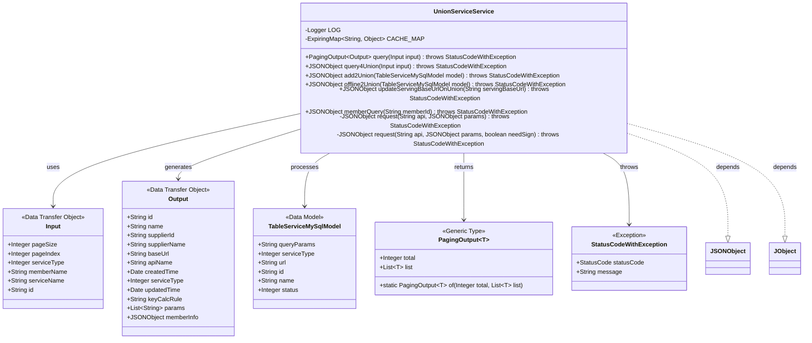
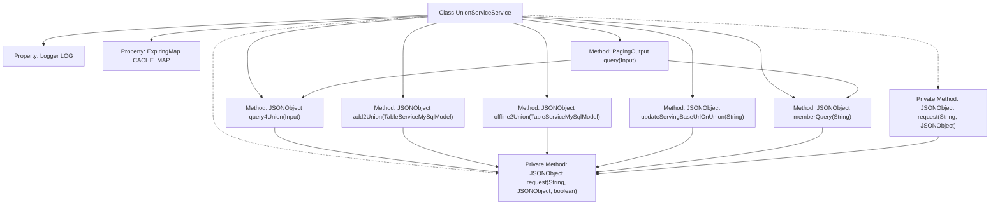
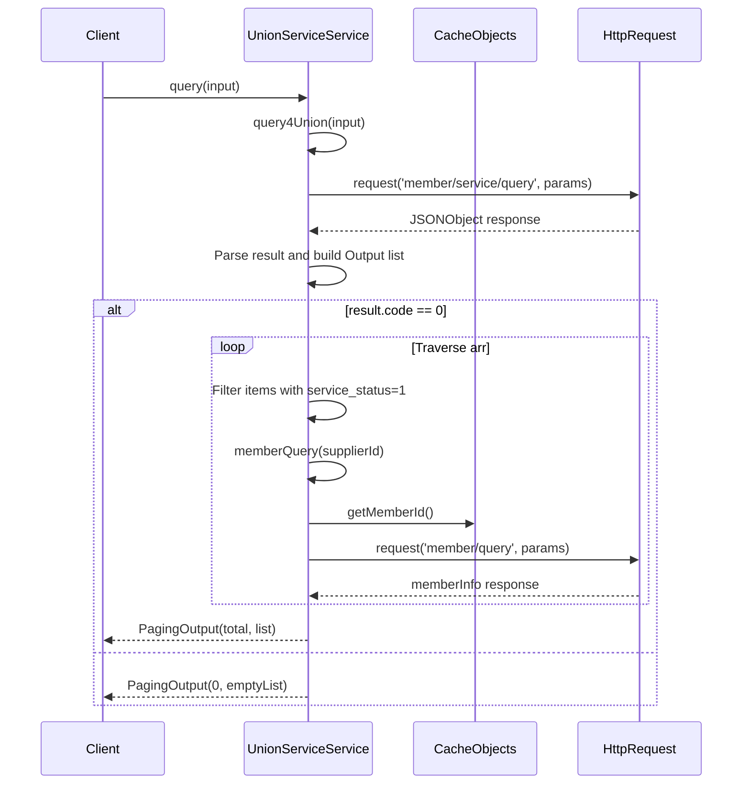

# Basic Information

|      |      |
|------|------|
| Name | UnionServiceService |
| Language | .java |
| Code Path | WeFe/serving/serving-service/src/main/java/com/welab/wefe/serving/service/service/UnionServiceService.java |
| Package Name | com.welab.wefe.serving.service.service |
| Dependencies | ['com.alibaba.fastjson.JSONArray', 'com.alibaba.fastjson.JSONException', 'com.alibaba.fastjson.JSONObject', 'com.welab.wefe.common.StatusCode', 'com.welab.wefe.common.exception.StatusCodeWithException', 'com.welab.wefe.common.http.HttpRequest', 'com.welab.wefe.common.http.HttpResponse', 'com.welab.wefe.common.util.JObject', 'com.welab.wefe.common.util.RSAUtil', 'com.welab.wefe.common.util.SignUtil', 'com.welab.wefe.serving.service.api.service.UnionServiceApi', 'com.welab.wefe.serving.service.api.service.UnionServiceApi.Input', 'com.welab.wefe.serving.service.api.service.UnionServiceApi.Output', 'com.welab.wefe.serving.service.database.entity.TableServiceMySqlModel', 'com.welab.wefe.serving.service.dto.PagingOutput', 'com.welab.wefe.serving.service.enums.ServiceTypeEnum', 'net.jodah.expiringmap.ExpiringMap', 'org.apache.commons.lang3.StringUtils', 'org.slf4j.Logger', 'org.slf4j.LoggerFactory', 'org.springframework.stereotype.Service', 'java.util', 'java.util.concurrent.TimeUnit'] |
| Brief Description | The UnionServiceService class provides functionalities for federated service querying, adding, decommissioning, and member information querying. It utilizes caching to optimize performance, supports RSA signature verification, and handles paginated data returns. |

# Description

UnionServiceService is a service class that provides functionalities such as federated member service querying, adding, offline management, and base URL updates. It utilizes ExpiringMap to cache member information, with a validity period of 60 seconds and a maximum capacity of 500. Key methods include query (pagination-based service list query with status filtering), query4Union (constructing query parameters), add2Union (adding services to the federation), offline2Union (taking services offline), updateServingBaseUrlOnUnion (updating service base URLs), and memberQuery (querying member information). All requests are processed through the request method, supporting RSA signature verification, with unified handling of response error codes and exceptions. Critical operation parameters and results are logged.

# Class Summary

| Name   | Type  | Description |
|-------|------|-------------|
| UnionServiceService | class | The UnionServiceService class provides functionalities for querying, adding, taking offline, and retrieving member information of union services. It utilizes caching to optimize performance and supports RSA signature verification and error handling. |

## Class UnionServiceService

|      |      |
|------|------|
| Access Modifier | @Service;public |
| Type | class |
| Name | UnionServiceService |
| Description | The UnionServiceService class provides functionalities for querying, adding, taking offline, and retrieving member information of union services. It utilizes caching to optimize performance and supports RSA signature verification and error handling. |

### UML Class Diagram

This code demonstrates a federated service class `UnionServiceService` that provides functionalities such as querying, adding, taking services offline, and updating service URLs. The class utilizes a caching mechanism to optimize member queries and interacts with remote federated services through HTTP requests. It primarily handles JSON-formatted input/output, including paginated query result encapsulation and exception handling mechanisms. The class diagram clearly illustrates the core data flow relationships and dependencies on external data structures.

### Internal Method Call Graph

This code implements a federated service management class, with core functionalities including service query, addition, deactivation, URL updates, and member queries. The key workflow involves HTTP interactions with the federated server, performance optimization through caching for member queries, and signature verification for request parameters. The class diagram illustrates the structure and method call relationships, while the sequence diagram details the execution flow of the query method, covering parameter construction, remote requests, result processing, and caching mechanisms.

### Field List

| Name  | Type  | Description |
|-------|-------|------|
| CACHE_MAP = ExpiringMap            .builder()            .expiration(60, TimeUnit.SECONDS)            .maxSize(500)            .build() | ExpiringMap<String, Object> | Define a protected static constant CACHE_MAP, implemented using ExpiringMap, with an expiration time of 60 seconds and a maximum capacity of 500. |
| LOG = LoggerFactory.getLogger(this.getClass()) | Logger | Define a protected final logger instance of the current class. |

### Method List

| Name  | Type  | Description |
|-------|-------|------|
| add2Union | JSONObject | The method `add2Union` takes a `TableServiceMySqlModel` parameter, constructs a JSON object containing query parameters, service type, and other information, sends a request to the `member/service/put` endpoint, and returns the response result. |
| query4Union | JSONObject | The method `query4Union` constructs query conditions based on input parameters, including pagination, service type, member name, service name, and ID, then sends a request to the `member/service/query` endpoint. |
| updateServingBaseUrlOnUnion | JSONObject | Method to update the federation service base URL, which receives the URL parameter, sends a request, records the request and response logs, and then returns the result. |
| query | PagingOutput<Output> | The method `query` takes an `Input` parameter and returns paginated `Output`. The query results are parsed into a list of `UnionServiceApi.Output`, filtered for items with status `1`, and returned after populating the fields. An empty list is returned in case of exceptions. |
| memberQuery | JSONObject | Method for querying member information: First check the cache, if not found then request the API, return a JSON object containing details such as name, phone number, email, etc., and cache the result. |
| request | JSONObject | Private method `request`: Checks the base URL and model state, returns empty JSON if invalid, otherwise invokes the `request` method with a boolean parameter. May throw `StatusCodeWithException` on exceptions. |
| offline2Union | JSONObject | Convert MySQL model data into JSON objects, send requests, and return responses. Includes query parameters, service type, member ID, and other information. |
| request | JSONObject | Send a JSON request and process the response. If a signature is required, generate it using the private key and encapsulate the request body. Check the response status and JSON format, handle error codes, and return the JSON object upon success. |

