# Basic Information

|      |      |
|------|------|
| Name | service |
| Language | .java |
| Code Path | WeFe/serving/serving-service/src/main/java/com/welab/wefe/serving/service/service |
| Package Name | docs.serving.serving-service.src.main.java.com.welab.wefe.serving.service.service |
| Brief Description | The system manages global configuration initialization and maintenance, supporting multi-mode initialization and secure updates. It includes methods such as initialization checks, standalone/joint mode initialization, and configuration updates. Key data structures involve the AbstractConfigModel base class and encrypted fields. It relies on RSA key management and database storage layer. |

# Description

## Overview  
This module is a service governance system designed for federated learning scenarios, with core responsibilities including global configuration management, model service lifecycle management, and multi-party collaborative data governance. The interface specifications cover basic operations such as initialization checks (`isInitialized`) and multi-mode configuration updates (`update`), as well as advanced functionalities like model import/prediction, service invocation (`executeService`), and federated member management (`query4Union`). Key data structures involve encrypted fields annotated with `@Secret`, composite objects such as model binning statistics (`ModelPredictScoreStatistics`) and service orders (`ServiceOrder`). External dependencies include the RSA encryption system, `JdbcManager` database connection pool, and `ExpiringMap` caching component. For example, model import requires decryption of AES keys, while federated service calls necessitate RSA signature verification.  

## Key Business Scenarios  
The module supports end-to-end federated learning operations, akin to a microservices governance platform. Typical workflows include: loading RSA keys and runtime modes during system initialization; model services being registered via `saveService` and invoked across nodes through `callOtherPartnerServing`; prediction logs asynchronously aggregating binning data via `asyncIncrement`. In security scenarios, `updateRsaKeyByBoard` facilitates key rotation, while `ClientServiceService` validates public key legitimacy. For instance, PSI service results are batch-stored via `PsiServiceResultService`, and `OrderStatisticsService` analyzes order trends by time granularity. All core operations are atomic via `@Transactional`, with caching mechanisms (`CacheObjects`) optimizing performance for high-frequency access.

### Package Internal Structure View

```mermaid
graph TD
    service --> globalconfig
    service --> ClientService.java
    service --> model
    service --> EmailService.java
    service --> TableModelService.java
    service --> ModelPredictScoreRecordService.java
    service --> ModelPredictScoreStatisticsService.java
    service --> PartnerService.java
    service --> ApiRequestRecordService.java
    service --> AccountService.java
    service --> ServiceCallLogService.java
    service --> FeeConfigService.java
    service --> PredictStatisticsService.java
    service --> MessageService.java
    service --> PredictLogService.java
    service --> TestTempService.java
    service --> RequestStatisticsService.java
    service --> PaymentsRecordsService.java
    service --> UnionServiceService.java
    service --> ModelMemberService.java
    service --> ClientServiceService.java
    service --> CacheObjects.java
    service --> PrivacyDatabaseEncryptService.java
    service --> ServiceOrderService.java
    service --> ModelService.java
    service --> DataSourceService.java
    service --> MemberService.java
    service --> ServiceService.java
    service --> OperationLogService.java
    service --> OrderStatisticsService.java
    service --> FeeDetailService.java
    service --> PsiServiceResultService.java
    service --> ModelSqlConfigService.java
    globalconfig --> GlobalConfigService.java
    globalconfig --> BaseGlobalConfigService.java
    model --> ModelImportService.java
```

This flowchart illustrates the hierarchical structure of the WeFe service module, with the root node being the service directory, which contains the globalconfig subdirectory and 26 service class files. The globalconfig directory includes two configuration files, while the model directory contains a model import service class. The overall structure clearly reflects the functional division of the service module, covering multiple business domains such as configuration management, model processing, and client services.

# File List

| Name   | Type  | Description |
|-------|------|-------------|
| [ClientService.java](ClientService.md) | file | The `ClientService` class provides customer data management functionalities, including save, update, query, and delete operations. During saving, it checks the uniqueness of customer codes and names. During updates, it synchronizes data in the customer service table. Queries support pagination and fuzzy search, while deletions mark the status rather than performing physical deletion. Key fields include name, email, public key, etc. |
| [EmailService.java](EmailService.md) | file | The EmailService class provides email sending functionality, supporting batch sending and error handling, including invalid address filtering and retry mechanisms, with dependencies on configuration services and account data. |
| [TableModelService.java](TableModelService.md) | file | This is a Spring service class that includes logging and database query functionality, checking whether there is rating distribution data for a specified service ID. It queries the database through an auto-injected repository class and returns a boolean result. |
| [ModelPredictScoreRecordService.java](ModelPredictScoreRecordService.md) | file | The service class ModelPredictScoreRecordService includes a logger and automatically injects the model repository and prediction score statistics repository. |
| [ModelPredictScoreStatisticsService.java](ModelPredictScoreStatisticsService.md) | file | This service class is used for model prediction score statistics, including asynchronous incremental updates, score recording, and statistics by binning points, achieving data persistence through multi-repository operations. |
| [PartnerService.java](PartnerService.md) | file | The PartnerService class provides partner management functionalities, including data initialization, CRUD operations, paginated queries, and batch operations. Key methods: `init` for data initialization, `save` for partner creation, `query` for paginated queries, `update` for information updates, `delete` for logical deletion, and `upsert` for batch insertions or updates. It supports transaction handling and returns exception status codes. |
| [ApiRequestRecordService.java](ApiRequestRecordService.md) | file | The ApiRequestRecordService class provides API request record management functionalities, including saving records, querying by time range, querying by service ID and client ID, as well as paginated query with output format conversion methods. |
| [AccountService.java](AccountService.md) | file | The AccountService provides account query and SSO login functionality. It retrieves all account data and maps it for output. During SSO login, it checks the global configuration, generates and stores a key pair if uninitialized, then updates or creates an account based on the account information, and finally returns the login result. |
| [ServiceCallLogService.java](ServiceCallLogService.md) | file | The ServiceCallLogService provides functionalities for log querying, saving, adding, and updating. It supports conditional paginated queries, is compatible with add/update operations, and can retrieve log lists based on parameters. |
| [FeeConfigService.java](FeeConfigService.md) | file | The FeeConfigService class provides functionality for saving and querying billing configurations. It interacts with the database through FeeConfigRepository and PartnerRepository, supporting updating or creating configurations by ID, as well as querying the latest configurations by service ID and customer ID. |
| [PredictStatisticsService.java](PredictStatisticsService.md) | file | The `PredictStatisticsService` class provides prediction statistics functionality, supporting log queries by time intervals, counting successful/failed attempts, and enabling paginated queries by month, day, hour, or minute. Core methods include initializing time intervals, inserting statistical records, and counting logs. |
| [MessageService.java](MessageService.md) | file | Message service class, which includes functions for reading and adding messages. Reading a message updates its status to "read" via ID, while adding a message directly saves the model to the database. It relies on the message repository to operate on data. |
| [PredictLogService.java](PredictLogService.md) | file | The `PredictLogService` class provides functionality for saving prediction logs and paginated queries. The save method accepts multiple parameters and stores them in the database, while the query method supports multi-condition filtering and returns paginated results. |
| [TestTempService.java](TestTempService.md) | file | This is a Spring service class TestTempService, containing commented-out database query methods for retrieving data by user ID or batch querying. |
| [RequestStatisticsService.java](RequestStatisticsService.md) | file | The RequestStatisticsService class queries the request statistics list grouped by service ID and client ID through the RequestStatisticsRepository and returns paginated results. |
| [PaymentsRecordsService.java](PaymentsRecordsService.md) | file | Payment Record Service Class, includes functionalities for downloading CSV files, querying lists, and saving records, involving operations related to services, clients, and amounts. |
| [UnionServiceService.java](UnionServiceService.md) | file | The UnionServiceService class provides functionalities for querying, adding, taking offline federated services, and querying member information. It uses caching to optimize performance, supports RSA signature verification, and handles paginated data returns. |
| [ModelMemberService.java](ModelMemberService.md) | file | The ModelMemberService class provides model member management functionalities, including querying, saving member information, checking service availability, and invoking partner services. It relies on components such as ModelMemberRepository and PartnerService to implement core business logic. |
| [ClientServiceService.java](ClientServiceService.md) | file | The `ClientServiceService` class provides client service management functionalities, including adding, querying, updating, and deleting services. It supports both activation and provisioning service types, handling public-private keys, billing rules, and status changes. It includes URL validation and provider list queries. |
| [CacheObjects.java](CacheObjects.md) | file | The CacheObjects class stores system configuration information, including member IDs, public/private keys, service addresses, etc., and provides refresh and retrieval methods. It supports both standalone and federated modes, managing accounts, partners, and service mappings. |
| [PrivacyDatabaseEncryptService.java](PrivacyDatabaseEncryptService.md) | file | The `PrivacyDatabaseEncryptService` class is designed to encrypt private data in databases by updating and saving the modification timestamps of the `Account`, `DataSource`, and `GlobalConfig` models. It employs transactions to ensure operational integrity. |
| [ServiceOrderService.java](ServiceOrderService.md) | file | The ServiceOrderService class provides order management functionalities, including saving, adding, updating, querying lists, and exporting CSV files. It supports filtering orders based on conditions, handling order status changes, and mapping data to CSV format for download. |
| [ModelService.java](ModelService.md) | file | The ModelService class provides model management functionalities, including saving, querying, enabling/disabling models, handling members and partner relationships, supporting machine learning service types, and incorporating transaction management and error handling. |
| [DataSourceService.java](DataSourceService.md) | file | The DataSourceService provides data source management functionalities, including CRUD operations, connection testing, SQL execution, and table structure queries. It supports multiple database types to ensure data source validity and security. |
| [MemberService.java](MemberService.md) | file | The MemberService class provides member data operations: saving member information (updating if existing), querying by ID, and paginated queries (with support for conditional filtering). It uses transactions to ensure data consistency and automatically injects MemberRepository for database interactions. |
| [ServiceService.java](ServiceService.md) | file | The `ServiceService` class is a service management component that provides functionalities such as service CRUD operations, status management, invocation execution, and SDK export. Key features include: service detail query, paginated query, service creation and update, enable/disable operations, service invocation logging, SQL testing, IP whitelist validation, multi-thread processing, and XGBoost model parsing. It supports transaction management and caching mechanisms by injecting multiple repository and service dependencies via `@Autowired`. |
| [OperationLogService.java](OperationLogService.md) | file | Operation log service class, which queries logs based on input conditions, supports pagination, interface, operator ID, and time range filtering, with results sorted in descending order by time. |
| [OrderStatisticsService.java](OrderStatisticsService.md) | file | Order Statistics Service Class, providing functionality to query order data grouped by different time granularities (month, day, hour, minute) and export to CSV. Supports CRUD operations and batch processing. Includes data persistence and file handling logic. |
| [FeeDetailService.java](FeeDetailService.md) | file | The `FeeDetailService` class provides operations for fee details, including retrieving the latest records, saving data, paginated querying of lists, and conditional queries. It supports hourly, daily, monthly, and yearly statistics, utilizing transactions to ensure data consistency. |
| [PsiServiceResultService.java](PsiServiceResultService.md) | file | The PsiServiceResultService class batch-saves PsiServiceResultMysqlModel list data through the auto-injected PsiServiceResultRepository. |
| [ModelSqlConfigService.java](ModelSqlConfigService.md) | file | The ModelSqlConfigService class provides CRUD functionality for model SQL configurations, including querying by ID, saving configurations, updating or creating configurations, and clearing configurations. It relies on ModelSqlConfigRepository to interact with the database. |
| [model](model/_module.md) | package | The ModelImportService provides functionality for saving machine learning and deep learning models. Machine learning models are saved by parsing encrypted files, decrypting the content, and constructing parameters; deep learning models verify name uniqueness before saving file information to the database. Both handle exceptions and log events. |
| [globalconfig](globalconfig/_module.md) | package | The GlobalConfigService inherits from BaseGlobalConfigService and is responsible for system initialization, configuration updates, and RSA key management, supporting both standalone and federated modes. The BaseGlobalConfigService provides CRUD operations for global configurations, supporting batch operations, field decryption, and thread safety. |

