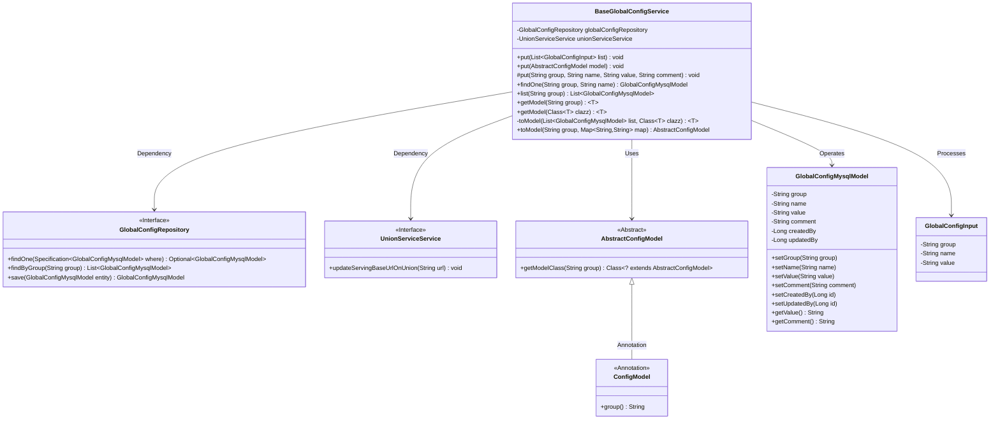
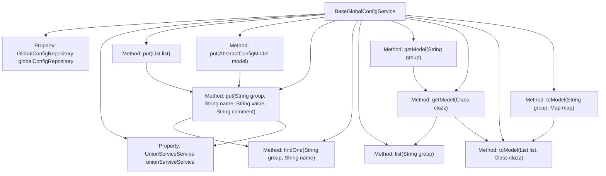

# Basic Information

|      |      |
|------|------|
| Name | BaseGlobalConfigService |
| Language | .java |
| Code Path | WeFe/serving/serving-service/src/main/java/com/welab/wefe/serving/service/service/globalconfig/BaseGlobalConfigService.java |
| Package Name | com.welab.wefe.serving.service.service.globalconfig |
| Dependencies | ['com.alibaba.fastjson.JSON', 'com.alibaba.fastjson.JSONObject', 'com.alibaba.fastjson.PropertyNamingStrategy', 'com.alibaba.fastjson.serializer.SerializeConfig', 'com.alibaba.fastjson.serializer.SerializerFeature', 'com.welab.wefe.common.data.mysql.Where', 'com.welab.wefe.common.exception.StatusCodeWithException', 'com.welab.wefe.common.fieldvalidate.secret.Secret', 'com.welab.wefe.common.fieldvalidate.secret.SecretUtil', 'com.welab.wefe.common.util.JObject', 'com.welab.wefe.common.util.StringUtil', 'com.welab.wefe.common.web.TempRsaCache', 'com.welab.wefe.common.web.util.CurrentAccountUtil', 'com.welab.wefe.serving.service.database.entity.GlobalConfigMysqlModel', 'com.welab.wefe.serving.service.database.repository.GlobalConfigRepository', 'com.welab.wefe.serving.service.dto.globalconfig.base.AbstractConfigModel', 'com.welab.wefe.serving.service.dto.globalconfig.base.ConfigModel', 'com.welab.wefe.serving.service.dto.globalconfig.base.GlobalConfigInput', 'com.welab.wefe.serving.service.service.CacheObjects', 'com.welab.wefe.serving.service.service.UnionServiceService', 'org.apache.commons.lang3.StringUtils', 'org.springframework.beans.factory.annotation.Autowired', 'org.springframework.data.jpa.domain.Specification', 'java.util.List', 'java.util.Map', 'java.util.Objects'] |
| Brief Description | The BaseGlobalConfigService class provides global configuration management functionality, supporting CRUD operations, including batch processing, model conversion, and sensitive field decryption. |

# Description

BaseGlobalConfigService is a service class designed for managing global configurations, providing functionalities for adding, deleting, modifying, and querying configurations. It interacts with the database through GlobalConfigRepository and supports batch operations as well as adding or updating individual records. The class includes multiple put methods to handle different forms of configuration inputs, such as lists and abstract configuration models. When updating configurations, it checks whether an update is necessary and performs format processing on specific fields (e.g., serving_base_url). Additionally, the class offers query functionalities, such as retrieving configuration lists by group or converting configurations into model objects. The toModel method supports restoring a Map to an AbstractConfigModel and decrypts fields marked with @Secret. The entire service class ensures thread safety through synchronized methods and logs the operator ID during updates.

# Class Summary

| Name   | Type  | Description |
|-------|------|-------------|
| BaseGlobalConfigService | class | The BaseGlobalConfigService class provides global configuration management functionality, supporting CRUD operations. It includes methods for batch updating configurations, single-record updates, querying configurations by group, converting configurations to model objects, and handles logic such as field encryption and URL formatting. |

## Class BaseGlobalConfigService

|      |      |
|------|------|
| Access Modifier | public |
| Type | class |
| Name | BaseGlobalConfigService |
| Description | The BaseGlobalConfigService class provides global configuration management functionality, supporting CRUD operations. It includes methods for batch updating configurations, single-record updates, querying configurations by group, converting configurations to model objects, and handles logic such as field encryption and URL formatting. |

### UML Class Diagram

Class Diagram Description:
BaseGlobalConfigService is a core configuration service class responsible for CRUD operations of global configurations. It depends on GlobalConfigRepository for database operations and utilizes UnionServiceService for union service updates. The class provides multiple put methods for configuration updates, supporting batch operations and model conversion, including processing logic for AbstractConfigModel and its subclasses. Group management is achieved through the ConfigModel annotation, with GlobalConfigMysqlModel serving as the database entity for storing configuration items. The entire design reflects the complete lifecycle of configuration management, encompassing serialization, validation, storage, and transformation functionalities.

### Internal Method Call Graph

This flowchart illustrates the core structure and method invocation relationships of the BaseGlobalConfigService class. The class contains two auto-wired dependencies and seven core methods, with three overloaded versions of the put method handling different parameter types for configuration updates. The key method put(String group, String name, String value, String comment) serves as the final executor, being called by other put methods and involving database queries, field validation, and special processing logic. Query-related methods form a call chain: getModel ultimately relies on list and toModel methods for data transformation. The class primarily implements CRUD operations for configuration items and model conversion functionality.

### Field List

| Name  | Type  | Description |
|-------|-------|------|
| unionServiceService | UnionServiceService | Automatically inject the UnionServiceService instance. |
| globalConfigRepository | GlobalConfigRepository | Automatically inject global configuration repository instances. |

### Method List

| Name  | Type  | Description |
|-------|-------|------|
| getModel | T | This method retrieves the corresponding configuration model class based on the passed group name and calls another method to return an instance of that class. |
| findOne | GlobalConfigMysqlModel | This method retrieves the specified global configuration item by group and name from the database through conditional query, returning null if no result is found. |
| put | void | The synchronous method `put` is used to update or create configuration items. It checks for the existence of a configuration with the same name and skips if there are no changes. If the configuration name is `serving_base_url` or `intranet_base_uri`, it ensures the value ends with a `/`. It updates the value, modifier, and remarks, and in specific cases, calls `unionServiceService` for updates. Finally, it saves the configuration. |
| put | void | The method `put` saves the configuration model to the database: 1. Field names are converted to underscore format; 2. Null values are retained. After parsing JSON, null values are skipped, and non-null values are stored by group name and field name. |
| put | void | The method iterates through the input list, calling the put method one by one to process configuration items, with parameters including group, name, value, and empty extension items. It throws a StatusCodeWithException in case of exceptions. |
| toModel | T | Convert the MySQL configuration list into an object of the specified type, returning null for an empty list, otherwise converting it into a JSON object first and then performing the conversion. |
| toModel | AbstractConfigModel | Convert a Map into an AbstractConfigModel object of the specified group, decrypt encrypted fields, and return the model instance. |
| list | List<GlobalConfigMysqlModel> | This method returns a collection of MySQL models that match the specified group query for the global configuration list. |
| getModel | T | Java Method: Retrieve configuration group data based on class annotations and convert it into an instance of the specified model class. |

