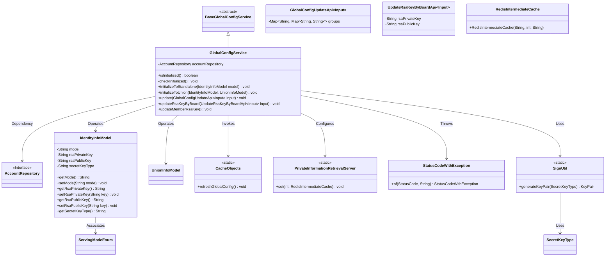
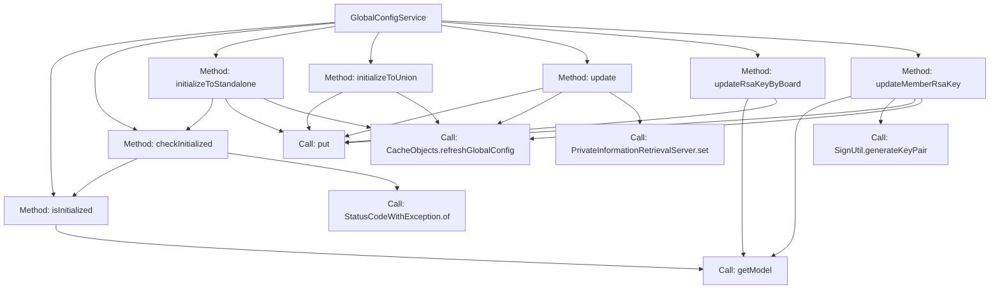
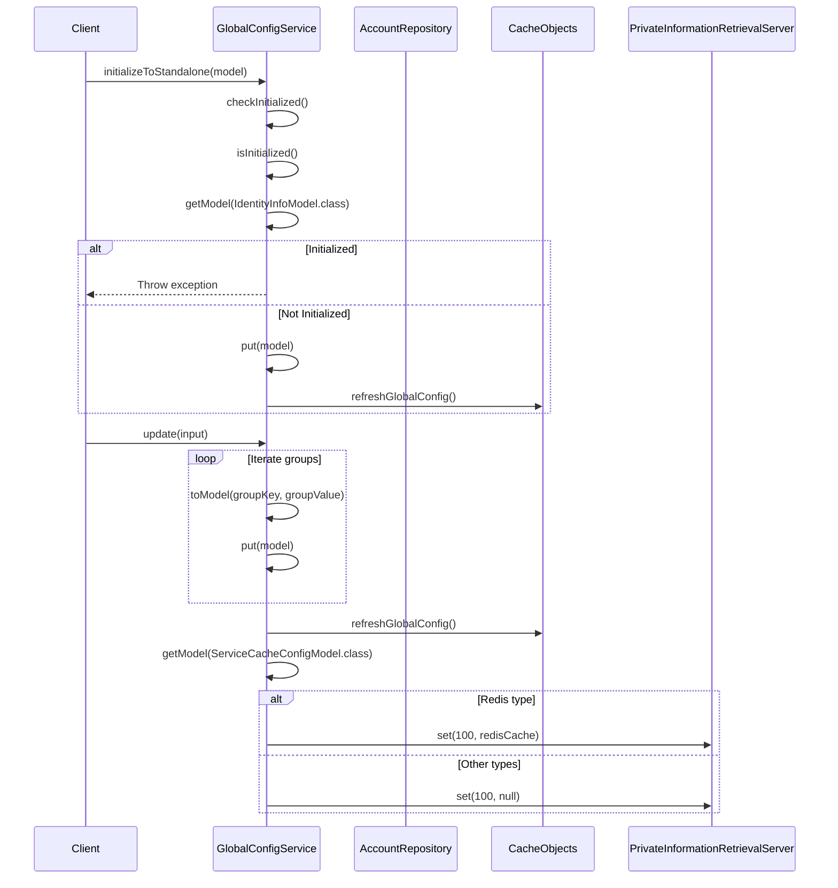

# Basic Information

|      |      |
|------|------|
| Name | GlobalConfigService |
| Language | .java |
| Code Path | WeFe/serving/serving-service/src/main/java/com/welab/wefe/serving/service/service/globalconfig/GlobalConfigService.java |
| Package Name | com.welab.wefe.serving.service.service.globalconfig |
| Dependencies | ['com.welab.wefe.common.StatusCode', 'com.welab.wefe.common.constant.SecretKeyType', 'com.welab.wefe.common.exception.StatusCodeWithException', 'com.welab.wefe.common.util.SignUtil', 'com.welab.wefe.common.web.util.CurrentAccountUtil', 'com.welab.wefe.common.web.util.DatabaseEncryptUtil', 'com.welab.wefe.mpc.pir.server.PrivateInformationRetrievalServer', 'com.welab.wefe.serving.service.api.system.GlobalConfigUpdateApi', 'com.welab.wefe.serving.service.api.system.UpdateRsaKeyByBoardApi', 'com.welab.wefe.serving.service.database.entity.AccountMySqlModel', 'com.welab.wefe.serving.service.database.repository.AccountRepository', 'com.welab.wefe.serving.service.dto.globalconfig.IdentityInfoModel', 'com.welab.wefe.serving.service.dto.globalconfig.ServiceCacheConfigModel', 'com.welab.wefe.serving.service.dto.globalconfig.UnionInfoModel', 'com.welab.wefe.serving.service.dto.globalconfig.base.AbstractConfigModel', 'com.welab.wefe.serving.service.enums.ServingModeEnum', 'com.welab.wefe.serving.service.service.CacheObjects', 'com.welab.wefe.serving.service.utils.RedisIntermediateCache', 'org.springframework.beans.factory.annotation.Autowired', 'org.springframework.stereotype.Service', 'org.springframework.transaction.annotation.Transactional', 'java.security.NoSuchAlgorithmException', 'java.util.Map'] |
| Brief Description | The GlobalConfigService provides system initialization, configuration updates, and RSA key management functionalities. It supports both standalone and federated mode initialization, checks system status, and maintains configuration synchronization through cache refresh. |

# Description

The `GlobalConfigService` is a service class that inherits from `BaseGlobalConfigService`, primarily used for managing system initialization and configuration updates. It provides the `isInitialized` method to check whether the system is initialized, along with two initialization modes: standalone mode `initializeToStandalone` and union mode `initializeToUnion`. The class also includes the `update` method for updating global configurations, as well as the `updateRsaKeyByBoard` and `updateMemberRsaKey` methods for handling RSA key updates. These operations trigger a refresh of the global configuration cache. The service utilizes annotations for dependency injection and transaction management to ensure atomicity of operations. Some code segments are commented out, potentially involving permission checks and administrator operation restrictions.

# Class Summary

| Name   | Type  | Description |
|-------|------|-------------|
| GlobalConfigService | class | The GlobalConfigService provides system initialization, configuration updates, and RSA key management functionalities. It includes both standalone and federated initialization methods, supports configuration updates and cache refresh, as well as RSA key generation and synchronization operations. |

## Class GlobalConfigService

|      |      |
|------|------|
| Access Modifier | @Service;public |
| Type | class |
| Name | GlobalConfigService |
| Description | The GlobalConfigService provides system initialization, configuration updates, and RSA key management functionalities. It includes both standalone and federated initialization methods, supports configuration updates and cache refresh, as well as RSA key generation and synchronization operations. |

### UML Class Diagram

This class diagram illustrates GlobalConfigService as the core configuration service, inheriting from BaseGlobalConfigService, accessing data through AccountRepository, and managing configuration models such as IdentityInfoModel and UnionInfoModel. The service provides system initialization, configuration updates, key management, and other functionalities, relying on CacheObjects for cache refresh, using StatusCodeWithException for exception handling, and interacting with encryption tool SignUtil and caching component PrivateInformationRetrievalServer. The overall structure reflects the core processes of configuration management and key dependency relationships.

### Internal Method Call Graph

The flowchart illustrates the main method invocation relationships of the GlobalConfigService class, including initialization checks, system configuration initialization, update operations, and key management modules. The sequence diagram details the execution flows of two core methods, initializeToStandalone and update, covering exception handling, model operations, and cache refresh procedures. This service primarily manages global system configurations, supports multiple initialization approaches, implements configuration update logic, and ensures real-time configuration through caching mechanisms.

### Field List

| Name  | Type  | Description |
|-------|-------|------|
| accountRepository | AccountRepository | Use @Autowired to automatically inject an instance of AccountRepository. |

### Method List

| Name  | Type  | Description |
|-------|-------|------|
| checkInitialized | void | Check if the system has been initialized, and if so, throw an exception indicating that the operation cannot be repeated. |
| isInitialized | boolean | Check if the IdentityInfoModel class model has been initialized. Return true if it exists, otherwise false. |
| update | void | Update global configurations, process input groups and convert them into models, then refresh the cache. If the cache type is Redis, configure the private information retrieval server to use Redis; otherwise, set it to null. |
| updateRsaKeyByBoard | void | This method is used to update RSA keys. It first checks whether the system is in standalone mode, and if so, throws an exception. In non-standalone mode, it updates the public and private keys and saves them. |
| updateMemberRsaKey | void | The method `updateMemberRsaKey` is used to update a member's RSA key. It generates a key pair and sets it in the model, handles exceptions, updates the model mode to standalone, notifies the federation service, and refreshes the global configuration. |
| initializeToUnion | void | The method `initializeToUnion` merges the data from `identityInfoModel` and `unionInfoModel`, and refreshes the global configuration. |
| initializeToStandalone | void | Initialize the method in standalone mode, check the status, then store the model and refresh the global configuration. Exceptions may be thrown. |

