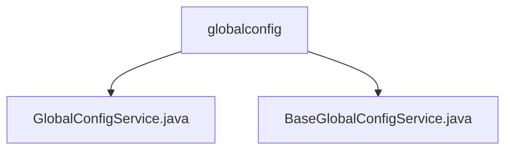

# Basic Information

|      |      |
|------|------|
| Name | globalconfig |
| Language | .java |
| Code Path | WeFe/serving/serving-service/src/main/java/com/welab/wefe/serving/service/service/globalconfig |
| Package Name | docs.serving.serving-service.src.main.java.com.welab.wefe.serving.service.service.globalconfig |
| Brief Description | The GlobalConfigService inherits from BaseGlobalConfigService and is responsible for system initialization, configuration updates, and RSA key management, supporting both standalone and federated modes. The BaseGlobalConfigService provides CRUD operations for global configurations, supporting batch operations, field decryption, and thread safety. |

# Description

## Overview  
The core responsibility of this module is to manage the initialization and maintenance of system-wide configurations, supporting multi-mode initialization and secure update mechanisms. The interface specifications include methods such as initialization check (isInitialized), standalone/union mode initialization (initializeToStandalone/ToUnion), and configuration updates (update). Key data structures involve the AbstractConfigModel base class and encrypted fields marked with the @Secret annotation. External dependencies include RSA key management and the database storage layer (GlobalConfigRepository). For example, standalone initialization mode is suitable for single-node deployments, while union mode is designed for distributed scenarios.  

## Key Business Scenarios  
The module handles configuration loading during system startup and dynamic updates at runtime, similar to a configuration center pattern. Typical workflows include: invoking the initialize method during initial deployment and performing hot updates via the update method during runtime. In security scenarios, methods like updateRsaKeyByBoard facilitate key rotation. For instance, updating serving_base_url triggers automatic format validation. All operations are guaranteed atomicity through transactional annotations, and the thread-safe design supports high-concurrency access.

### Package Internal Structure View

This flowchart displays two service class files under the globalconfig directory: GlobalConfigService.java and BaseGlobalConfigService.java. Both files reside at the same level, directly subordinate to the globalconfig directory without deeper nesting. The diagram clearly presents a simple file hierarchy structure, aligning with the original path information.

# File List

| Name   | Type  | Description |
|-------|------|-------------|
| [GlobalConfigService.java](GlobalConfigService.md) | file | The GlobalConfigService provides system initialization, configuration updates, and RSA key management functionalities. It supports both standalone and federated mode initialization, checks system status, and maintains configuration synchronization through cache refresh. |
| [BaseGlobalConfigService.java](BaseGlobalConfigService.md) | file | The BaseGlobalConfigService class provides global configuration management capabilities, supporting CRUD operations, including batch processing, model conversion, and sensitive field decryption. |

