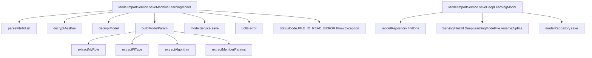
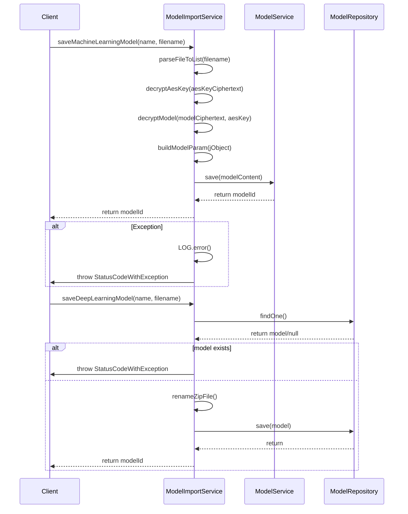

# Basic Information

|      |      |
|------|------|
| Name | ModelImportService |
| Language | .java |
| Code Path | WeFe/serving/serving-service/src/main/java/com/welab/wefe/serving/service/service/model/ModelImportService.java |
| Package Name | com.welab.wefe.serving.service.service.model |
| Dependencies | ['com.welab.wefe.common.StatusCode', 'com.welab.wefe.common.exception.StatusCodeWithException', 'com.welab.wefe.common.util', 'com.welab.wefe.common.web.util.CurrentAccountUtil', 'com.welab.wefe.common.web.util.ModelMapper', 'com.welab.wefe.common.wefe.enums.Algorithm', 'com.welab.wefe.common.wefe.enums.FederatedLearningType', 'com.welab.wefe.common.wefe.enums.JobMemberRole', 'com.welab.wefe.serving.service.api.model.SaveModelApi', 'com.welab.wefe.serving.service.database.entity.TableModelMySqlModel', 'com.welab.wefe.serving.service.database.repository.TableModelRepository', 'com.welab.wefe.serving.service.dto.MemberParams', 'com.welab.wefe.serving.service.enums.ServiceTypeEnum', 'com.welab.wefe.serving.service.service.CacheObjects', 'com.welab.wefe.serving.service.service.ModelService', 'com.welab.wefe.serving.service.utils.ServingFileUtil', 'org.slf4j.Logger', 'org.slf4j.LoggerFactory', 'org.springframework.beans.factory.annotation.Autowired', 'org.springframework.stereotype.Service', 'org.springframework.transaction.annotation.Transactional', 'java.io.IOException', 'java.util.List'] |
| Brief Description | The ModelImportService provides functionality for saving machine learning and deep learning models. Machine learning models are saved by parsing encrypted files, decrypting the content, and constructing parameters, while deep learning models verify name uniqueness before saving file information to the database. Both processes handle exceptions and log events. |

# Description

This service class implements the import functionality for machine learning and deep learning models. The machine learning model import process includes: parsing encrypted files, decrypting AES keys, decrypting model data, constructing model parameters, and saving them. For deep learning model imports, it checks name uniqueness, processes compressed files, and saves metadata. Both types of models support transaction rollback and provide comprehensive error handling and logging. Key operations involve file parsing, data decryption, parameter extraction, and database persistence, utilizing various encryption algorithms and type conversions.

# Class Summary

| Name   | Type  | Description |
|-------|------|-------------|
| ModelImportService | class | The ModelImportService provides model import functionality, supporting both machine learning and deep learning models. For machine learning models, it parses encrypted files, decrypts parameters, constructs the model content, and then saves it. For deep learning models, it verifies name uniqueness before saving the file information to the database. In case of exceptions, it logs the error and displays a prompt. |


## Class ModelImportService

|      |      |
|------|------|
| Access Modifier | @Service;public |
| Type | class |
| Name | ModelImportService |
| Description | The ModelImportService provides model import functionality, supporting both machine learning and deep learning models. For machine learning models, it parses encrypted files, decrypts parameters, constructs the model content, and then saves it. For deep learning models, it verifies name uniqueness before saving the file information to the database. In case of exceptions, it logs the error and displays a prompt. |


### UML Class Diagram

```mermaid
classDiagram
    class ModelImportService {
        -Logger LOG
        -ModelService modelService
        -TableModelRepository modelRepository
        +saveMachineLearningModel(String name, String filename) String
        -buildModelParam(JObject jObject) SaveModelApi$Input
        -extractMyRole(JObject jObject) JobMemberRole
        -decryptModel(String modelCiphertext, String aesKey) JObject
        -decryptAesKey(String aesKeyCiphertext) String
        -parseFileToList(String filename) List~String~
        -extractAlgorithm(JObject jobj) Algorithm
        -extractFlType(JObject jobj) FederatedLearningType
        -extractMemberParams(JObject jobj) List~MemberParams~
        +saveDeepLearningModel(String name, String filename) String
    }

    class ModelService {
        <<Interface>>
        +save(SaveModelApi$Input modelContent) String
    }

    class TableModelRepository {
        <<Interface>>
        +findOne(String field, Object value, Class~T~ clazz) T
        +save(TableModelMySqlModel model) void
    }

    class SaveModelApi$Input {
        +setServiceId(String serviceId)
        +setName(String name)
        +setMyRole(JobMemberRole myRole)
        +setFlType(FederatedLearningType flType)
        +setAlgorithm(Algorithm algorithm)
        +setModelParam(String modelParam)
        +setMemberParams(List~MemberParams~ memberParams)
        +setScoresDistribution(String scoresDistribution)
        +setScoreCardInfo(String scoreCardInfo)
    }

    class ServingFileUtil {
        <<Utility>>
        +getBaseDir(FileType type) Path
        +DeepLearningModelFile
    }

    class JObject {
        +create(String json) JObject
        +getString(String key) String
        +getJSONList(String key) List~JObject~
        +append(String key, Object value) JObject
    }

    class ModelMapper {
        <<Utility>>
        +maps(List~JObject~ source, Class~T~ targetClass) List~T~
    }

    ModelImportService --> ModelService : depends
    ModelImportService --> TableModelRepository : depends
    ModelImportService --> ServingFileUtil : depends
    ModelImportService --> JObject : depends
    ModelImportService --> ModelMapper : depends
    SaveModelApi$Input --> JobMemberRole : contains
    SaveModelApi$Input --> FederatedLearningType : contains
    SaveModelApi$Input --> Algorithm : contains
    SaveModelApi$Input --> MemberParams : contains
```

This code demonstrates a model import service class `ModelImportService` that provides functionality for saving machine learning and deep learning models. The class depends on `ModelService` and `TableModelRepository` interfaces for model storage operations, uses `ServingFileUtil` for file path handling, and parses JSON data through `JObject`. The core method `saveMachineLearningModel` implements the model file parsing, decryption, and parameter construction process, while `saveDeepLearningModel` handles the saving logic for deep learning models. The class diagram clearly illustrates the relationships and dependencies among these classes.


### Internal Method Call Graph





This code demonstrates two core methods of the ModelImportService class: saveMachineLearningModel and saveDeepLearningModel. The flowchart clearly presents the calling relationships between methods, while the sequence diagram details the complete process from client invocation to final return. The saveMachineLearningModel primarily handles the parsing, decryption, and saving of machine learning models, whereas saveDeepLearningModel focuses on name validation and file renaming operations for deep learning models. Both methods include comprehensive exception handling mechanisms to ensure proper error logging and error message returns when issues occur.

### Field List

| Name  | Type  | Description |
|-------|-------|------|
| modelService | ModelService | Using @Autowired to automatically inject an instance of ModelService. |
| LOG = LoggerFactory.getLogger(this.getClass()) | Logger | Declare a protected final logger instance for log output of the current class. |
| modelRepository | TableModelRepository | Automatically inject the TableModelRepository instance. |

### Method List

| Name  | Type  | Description |
|-------|-------|------|
| parseFileToList | List<String> | Parse the file content into a list of strings, handle path concatenation and encoding reading, and return each line of text. |
| extractMyRole | JobMemberRole | This method extracts the "myRole" field value from the JSON object and converts it into the JobMemberRole enum type for return. |
| saveMachineLearningModel | String | The method `saveMachineLearningModel` is used to save a machine learning model, which includes parsing files, decrypting AES keys and the model, constructing parameters, and saving. In case of exceptions, it rolls back and logs errors, prompting the reason for the import failure. |
| buildModelParam | SaveModelApi.Input | Method for constructing model parameters: Extract data from JObject to populate the SaveModelApi.Input object, including model ID, name, role, type, algorithm, parameters, member parameters, score distribution, and scorecard information. |
| decryptAesKey | String | Decrypt the AES key using the private key by invoking the `decryptByPrivateKey` method of `SignUtil`, passing in the ciphertext, private key, and key type parameters. |
| decryptModel | JObject | This method uses an AES key to decrypt the model ciphertext and returns the decrypted JSON object. |
| extractAlgorithm | Algorithm | The method extracts the algorithm type from the JSON object by obtaining the string via the key "algorithm" and converting it into an Algorithm enum value. |
| extractFlType | FederatedLearningType | Extract the flType field from the JObject and convert it to the FederatedLearningType enum type. |
| extractMemberParams | List<MemberParams> | The method extracts the memberParams list from the JObject and maps it to a list of MemberParams objects for return. |
| saveDeepLearningModel | String | Methods for Saving Deep Learning Models: Check the uniqueness of the name, generate the storage path, set model attributes (ID, path, filename, usage count, etc.), and finally save and return the model ID. If the name is duplicated, an exception will be thrown. |


