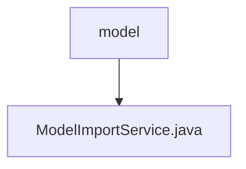

# Basic Information

|      |      |
|------|------|
| Name | model |
| Language | .java |
| Code Path | WeFe/serving/serving-service/src/main/java/com/welab/wefe/serving/service/service/model |
| Package Name | docs.serving.serving-service.src.main.java.com.welab.wefe.serving.service.service.model |
| Brief Description | The ModelImportService provides functionality for saving machine learning and deep learning models. Machine learning models are saved by parsing encrypted files, decrypting the content, and constructing parameters; deep learning models verify name uniqueness before saving file information to the database. Both handle exceptions and log events. |

# Description

This service class implements the import functionality for machine learning and deep learning models. The machine learning model import process includes: parsing encrypted files, decrypting the AES key, decrypting model data, constructing model parameters, and saving them. For deep learning model imports, it checks name uniqueness before processing compressed files and saving metadata. Both types of models support transaction rollback and provide comprehensive error handling and logging. Key operations involve file parsing, data decryption, parameter extraction, and database persistence, utilizing various encryption algorithms and type conversions.

### Package Internal Structure View

This flowchart illustrates a simple hierarchical structure of the model service module in the WeFe project. The root node "model" represents the model service directory, which contains a specific implementation file "ModelImportService.java". This structure clearly reflects the subordinate relationship between the core file and its parent directory in the model service module, adhering to the typical layered design pattern of Java projects.

# File List

| Name   | Type  | Description |
|-------|------|-------------|
| [ModelImportService.java](ModelImportService.md) | file | The ModelImportService provides functionality for saving machine learning and deep learning models. Machine learning models are saved by parsing encrypted files, decrypting the content, and constructing parameters; deep learning models verify name uniqueness before saving file information to the database. Both processes handle exceptions and log events. |

