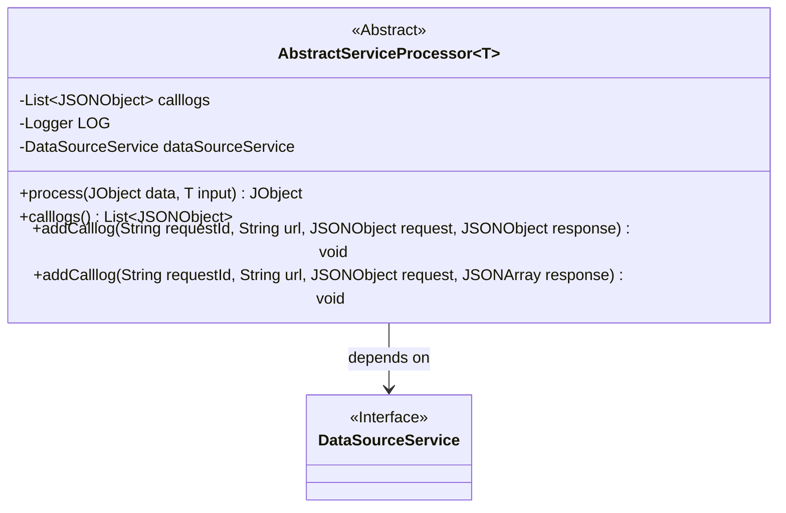
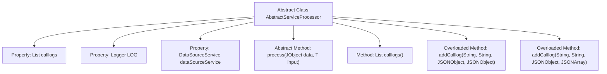

# Basic Information

|      |      |
|------|------|
| Name | AbstractServiceProcessor |
| Language | .java |
| Code Path | WeFe/serving/serving-service/src/main/java/com/welab/wefe/serving/service/service_processor/AbstractServiceProcessor.java |
| Package Name | com.welab.wefe.serving.service.service_processor |
| Dependencies | ['java.util.ArrayList', 'java.util.List', 'org.slf4j.Logger', 'org.slf4j.LoggerFactory', 'com.alibaba.fastjson.JSONArray', 'com.alibaba.fastjson.JSONObject', 'com.welab.wefe.common.util.JObject', 'com.welab.wefe.common.web.Launcher', 'com.welab.wefe.serving.service.service.DataSourceService'] |
| Brief Description | Abstract service processor class, which includes logging, data source services, and call log management functions, supports processing generic data and adding two types of call logs. |

# Description

This is an abstract class named AbstractServiceProcessor that uses a generic type T. It contains a list called calllogs for storing invocation logs, a logger LOG, and a DataSourceService instance dataSourceService obtained via Launcher. The class defines an abstract method process for handling input data and returning a JObject. It provides a method calllogs to retrieve the invocation logs, as well as two overloaded addCalllog methods for adding invocation logs (including request ID, URL, request, and response—either JSONObject or JSONArray) to the list.

# Class Summary

| Name   | Type  | Description |
|-------|------|-------------|
| AbstractServiceProcessor | class | Abstract service processor class providing logging functionality, including abstract processing methods, methods for obtaining logs, and adding request-response logs. |

## Class AbstractServiceProcessor

|      |      |
|------|------|
| Access Modifier | public abstract |
| Type | class |
| Name | AbstractServiceProcessor |
| Description | Abstract service processor class providing logging functionality, including abstract processing methods, methods for obtaining logs, and adding request-response logs. |

### UML Class Diagram

This code defines a generic abstract class AbstractServiceProcessor<T>, primarily used for processing service requests and logging call records. The class contains an abstract method process() for handling business logic, two overloaded addCalllog() methods for logging responses in different formats, and a calllogs() method to retrieve the log list. It maintains a DataSourceService instance for data source operations, with the instance dynamically obtained via Launcher.getBean(). Designed as an extensible base class, subclasses need to implement specific process() method logic.

### Internal Method Call Graph

This flowchart illustrates the core structure of the AbstractServiceProcessor abstract class, containing two logging properties and one service property. It defines one abstract processing method and three concrete methods. The addCalllog method supports two different response types (JSONObject/JSONArray) through overloading, the calllogs() method provides access to the log list, and the process() abstract method requires implementation by subclasses. All methods revolve around core data processing and logging functionalities, forming a complete service processing framework.

### Field List

| Name  | Type  | Description |
|-------|-------|------|
| LOG = LoggerFactory.getLogger(getClass()) | Logger | A protected and immutable logger instance is defined in the class for logging the current class's information. |
| calllogs = new ArrayList<>() | List<JSONObject> | Declare a protected JSONObject list variable named calllogs, initialized as an empty ArrayList. |
| dataSourceService = Launcher.getBean(DataSourceService.class) | DataSourceService | Obtain the DataSourceService instance and assign it to the protected final variable dataSourceService. |

### Method List

| Name  | Type  | Description |
|-------|-------|------|
| process | JObject | Abstract method `process`, which takes a `JObject` and a generic type `T` as input, returns a `JObject`, and may throw exceptions. |
| calllogs | List<JSONObject> | The method to obtain the call log list returns a List collection of JSONObject type. |
| addCalllog | void | This method is used to add call logs, recording the request ID, URL, request and response data into a JSON object and storing it in a list. |
| addCalllog | void | This method is used to add call logs, recording the request ID, URL, request parameters, and response data to the log collection. |

