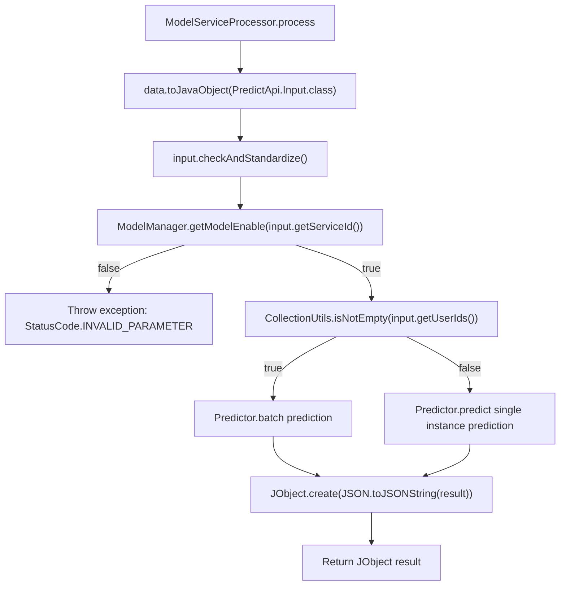

# Basic Information

|      |      |
|------|------|
| Name | ModelServiceProcessor |
| Language | .java |
| Code Path | WeFe/serving/serving-service/src/main/java/com/welab/wefe/serving/service/service_processor/ModelServiceProcessor.java |
| Package Name | com.welab.wefe.serving.service.service_processor |
| Dependencies | ['com.alibaba.fastjson.JSON', 'com.welab.wefe.common.StatusCode', 'com.welab.wefe.common.exception.StatusCodeWithException', 'com.welab.wefe.common.util.JObject', 'com.welab.wefe.serving.sdk.dto.PredictResult', 'com.welab.wefe.serving.service.api.predict.PredictApi', 'com.welab.wefe.serving.service.database.entity.TableModelMySqlModel', 'com.welab.wefe.serving.service.manager.ModelManager', 'com.welab.wefe.serving.service.predicter.Predictor', 'com.welab.wefe.serving.service.service.CacheObjects', 'org.apache.commons.collections4.CollectionUtils'] |
| Brief Description | The ModelServiceProcessor handles model prediction requests, checks the model status, and supports both batch and single predictions, returning results in JSON format. |

# Description

The ModelServiceProcessor class inherits from AbstractServiceProcessor and handles TableModelMySqlModel type data. Its process method receives JObject data and a model, converts them into a PredictApi.Input object, and then performs standardized validation. It first checks whether the model is enabled—if not, an exception is thrown. It supports batch prediction (invoking Predictor.batch when the input contains a userIds list) and single prediction (invoking Predictor.predict), with both results converted to JObject for return.

# Class Summary

| Name   | Type  | Description |
|-------|------|-------------|
| ModelServiceProcessor | class | The ModelServiceProcessor handles prediction requests, checks the model status, and then executes batch or single predictions, returning results in JSON format. |


## Class ModelServiceProcessor

|      |      |
|------|------|
| Access Modifier | public |
| Type | class |
| Name | ModelServiceProcessor |
| Description | The ModelServiceProcessor handles prediction requests, checks the model status, and then executes batch or single predictions, returning results in JSON format. |


### UML Class Diagram

```mermaid
classDiagram
    class AbstractServiceProcessor~T~ {
        <<Abstract>>
        +process(JObject data, T model) JObject throws StatusCodeWithException
    }

    class ModelServiceProcessor {
        +process(JObject data, TableModelMySqlModel model) JObject throws StatusCodeWithException
    }

    class PredictApi {
        <<Interface>>
    }

    class PredictApi$Input {
        +checkAndStandardize()
        +String getServiceId()
        +List~String~ getUserIds()
        +String getRequestId()
        +String getUserId()
        +Map~String,Object~ getFeatureDataMap()
        +Object getFeatureData()
    }

    class ModelManager {
        <<Static>>
        +getModelEnable(String serviceId) boolean
    }

    class StatusCode {
        <<Enum>>
        +INVALID_PARAMETER
        +throwException(String msg) StatusCodeWithException
    }

    class CacheObjects {
        <<Static>>
        +getMemberName() String
    }

    class Predictor {
        <<Static>>
        +batch(String requestId, String serviceId, List~String~ userIds, Map~String,Object~ featureDataMap) PredictResult
        +predict(String requestId, String serviceId, String userId, Object featureData) PredictResult
    }

    class PredictResult {
        // Prediction result class
    }

    class JObject {
        +toJavaObject(Class~T~ clazz) T
        +create(String json) JObject
    }

    AbstractServiceProcessor <|-- ModelServiceProcessor
    ModelServiceProcessor --> PredictApi : Uses input parameters
    ModelServiceProcessor --> ModelManager : Checks model status
    ModelServiceProcessor --> StatusCode : Throws exception
    ModelServiceProcessor --> CacheObjects : Gets member name
    ModelServiceProcessor --> Predictor : Executes prediction
    ModelServiceProcessor --> JObject : Data conversion
    PredictApi <|-- PredictApi$Input
    Predictor --> PredictResult : Generates result
```

This code demonstrates a model service processor `ModelServiceProcessor`, which inherits from the generic abstract class `AbstractServiceProcessor` and specializes in processing `TableModelMySqlModel` type data. Its primary function is to receive prediction requests via `PredictApi.Input`, validate the model status, and then invoke `Predictor` for predictions based on the request type (batch or single). Finally, it converts the results into `JObject` for return. During processing, it checks the model's online status and throws a `StatusCode.INVALID_PARAMETER` exception if the model is not online. The process involves collaboration with multiple utility classes and static methods, showcasing a complete workflow of data validation, business processing, and result conversion.


### Internal Method Call Graph



This code flowchart illustrates the core processing logic of the ModelServiceProcessor class. The flow begins with data conversion and standardization validation, followed by checking model availability, throwing an exception if unavailable. Based on input parameters, it executes either batch prediction or single instance prediction, ultimately converting the prediction results into JObject format for return. The entire process consists of three main stages: input validation, business logic branching, and result encapsulation, demonstrating a typical prediction service workflow.

### Field List

| Name  | Type  | Description |
|-------|-------|------|

### Method List

| Name  | Type  | Description |
|-------|-------|------|
| process | JObject | Process prediction requests, check model status, support batch or single-user prediction, and return results in JSON format. |


