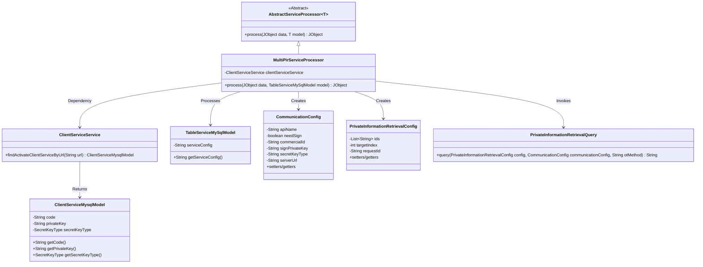
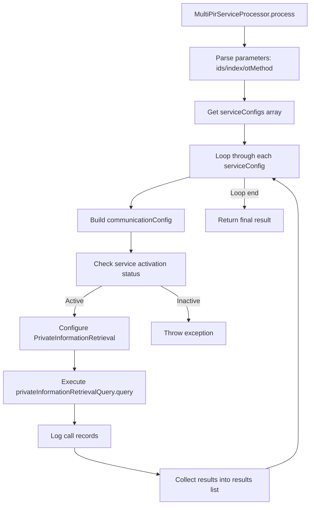

# Basic Information

|      |      |
|------|------|
| Name | MultiPirServiceProcessor |
| Language | .java |
| Code Path | WeFe/serving/serving-service/src/main/java/com/welab/wefe/serving/service/service_processor/MultiPirServiceProcessor.java |
| Package Name | com.welab.wefe.serving.service.service_processor |
| Dependencies | ['java.util.ArrayList', 'java.util.List', 'org.apache.commons.lang3.StringUtils', 'com.alibaba.fastjson.JSONArray', 'com.alibaba.fastjson.JSONObject', 'com.welab.wefe.common.util.JObject', 'com.welab.wefe.common.web.Launcher', 'com.welab.wefe.mpc.commom.Constants', 'com.welab.wefe.mpc.config.CommunicationConfig', 'com.welab.wefe.mpc.pir.sdk.PrivateInformationRetrievalQuery', 'com.welab.wefe.mpc.pir.sdk.config.PrivateInformationRetrievalConfig', 'com.welab.wefe.serving.service.database.entity.ClientServiceMysqlModel', 'com.welab.wefe.serving.service.database.entity.TableServiceMySqlModel', 'com.welab.wefe.serving.service.service.ClientServiceService', 'cn.hutool.core.lang.UUID'] |
| Brief Description | The MultiPirServiceProcessor class handles multi-PIR service requests, parses configurations, invokes queries, logs the results, and returns the response. |

# Description

The MultiPirServiceProcessor is a service processor class that inherits from AbstractServiceProcessor, primarily designed to handle private information retrieval (PIR) requests. It processes the input data by parsing ID lists, indexes, and OT methods, then iterates through the service configuration list to construct communication parameters for each configuration. The processor checks whether the service is active, sets up necessary signature and key information, creates PIR query configurations, and initiates requests. Each request generates a unique ID, logs the call details, and returns the results along with member information. The entire process includes exception handling and result aggregation, ultimately returning a JObject containing all results.

# Class Summary

| Name   | Type  | Description |
|-------|------|-------------|
| MultiPirServiceProcessor | class | The MultiPirServiceProcessor class handles multi-PIR service requests, parses configurations, invokes private information retrieval queries, logs the process, and returns results. |

## Class MultiPirServiceProcessor

|      |      |
|------|------|
| Access Modifier | public |
| Type | class |
| Name | MultiPirServiceProcessor |
| Description | The MultiPirServiceProcessor class handles multi-PIR service requests, parses configurations, invokes private information retrieval queries, logs the process, and returns results. |

### UML Class Diagram

This diagram illustrates the MultiPirServiceProcessor class and its related dependencies. MultiPirServiceProcessor inherits from AbstractServiceProcessor, processes TableServiceMySqlModel data, retrieves service information via ClientServiceService, creates CommunicationConfig and PrivateInformationRetrievalConfig configurations, and invokes PrivateInformationRetrievalQuery to execute queries. It primarily involves a multi-party private information retrieval flow, encompassing key steps such as service configuration parsing, communication parameter setup, and query execution.

### Internal Method Call Graph

This flowchart illustrates the processing flow of the `process` method in the `MultiPirServiceProcessor` class. The method first parses input parameters, then iterates through the service configuration array, constructs communication parameters for each configuration, and verifies service status. It then sets up private information retrieval parameters and executes the query, finally collecting results and returning them. The entire process includes exception handling and call logging to ensure data processing integrity and traceability.

### Field List

| Name  | Type  | Description |
|-------|-------|------|
| clientServiceService = Launcher.getBean(ClientServiceService.class) | ClientServiceService | Obtain the ClientServiceService instance and assign it to the private constant clientServiceService. |

### Method List

| Name  | Type  | Description |
|-------|-------|------|
| process | JObject | Processing JObject data, parsing ids, index, and otMethod, iterating through serviceConfigs to construct communication configurations, invoking private information retrieval queries, logging the process, and returning the result list. |

