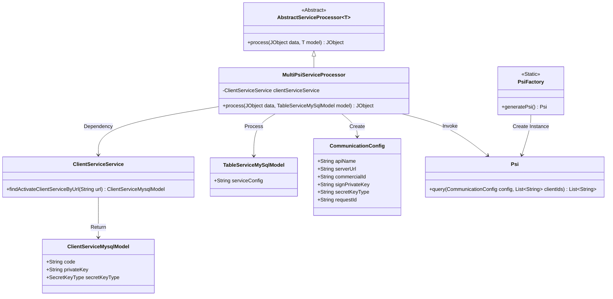
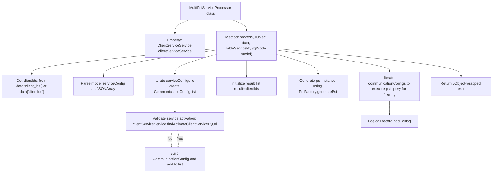
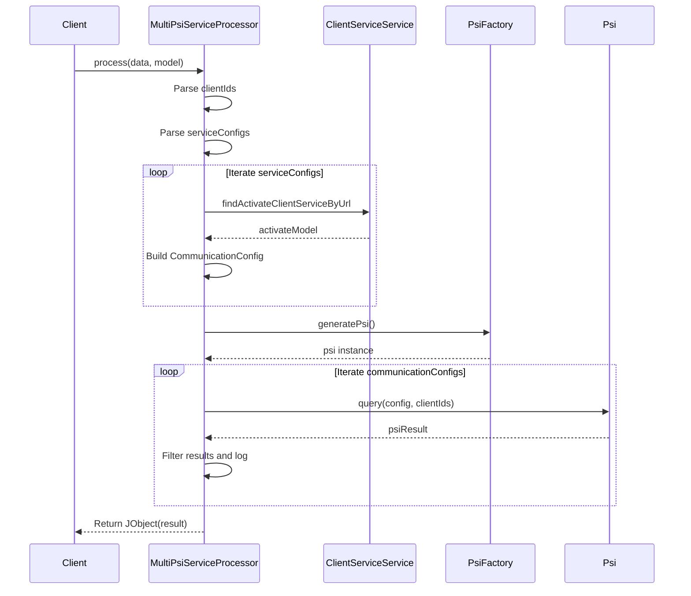

# Basic Information

|      |      |
|------|------|
| Name | MultiPsiServiceProcessor |
| Language | .java |
| Code Path | WeFe/serving/serving-service/src/main/java/com/welab/wefe/serving/service/service_processor/MultiPsiServiceProcessor.java |
| Package Name | com.welab.wefe.serving.service.service_processor |
| Dependencies | ['java.util.ArrayList', 'java.util.LinkedList', 'java.util.List', 'java.util.stream.Collectors', 'org.apache.commons.collections.CollectionUtils', 'com.alibaba.fastjson.JSONArray', 'com.alibaba.fastjson.JSONObject', 'com.welab.wefe.common.util.JObject', 'com.welab.wefe.common.web.Launcher', 'com.welab.wefe.mpc.config.CommunicationConfig', 'com.welab.wefe.mpc.psi.sdk.Psi', 'com.welab.wefe.mpc.psi.sdk.PsiFactory', 'com.welab.wefe.serving.service.database.entity.ClientServiceMysqlModel', 'com.welab.wefe.serving.service.database.entity.TableServiceMySqlModel', 'com.welab.wefe.serving.service.service.ClientServiceService'] |
| Brief Description | The MultiPsiServiceProcessor class handles client IDs and service configurations, verifies service activation status and generates communication configurations, filters results through PSI queries and logs call records, ultimately returning a list of matched client IDs. |

# Description

The MultiPsiServiceProcessor class inherits from AbstractServiceProcessor and processes TableServiceMySqlModel data. It retrieves active client services through clientServiceService and constructs a list of CommunicationConfig configurations. It parses the client_ids from the input data, iterates through the service configurations, validates URL validity, and sets communication parameters. Using PsiFactory, it generates a Psi instance, executes queries for each configuration, and progressively filters the client ID list. Finally, it logs the call details and returns the result list. The main processes involve service configuration validation, communication parameter setup, and PSI query handling.

# Class Summary

| Name   | Type  | Description |
|-------|------|-------------|
| MultiPsiServiceProcessor | class | The MultiPsiServiceProcessor class handles multi-PSI service requests, parses client IDs and service configurations, verifies service activation status, generates communication configurations, executes PSI queries, returns results, and logs call records. |

## Class MultiPsiServiceProcessor

|      |      |
|------|------|
| Access Modifier | public |
| Type | class |
| Name | MultiPsiServiceProcessor |
| Description | The MultiPsiServiceProcessor class handles multi-PSI service requests, parses client IDs and service configurations, verifies service activation status, generates communication configurations, executes PSI queries, returns results, and logs call records. |

### UML Class Diagram

This code demonstrates a multi-PSI service processor that inherits from an abstract service processor, primarily handling the matching logic between client IDs and service configurations. It retrieves activated client service models via ClientServiceService, constructs communication configuration objects, utilizes Psi instances generated by PsiFactory for queries, and ultimately returns matching results. The diagram involves 6 core classes and 1 interface, illustrating the complete workflow from configuration parsing to service invocation.

### Internal Method Call Graph

This code implements a multi-PSI service processor, primarily functioning to perform Private Set Intersection (PSI) processing on client ID lists through configured service information. The flowchart illustrates the entire process from initializing configurations and service validation to PSI query filtering, while the sequence diagram details inter-class interactions. The processor first parses input parameters, validates the effectiveness of each communication configuration, then uses the PSI algorithm to progressively filter the client ID list, ultimately returning the intersection results and logging call records. The entire process includes critical steps such as exception handling and service status validation.

### Field List

| Name  | Type  | Description |
|-------|-------|------|
| clientServiceService = Launcher.getBean(ClientServiceService.class) | ClientServiceService | Obtain the ClientServiceService instance from the Launcher and assign it to the private constant clientServiceService. |

### Method List

| Name  | Type  | Description |
|-------|-------|------|
| process | JObject | Processing client IDs and service configurations, verifying service activation status, generating communication configurations and querying PSI results, returning filtered client ID lists. |

