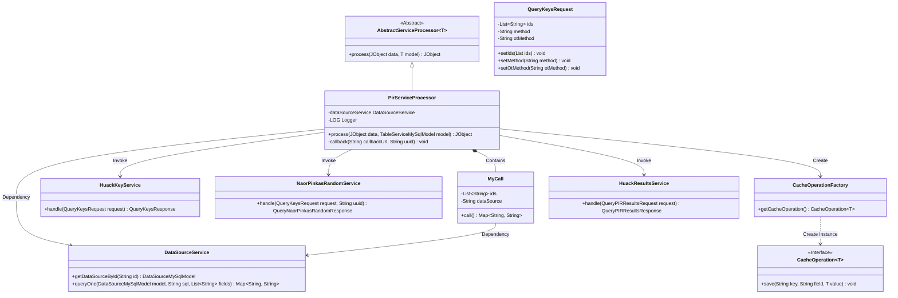
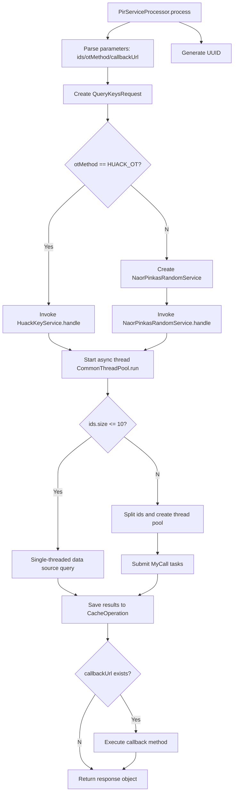

# Basic Information

|      |      |
|------|------|
| Name | PirServiceProcessor |
| Language | .java |
| Code Path | WeFe/serving/serving-service/src/main/java/com/welab/wefe/serving/service/service_processor/PirServiceProcessor.java |
| Package Name | com.welab.wefe.serving.service.service_processor |
| Dependencies | ['java.util.Arrays', 'java.util.HashMap', 'java.util.List', 'java.util.Map', 'java.util.UUID', 'java.util.concurrent.Callable', 'java.util.concurrent.ExecutorService', 'java.util.concurrent.Executors', 'java.util.concurrent.Future', 'org.apache.commons.lang3.StringUtils', 'com.alibaba.fastjson.JSONObject', 'com.google.common.collect.Lists', 'com.welab.wefe.common.CommonThreadPool', 'com.welab.wefe.common.StatusCode', 'com.welab.wefe.common.exception.StatusCodeWithException', 'com.welab.wefe.common.util.JObject', 'com.welab.wefe.mpc.cache.intermediate.CacheOperation', 'com.welab.wefe.mpc.cache.intermediate.CacheOperationFactory', 'com.welab.wefe.mpc.commom.Constants', 'com.welab.wefe.mpc.pir.request.QueryKeysRequest', 'com.welab.wefe.mpc.pir.request.QueryKeysResponse', 'com.welab.wefe.mpc.pir.request.QueryPIRResultsRequest', 'com.welab.wefe.mpc.pir.request.QueryPIRResultsResponse', 'com.welab.wefe.mpc.pir.request.naor.QueryNaorPinkasRandomResponse', 'com.welab.wefe.mpc.pir.server.service.HuackKeyService', 'com.welab.wefe.mpc.pir.server.service.HuackResultsService', 'com.welab.wefe.mpc.pir.server.service.naor.NaorPinkasRandomService', 'com.welab.wefe.serving.service.database.entity.DataSourceMySqlModel', 'com.welab.wefe.serving.service.database.entity.TableServiceMySqlModel', 'com.welab.wefe.serving.service.utils.ServiceUtil', 'cn.hutool.http.HttpGlobalConfig', 'cn.hutool.http.HttpRequest', 'cn.hutool.http.HttpResponse'] |
| Brief Description | The PirServiceProcessor class handles PIR requests, selects different service processing based on the OT method, queries data sources and caches results, with support for callback notifications. |

# Description

The PirServiceProcessor class inherits from AbstractServiceProcessor and handles JObject data and the TableServiceMySqlModel model. Its primary functions include parsing ID lists and OT methods from input data, selecting either HuackKeyService or NaorPinkasRandomService to process requests based on the OT method, and generating responses. It then asynchronously queries the data source, employing either single-threaded or thread-pooled batch queries depending on the number of IDs, with results stored in cache. Callback URL notifications are supported. The inner class MyCall implements the Callable interface for multi-threaded data source queries. The entire process includes exception handling and logging.

# Class Summary

| Name   | Type  | Description |
|-------|------|-------------|
| PirServiceProcessor | class | The PirServiceProcessor class handles PIR requests, processes them using either the HUACK_OT or NAORPINKAS_OT method based on otMethod, queries the data source and caches the results, and supports callback notifications. |

## Class PirServiceProcessor

|      |      |
|------|------|
| Access Modifier | public |
| Type | class |
| Name | PirServiceProcessor |
| Description | The PirServiceProcessor class handles PIR requests, processes them using either the HUACK_OT or NAORPINKAS_OT method based on otMethod, queries the data source and caches the results, and supports callback notifications. |

### UML Class Diagram

This code describes a PIR (Private Information Retrieval) service processor that inherits from an abstract service processor. Its main functionality is to process query requests based on different OT (Oblivious Transfer) methods, retrieving data from data sources via multi-threading and caching results. The class diagram illustrates core component relationships: PirServiceProcessor acts as the main controller, coordinating key services, data source services, and cache operations; MyCall serves as an inner class handling concurrent query tasks; various services (HuackKeyService/NaorPinkasRandomService) implement different OT protocols. The system employs factory pattern for cache operation management, supports callback notification mechanisms, and embodies design principles of separation of concerns and strategy pattern.

### Internal Method Call Graph

This flowchart illustrates the complete execution process of the PIR service processor. It begins by parsing input parameters and generating a request UUID, then selects different cryptographic service processing paths (HUACK_OT or NAORPINKAS_OT) based on the OT method type. An asynchronous thread is then launched to perform data queries, with the decision to use single-threaded or multi-threaded data source queries depending on the ID count. Finally, results are cached with optional callback notification execution. The entire process incorporates exception handling and multi-thread coordination mechanisms to achieve efficient and secure private information retrieval functionality.

### Field List

| Name  | Type  | Description |
|-------|-------|------|

### Method List

| Name  | Type  | Description |
|-------|-------|------|
| callback | void | This method queries results via callback URL and UUID, POSTs the response data to the specified URL, logs request and response details, records errors in case of exceptions, and finally closes the connection. |
| process | JObject | The method processes data query requests, selects different services for processing based on the OT method, caches the query results, and supports callbacks. |

