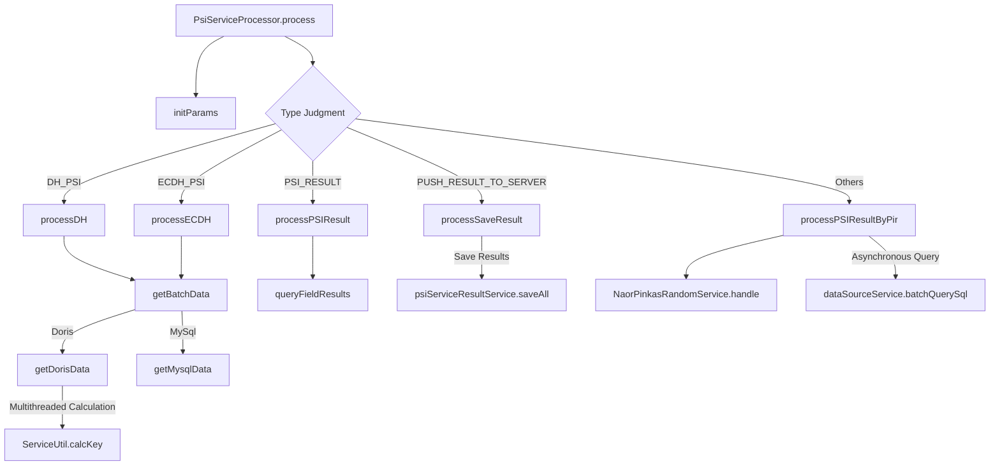
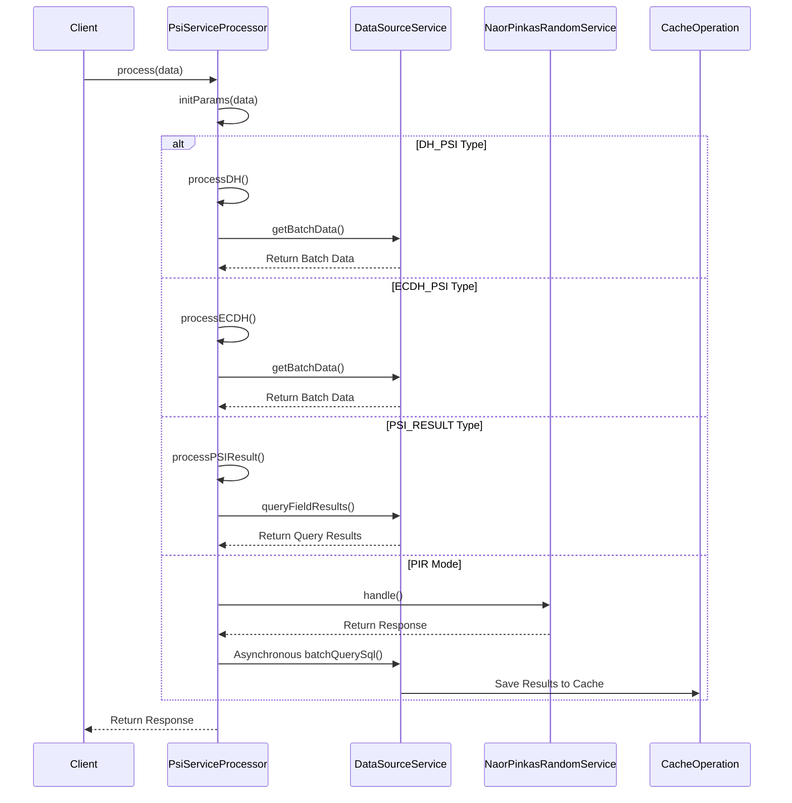

# Basic Information

|      |      |
|------|------|
| Name | PsiServiceProcessor |
| Language | .java |
| Code Path | WeFe/serving/serving-service/src/main/java/com/welab/wefe/serving/service/service_processor/PsiServiceProcessor.java |
| Package Name | com.welab.wefe.serving.service.service_processor |
| Dependencies | ['java.util.ArrayList', 'java.util.Arrays', 'java.util.HashMap', 'java.util.LinkedHashMap', 'java.util.LinkedList', 'java.util.List', 'java.util.Map', 'java.util.Queue', 'java.util.UUID', 'java.util.concurrent.BlockingQueue', 'java.util.concurrent.ConcurrentHashMap', 'java.util.concurrent.ExecutorService', 'java.util.concurrent.Executors', 'java.util.concurrent.LinkedBlockingQueue', 'java.util.concurrent.TimeUnit', 'org.apache.commons.collections.CollectionUtils', 'org.apache.commons.lang3.StringUtils', 'com.alibaba.fastjson.JSONArray', 'com.alibaba.fastjson.JSONObject', 'com.welab.wefe.common.StatusCode', 'com.welab.wefe.common.exception.StatusCodeWithException', 'com.welab.wefe.common.jdbc.base.DatabaseType', 'com.welab.wefe.common.util.JObject', 'com.welab.wefe.common.web.Launcher', 'com.welab.wefe.mpc.cache.intermediate.CacheOperation', 'com.welab.wefe.mpc.cache.intermediate.CacheOperationFactory', 'com.welab.wefe.mpc.commom.Constants', 'com.welab.wefe.mpc.pir.request.QueryKeysRequest', 'com.welab.wefe.mpc.pir.request.naor.QueryNaorPinkasRandomResponse', 'com.welab.wefe.mpc.pir.server.service.naor.NaorPinkasRandomService', 'com.welab.wefe.mpc.psi.request.QueryPrivateSetIntersectionResponse', 'com.welab.wefe.mpc.psi.sdk.Psi', 'com.welab.wefe.mpc.psi.sdk.dh.DhPsiServer', 'com.welab.wefe.mpc.psi.sdk.ecdh.EcdhPsiServer', 'com.welab.wefe.mpc.psi.sdk.util.EcdhUtil', 'com.welab.wefe.serving.service.config.Config', 'com.welab.wefe.serving.service.database.entity.DataSourceMySqlModel', 'com.welab.wefe.serving.service.database.entity.PsiServiceResultMysqlModel', 'com.welab.wefe.serving.service.database.entity.TableServiceMySqlModel', 'com.welab.wefe.serving.service.service.PsiServiceResultService', 'com.welab.wefe.serving.service.utils.ServiceUtil'] |
| Brief Description | The PsiServiceProcessor class handles private set intersection services, supporting both DH and ECDH algorithms. It manages batch data processing, result storage and querying, with compatibility for MySQL and Doris databases. |

# Description

PsiServiceProcessor is a Java class that handles Private Set Intersection (PSI) services, inheriting from AbstractServiceProcessor. It supports two encryption protocols, DH and ECDH, and stores server instances and datasets via ConcurrentHashMap. The class includes multiple processing methods, such as processSaveResult for saving results to the database, processPSIResultByPir for returning label fields via the PIR method, and processDH and processECDH for handling the encryption logic of their respective protocols. It also contains the batch data retrieval method getBatchData, supporting MySQL and Doris databases. Overall, it implements the core functionalities of PSI services, including data encryption, result querying, and storage.

# Class Summary

| Name   | Type  | Description |
|-------|------|-------------|
| PsiServiceProcessor | class | The PsiServiceProcessor class handles Private Set Intersection (PSI) service requests, supports DH and ECDH encryption protocols, manages batch data processing, stores results, and returns label fields via PIR. It includes functions for parameter initialization, data processing, and result storage. |

## Class PsiServiceProcessor

|      |      |
|------|------|
| Access Modifier | public |
| Type | class |
| Name | PsiServiceProcessor |
| Description | The PsiServiceProcessor class handles Private Set Intersection (PSI) service requests, supports DH and ECDH encryption protocols, manages batch data processing, stores results, and returns label fields via PIR. It includes functions for parameter initialization, data processing, and result storage. |

### UML Class Diagram

```mermaid
classDiagram
    class AbstractServiceProcessor~T~ {
        <<Abstract>>
        +process(JObject data, T model) JObject
    }

    class PsiServiceProcessor {
        -ConcurrentHashMap~String, EcdhPsiServer~ ECDH_SERVER_MAP
        -ConcurrentHashMap~String, DhPsiServer~ DH_SERVER_MAP
        -ConcurrentHashMap~String, Integer~ SERVER_DATASET_SIZE
        -ConcurrentHashMap~String, DataSourceMySqlModel~ DATASOURCE_MAP
        -Config config
        -PsiServiceResultService psiServiceResultService
        -int batchSize
        -int numPartitions
        -String requestId
        +process(JObject data, TableServiceMySqlModel model) JObject
        -initParams(JObject data) void
        -processSaveResult(JObject data, TableServiceMySqlModel model) JObject
        -processPSIResultByPir(JObject data, TableServiceMySqlModel model) JObject
        -processPSIResult(JObject data, TableServiceMySqlModel model) JObject
        -queryFieldResults(List~String~ clientIds, TableServiceMySqlModel model) List~String~
        -processDH(JObject data, TableServiceMySqlModel model) JObject
        -processECDH(JObject data, TableServiceMySqlModel model) JObject
        -getDorisData(TableServiceMySqlModel model, DataSourceMySqlModel dataSourceModel, JSONObject dataSource, int currentBatch) List~String~
        -getMysqlData(TableServiceMySqlModel model, DataSourceMySqlModel dataSourceModel, JSONObject dataSource, int currentBatch) List~String~
        -getBatchData(TableServiceMySqlModel model, int currentBatch) List~String~
    }

    class TableServiceMySqlModel {
        +String serviceId
        +String name
        +String dataSource
        +String idsTableName
    }

    class DataSourceMySqlModel {
        +String id
        +String databaseName
        +DatabaseType databaseType
    }

    class QueryPrivateSetIntersectionResponse {
        +String requestId
        +int code
        +List~String~ clientIdByServerKeys
        +List~String~ serverEncryptIds
        +int currentBatch
        +boolean hasNext
        +List~String~ fieldResults
    }

    class PsiServiceResultMysqlModel {
        +String requestId
        +String result
        +String serviceId
        +String serviceName
    }

    class EcdhPsiServer {
        +encryptDatasetMap(Map~Long, String~ clientEncryptedDatasetMap) Map~Long, String~
        +encryptDataset(List~String~ batchData) List~String~
    }

    class DhPsiServer {
        +DhPsiServer(String p)
        +encryptClientDatasetMap(Map~Long, String~ clientEncryptedDatasetMap) Map~Long, String~
        +encryptDataset(List~String~ batchData) List~String~
    }

    class NaorPinkasRandomService {
        +handle(QueryKeysRequest request, String uuid) QueryNaorPinkasRandomResponse
    }

    class QueryKeysRequest {
        +List~String~ ids
        +String method
        +String otMethod
    }

    class QueryNaorPinkasRandomResponse {
        +String uuid
    }

    AbstractServiceProcessor~TableServiceMySqlModel~ <|-- PsiServiceProcessor
    PsiServiceProcessor --> TableServiceMySqlModel : Process
    PsiServiceProcessor --> DataSourceMySqlModel : Query Data Source
    PsiServiceProcessor --> QueryPrivateSetIntersectionResponse : Generate Response
    PsiServiceProcessor --> PsiServiceResultMysqlModel : Store Result
    PsiServiceProcessor --> EcdhPsiServer : ECDH Encryption
    PsiServiceProcessor --> DhPsiServer : DH Encryption
    PsiServiceProcessor --> NaorPinkasRandomService : PIR Processing
    NaorPinkasRandomService --> QueryKeysRequest : Handle Request
    NaorPinkasRandomService --> QueryNaorPinkasRandomResponse : Return Response
```

This code implements a Private Set Intersection (PSI) service processor supporting both DH and ECDH encryption protocols, processing large-scale datasets in batches. The class diagram illustrates core component relationships: PsiServiceProcessor inherits from an abstract processor, relies on various encryption services (EcdhPsiServer/DhPsiServer) and database models (TableServiceMySqlModel/DataSourceMySqlModel), manages session states via concurrent hash maps, and supports both result storage (PsiServiceResultMysqlModel) and PIR (NaorPinkasRandomService) response methods. It reflects design features including multi-protocol support, batch processing optimization, and thread safety.

### Internal Method Call Graph

The flowchart illustrates the core processing logic of the PsiServiceProcessor class, encompassing five PSI protocol processing branches. The sequence diagram details the request handling flow under different protocol types, including parameter initialization, batch data retrieval, encryption computation, database queries, and result caching. The class internally maintains server states using ConcurrentHashMap and employs multithreading to optimize Doris data calculation performance. The entire workflow supports two encryption protocols (DH and ECDH) and two result retrieval methods (direct result return and PIR privacy query).

### Field List

| Name  | Type  | Description |
|-------|-------|------|
| SERVER_DATASET_SIZE = new ConcurrentHashMap<>() | ConcurrentHashMap<String, Integer> | Define a thread-safe global hash table with string keys and integer values for storing server dataset sizes. |
| requestId | String | The private string variable requestId is used to identify the request. |
| numPartitions | int | Private integer variable used to store the number of partitions. |
| batchSize | int | The private integer variable batchSize is used to define the batch size. |
| ECDH_SERVER_MAP = new ConcurrentHashMap<>() | ConcurrentHashMap<String, EcdhPsiServer> | Thread-safe global ECDH key agreement server mapping table, with strings as keys and EcdhPsiServer objects as values. |
| psiServiceResultService = Launcher.getBean(PsiServiceResultService.class) | PsiServiceResultService | The code obtains an instance of PsiServiceResultService through Launcher and assigns it to the protected final variable psiServiceResultService. |
| DATASOURCE_MAP = new ConcurrentHashMap<>() | ConcurrentHashMap<String, DataSourceMySqlModel> | private static final ConcurrentHashMap<String, MySQLDataSourceModel> |
| DH_SERVER_MAP = new ConcurrentHashMap<>() | ConcurrentHashMap<String, DhPsiServer> | A thread-safe hash map with string keys and DhPsiServer object values. |
| config = Launcher.getBean(Config.class) | Config | Obtain the singleton instance of the Config class and assign it to the protected final variable config. |

### Method List

| Name  | Type  | Description |
|-------|-------|------|
| getBatchData | List<String> | Method for batch data retrieval: Query data based on the data source type (MySQL or Doris), and throw an exception if the data source does not exist or the type is unsupported. |
| queryFieldResults | List<String> | This method queries database fields based on clientIds. If the clientId is JSON, it parses the fields to construct a conditional query; if it is a single value, it directly builds an IN query. It handles exceptions and returns a result list. |
| processECDH | JObject | Processing ECDH encrypted data, checking batches, initializing the server, handling client IDs, encrypting datasets, and returning responses. |
| getDorisData | List<String> | The method retrieves data from the Doris database, parses field rules to generate SQL queries, processes the result set with multithreading, calculates key-value pairs, and finally returns the processed data list. |
| processDH | JObject | Handling data encryption and intersection queries: Check batches, initialize the server, encrypt client data, process batch data, and return responses. |
| getMysqlData | List<String> | Fetch ID data from a MySQL table in batches, calculate the dataset size and number of partitions, and return the current batch data list. |
| processSaveResult | JObject | Processing and Saving Results: After verifying that the result ID is not empty, store information such as the request ID and result ID into the model, perform batch saving, and finally return the response object. |
| processPSIResultByPir | JObject | Processing PSI results: Generate UUID, invoke NaorPinkas service, asynchronously query data sources and cache results, then return the response. |
| initParams | void | The method `initParams` extracts the parameters `requestId` and `batchSize` from `JObject data`, and if `batchSize` is greater than 0, it overrides the configured value. |
| processPSIResult | JObject | Deprecated method processPSIResult: Processes PSI results, extracts clientIds, queries field results, and returns a response object. |
| process | JObject | This method selects different processing logic based on the type field in the input data: DH type calls processDH, ECDH type calls processECDH, PSI result type calls processPSIResult, push result type calls processSaveResult, and other cases return the label field via PIR. |

