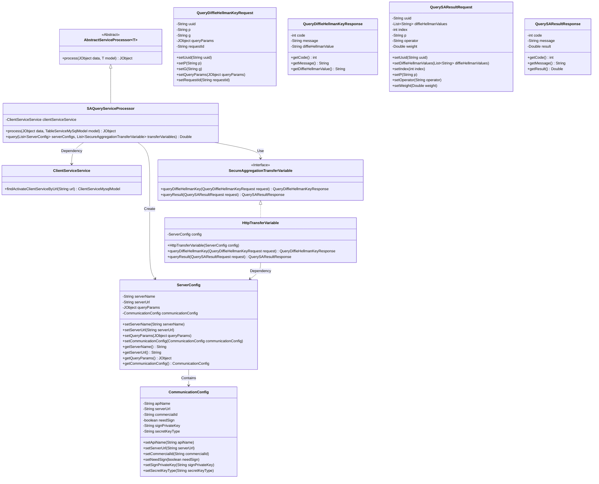
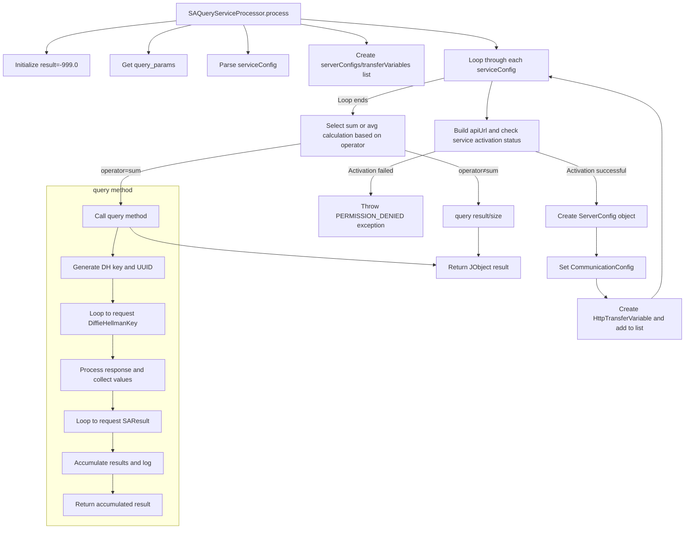

# Basic Information

|      |      |
|------|------|
| Name | SAQueryServiceProcessor |
| Language | .java |
| Code Path | WeFe/serving/serving-service/src/main/java/com/welab/wefe/serving/service/service_processor/SAQueryServiceProcessor.java |
| Package Name | com.welab.wefe.serving.service.service_processor |
| Dependencies | ['com.alibaba.fastjson.JSONArray', 'com.alibaba.fastjson.JSONObject', 'com.welab.wefe.common.StatusCode', 'com.welab.wefe.common.exception.StatusCodeWithException', 'com.welab.wefe.common.util.JObject', 'com.welab.wefe.common.web.Launcher', 'com.welab.wefe.mpc.config.CommunicationConfig', 'com.welab.wefe.mpc.key.DiffieHellmanKey', 'com.welab.wefe.mpc.sa.request.QueryDiffieHellmanKeyRequest', 'com.welab.wefe.mpc.sa.request.QueryDiffieHellmanKeyResponse', 'com.welab.wefe.mpc.sa.request.QuerySAResultRequest', 'com.welab.wefe.mpc.sa.request.QuerySAResultResponse', 'com.welab.wefe.mpc.sa.sdk.config.ServerConfig', 'com.welab.wefe.mpc.sa.sdk.transfer.SecureAggregationTransferVariable', 'com.welab.wefe.mpc.sa.sdk.transfer.impl.HttpTransferVariable', 'com.welab.wefe.mpc.util.DiffieHellmanUtil', 'com.welab.wefe.serving.service.database.entity.ClientServiceMysqlModel', 'com.welab.wefe.serving.service.database.entity.TableServiceMySqlModel', 'com.welab.wefe.serving.service.service.ClientServiceService', 'java.util.ArrayList', 'java.util.LinkedList', 'java.util.List', 'java.util.UUID'] |
| Brief Description | The SAQueryServiceProcessor class handles secure aggregation queries, validates service configurations, invokes multiple server-side APIs, ensures security using Diffie-Hellman key exchange, and ultimately returns aggregated results (sum or average). |

# Description

The SAQueryServiceProcessor class inherits from AbstractServiceProcessor and handles service requests based on TableServiceMySqlModel. It retrieves active client service configurations through clientServiceService, constructing a ServerConfig and a list of SecureAggregationTransferVariable. Depending on the operator (sum or average), it computes query results and ensures secure communication using Diffie-Hellman key exchange. The query method executes specific query logic, including key exchange, result requests, and aggregation, ultimately returning the computed results. The entire process incorporates error handling and logging.

# Class Summary

| Name   | Type  | Description |
|-------|------|-------------|
| SAQueryServiceProcessor | class | The SAQueryServiceProcessor class handles secure aggregation queries, validates service configurations, and invokes multiple servers for data querying and aggregation, supporting sum or average operations. It employs Diffie-Hellman key exchange to ensure secure communication. |

## Class SAQueryServiceProcessor

|      |      |
|------|------|
| Access Modifier | public |
| Type | class |
| Name | SAQueryServiceProcessor |
| Description | The SAQueryServiceProcessor class handles secure aggregation queries, validates service configurations, and invokes multiple servers for data querying and aggregation, supporting sum or average operations. It employs Diffie-Hellman key exchange to ensure secure communication. |

### UML Class Diagram

This code implements a secure aggregation query service processor, whose main functionality is to perform distributed queries through multiple service configurations, supporting Diffie-Hellman key exchange and secure aggregation calculations. The class diagram illustrates the relationships between core classes, including abstract processors, service configurations, communication protocols, and transfer variables, forming a complete distributed secure query processing system.

### Internal Method Call Graph

This flowchart describes the core processing logic of the SAQueryServiceProcessor class. The process method first parses input parameters and service configurations, then creates communication configurations and secure transfer objects for each service endpoint. Different aggregation methods (sum/avg) are selected based on the operator type, ultimately returning a JObject containing the results. The query method implements the core secure aggregation query flow, including Diffie-Hellman key exchange and distributed result aggregation phases, ensuring data transmission security. The entire process strictly handles service activation status checks, parameter validation, and error handling.

### Field List

| Name  | Type  | Description |
|-------|-------|------|
| clientServiceService = Launcher.getBean(ClientServiceService.class) | ClientServiceService | The code obtains a ClientServiceService instance through Launcher and assigns it to the private constant clientServiceService. |

### Method List

| Name  | Type  | Description |
|-------|-------|------|
| process | JObject | Processing JObject data, validating service configurations and constructing communication parameters, calculating query results (sum or average) based on operators, and returning the results. |
| query | Double | The method `query` securely interacts with multiple servers via Diffie-Hellman key exchange to aggregate query results. First, it generates DH keys and a UUID, requests DH values from each server, verifies the responses, and then requests the computation results again. Finally, it accumulates and returns the total sum. |

