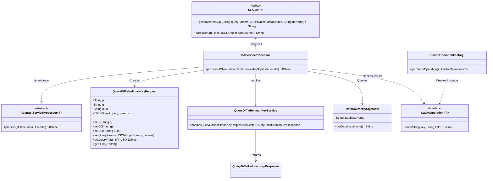
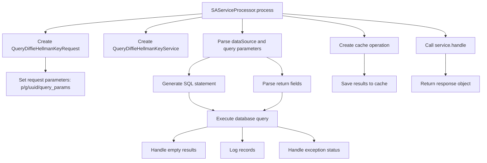

# Basic Information

|      |      |
|------|------|
| Name | SAServiceProcessor |
| Language | .java |
| Code Path | WeFe/serving/serving-service/src/main/java/com/welab/wefe/serving/service/service_processor/SAServiceProcessor.java |
| Package Name | com.welab.wefe.serving.service.service_processor |
| Dependencies | ['java.util.Arrays', 'java.util.HashMap', 'java.util.Map', 'com.alibaba.fastjson.JSONObject', 'com.welab.wefe.common.exception.StatusCodeWithException', 'com.welab.wefe.common.util.JObject', 'com.welab.wefe.mpc.cache.intermediate.CacheOperation', 'com.welab.wefe.mpc.cache.intermediate.CacheOperationFactory', 'com.welab.wefe.mpc.commom.Constants', 'com.welab.wefe.mpc.sa.request.QueryDiffieHellmanKeyRequest', 'com.welab.wefe.mpc.sa.request.QueryDiffieHellmanKeyResponse', 'com.welab.wefe.mpc.sa.server.service.QueryDiffieHellmanKeyService', 'com.welab.wefe.serving.service.database.entity.DataSourceMySqlModel', 'com.welab.wefe.serving.service.database.entity.TableServiceMySqlModel', 'com.welab.wefe.serving.service.utils.ServiceUtil'] |
| Brief Description | The SAServiceProcessor class handles Diffie-Hellman key query requests by executing SQL through a data source and returning the results, which are then stored in the cache before returning the response. |

# Description

The SAServiceProcessor class inherits from AbstractServiceProcessor and processes data of the TableServiceMySqlModel type. The main workflow includes parsing request parameters, generating SQL query statements, executing data source queries, and processing the results. The query results are converted to the Double type and stored in the cache before finally returning the response object. The process involves exception handling and logging to ensure the integrity of data queries and cache operations.

# Class Summary

| Name   | Type  | Description |
|-------|------|-------------|
| SAServiceProcessor | class | The SAServiceProcessor class handles Diffie-Hellman key query requests, retrieves SQL query results from the data source, and caches them. |

## Class SAServiceProcessor

|      |      |
|------|------|
| Access Modifier | public |
| Type | class |
| Name | SAServiceProcessor |
| Description | The SAServiceProcessor class handles Diffie-Hellman key query requests, retrieves SQL query results from the data source, and caches them. |

### UML Class Diagram

This code describes a service processor SAServiceProcessor that inherits from AbstractServiceProcessor, primarily handling Diffie-Hellman key query requests. The workflow includes: parsing request parameters, querying data sources, processing query results, cache operations, and returning responses. The class diagram illustrates the relationships between the processor and request/response objects, data source models, cache interfaces, and utility classes, demonstrating the complete query processing flow and component collaboration. Key aspects lie in the design of data source querying, result caching, and exception handling mechanisms.

### Internal Method Call Graph

This code represents the core processing method of the SAServiceProcessor class, primarily implementing the Diffie-Hellman key query service workflow. It first constructs the request object and sets parameters, then executes SQL queries through the data source service, processes the query results, stores data in cache, and finally returns the service response. The entire process includes key steps such as parameter parsing, SQL generation, database operations, exception handling, and cache management, forming a complete business logic processing chain from request to response.

### Field List

| Name  | Type  | Description |
|-------|-------|------|

### Method List

| Name  | Type  | Description |
|-------|-------|------|
| process | JObject | Process the Diffie-Hellman key query request, set parameters, execute the SQL query, save the results to the cache, and return the response. |

