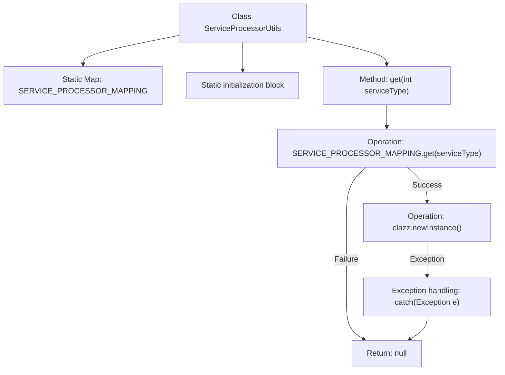

# Basic Information

|      |      |
|------|------|
| Name | ServiceProcessorUtils |
| Language | .java |
| Code Path | WeFe/serving/serving-service/src/main/java/com/welab/wefe/serving/service/service_processor/ServiceProcessorUtils.java |
| Package Name | com.welab.wefe.serving.service.service_processor |
| Dependencies | ['com.welab.wefe.serving.service.enums.ServiceTypeEnum', 'java.util.HashMap', 'java.util.Map'] |
| Brief Description | The `ServiceProcessorUtils` class associates service types with processor classes through a static mapping table, providing methods to retrieve corresponding processor instances based on types. |

# Description

The ServiceProcessorUtils class maintains a static mapping table SERVICE_PROCESSOR_MAPPING, which associates different service type enum values with their corresponding AbstractServiceProcessor subclasses. This mapping table is populated in a static initialization block with the relationships between seven service types and their processor classes, including PSI, PIR, SA, and their multi-version variants. The class provides a get method that returns the corresponding processor instance based on the input service type code. If instantiation fails, it returns null and prints an exception.

# Class Summary

| Name   | Type  | Description |
|-------|------|-------------|
| ServiceProcessorUtils | class | The ServiceProcessorUtils class associates service type enums with corresponding processor classes through a static mapping table, providing methods to obtain processor instances based on types. |


## Class ServiceProcessorUtils

|      |      |
|------|------|
| Access Modifier | public |
| Type | class |
| Name | ServiceProcessorUtils |
| Description | The ServiceProcessorUtils class associates service type enums with corresponding processor classes through a static mapping table, providing methods to obtain processor instances based on types. |


### UML Class Diagram

```mermaid
classDiagram
    class ServiceProcessorUtils {
        -Map~Integer, Class~AbstractServiceProcessor~~ SERVICE_PROCESSOR_MAPPING
        +get(int serviceType) AbstractServiceProcessor
    }

    <<Interface>> ServiceTypeEnum {
        +PSI
        +PIR
        +SA
        +MULTI_SA
        +MULTI_PSI
        +MULTI_PIR
        +MachineLearning
    }

    class AbstractServiceProcessor {
        <<abstract>>
    }

    class PsiServiceProcessor
    class PirServiceProcessor
    class SAServiceProcessor
    class SAQueryServiceProcessor
    class MultiPsiServiceProcessor
    class MultiPirServiceProcessor
    class ModelServiceProcessor

    ServiceProcessorUtils --> ServiceTypeEnum : Dependency
    ServiceProcessorUtils --> AbstractServiceProcessor : Create Instance
    PsiServiceProcessor --|> AbstractServiceProcessor
    PirServiceProcessor --|> AbstractServiceProcessor
    SAServiceProcessor --|> AbstractServiceProcessor
    SAQueryServiceProcessor --|> AbstractServiceProcessor
    MultiPsiServiceProcessor --|> AbstractServiceProcessor
    MultiPirServiceProcessor --|> AbstractServiceProcessor
    ModelServiceProcessor --|> AbstractServiceProcessor
```

This code demonstrates a service processor utility class `ServiceProcessorUtils`, which maps different service type enumeration values to corresponding processor classes through a static mapping table. The utility class provides functionality to retrieve the appropriate processor instance based on the service type, with all processor classes inheriting from the abstract base class `AbstractServiceProcessor`. The class diagram clearly illustrates the relationships between the utility class, the enumeration, the abstract processor, and various concrete processor implementation classes, embodying the design philosophy of the factory pattern.


### Internal Method Call Graph



This code demonstrates a service processor utility class that maintains a mapping between service types and processor classes through a static Map. The static initialization block preloads processor classes corresponding to 7 service type enums. The get method dynamically instantiates the appropriate processor based on the input service type. The flowchart clearly presents the class structure, initialization process, and method call chain, particularly highlighting exception handling paths and null return scenarios.

### Field List

| Name  | Type  | Description |
|-------|-------|------|
| SERVICE_PROCESSOR_MAPPING = new HashMap<>() | Map<Integer, Class<? extends AbstractServiceProcessor>> | Static Map mapping integer keys to service handler classes. |

### Method List

| Name  | Type  | Description |
|-------|-------|------|
| get | AbstractServiceProcessor | Static method retrieves the corresponding AbstractServiceProcessor instance based on serviceType. Returns null and prints an exception if the operation fails. |


