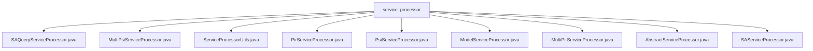

# Basic Information

|      |      |
|------|------|
| Name | service_processor |
| Language | .java |
| Code Path | WeFe/serving/serving-service/src/main/java/com/welab/wefe/serving/service/service_processor |
| Package Name | docs.serving.serving-service.src.main.java.com.welab.wefe.serving.service.service_processor |
| Brief Description | The SAQueryServiceProcessor handles secure aggregation queries using DH key exchange; the MultiPsiServiceProcessor manages multi-client PSI queries; the ServiceProcessorUtils maintains service type mappings; the PirServiceProcessor processes private information retrieval; the PsiServiceProcessor implements core PSI service functionality; the ModelServiceProcessor handles model predictions; the MultiPirServiceProcessor manages multiple PIR requests; the AbstractServiceProcessor serves as the abstract base class; the SAServiceProcessor executes SQL queries and caches results. |

# Description

## Overview  
This module is a service processing framework for privacy-preserving computation, with its core responsibility being the unified handling of various secure computation requests (such as PSI/PIR/SA). It achieves differentiated logic by deriving subclasses from the abstract processor base class. The interface specification follows the `process` method defined by `AbstractServiceProcessor`, which takes `JObject` data as input and returns a `JObject` result. Key data structures include `ServerConfig` (service configuration), `SecureAggregationTransferVariable` (secure aggregation variables), and `CommunicationConfig` (communication parameters). External dependencies involve Diffie-Hellman key exchange, `HuackKeyService` encryption services, and MySQL/Doris databases. For example, `SAQueryServiceProcessor` implements secure summation computation, while `MultiPsiServiceProcessor` supports multi-node PSI queries.

## Key Business Scenarios  
The module supports three typical scenarios: 1) **Private Set Intersection (PSI)**, akin to a data comparison middleware, where `PsiServiceProcessor` supports DH/ECDH protocols; 2) **Private Information Retrieval (PIR)**, such as `PirServiceProcessor` implementing ID matching queries via OT protocols; and 3) **Secure Aggregation (SA)**, resembling a distributed computation framework, where `SAQueryServiceProcessor` performs cross-node encrypted aggregation. The interaction pattern follows a "configuration validation-parameter construction-asynchronous execution-result aggregation" workflow, as seen in `MultiPirServiceProcessor`, which iterates through service configurations before merging results. API integration examples include batch prediction (`ModelServiceProcessor`) and callback notifications (`PirServiceProcessor` inner class `MyCall`).

### Package Internal Structure View

This flowchart illustrates the 9 Java files under the service_processor directory, including processor class files such as SAQueryServiceProcessor, MultiPsiServiceProcessor, etc., as well as the AbstractServiceProcessor abstract base class and the ServiceProcessorUtils utility class. All files are directly subordinate to the service_processor directory with no deeper subdirectory hierarchy.

# File List

| Name   | Type  | Description |
|-------|------|-------------|
| [SAQueryServiceProcessor.java](SAQueryServiceProcessor.md) | file | The SAQueryServiceProcessor class handles secure aggregation queries. After validating the service configuration, it invokes multiple server-side APIs, ensures security using Diffie-Hellman key exchange, and ultimately returns the aggregated result (sum or average). |
| [MultiPsiServiceProcessor.java](MultiPsiServiceProcessor.md) | file | The MultiPsiServiceProcessor class handles client IDs and service configurations, verifies service activation status, generates communication settings, filters results through PSI queries, logs call records, and ultimately returns a list of matched client IDs. |
| [ServiceProcessorUtils.java](ServiceProcessorUtils.md) | file | The ServiceProcessorUtils class associates service types with processor classes through a static mapping table, providing methods to retrieve corresponding processor instances based on types. |
| [PirServiceProcessor.java](PirServiceProcessor.md) | file | The PirServiceProcessor class handles PIR requests, selects different service processing based on OT methods, queries data sources and caches results, while supporting callback notifications. |
| [PsiServiceProcessor.java](PsiServiceProcessor.md) | file | The PsiServiceProcessor class handles private set intersection services, supporting both DH and ECDH algorithms. It manages batch data processing, result storage, and querying, with compatibility for MySQL and Doris databases. |
| [ModelServiceProcessor.java](ModelServiceProcessor.md) | file | The ModelServiceProcessor handles model prediction requests, checks the model status, and supports either batch or single-item prediction, returning results in JSON format. |
| [MultiPirServiceProcessor.java](MultiPirServiceProcessor.md) | file | The MultiPirServiceProcessor class handles multi-PIR service requests, parses configurations, invokes queries, and returns results after logging. |
| [AbstractServiceProcessor.java](AbstractServiceProcessor.md) | file | Abstract service processor class, incorporating logging, data source services, and call log management functionalities, supports processing generic data and adding two types of call logs. |
| [SAServiceProcessor.java](SAServiceProcessor.md) | file | The SAServiceProcessor class handles Diffie-Hellman key query requests, executes SQL through the data source, and returns the results. After storing the results in the cache, it returns the response. |

