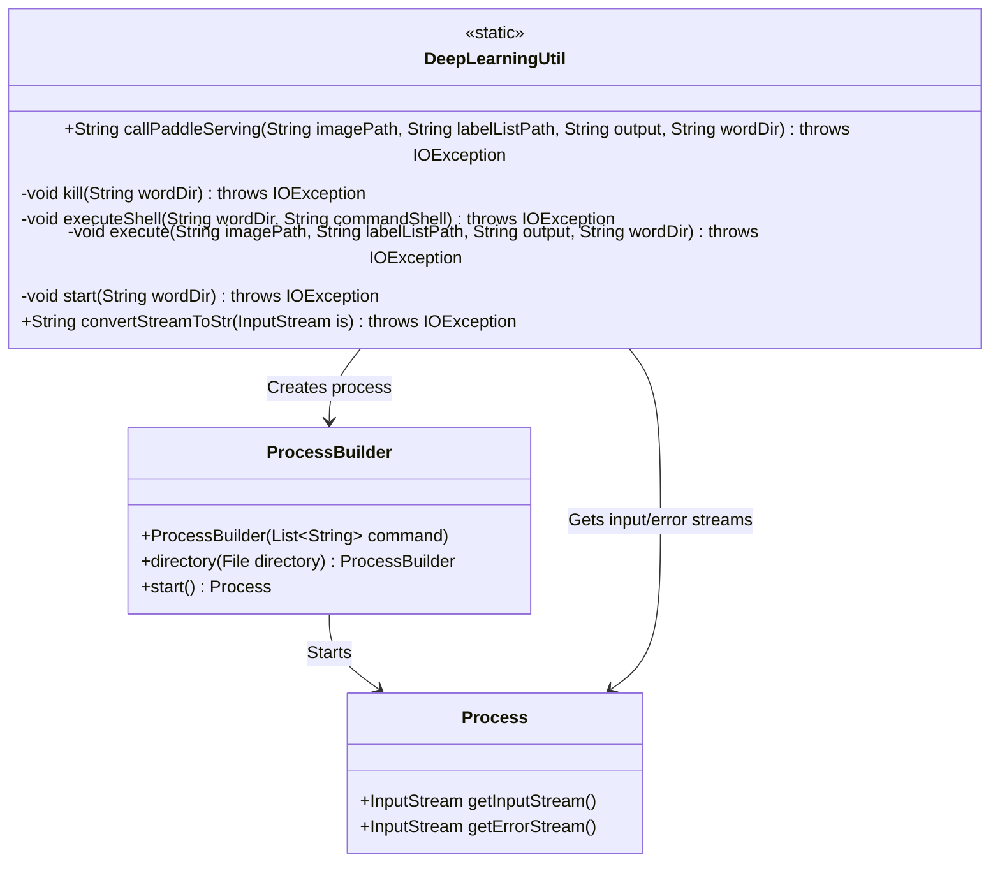
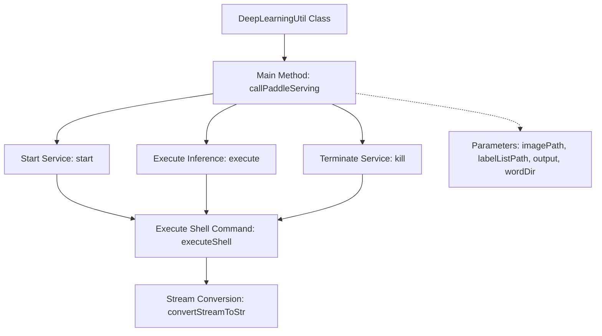

# Basic Information

|      |      |
|------|------|
| Name | DeepLearningUtil |
| Language | .java |
| Code Path | WeFe/serving/serving-service/src/main/java/com/welab/wefe/serving/service/utils/DeepLearningUtil.java |
| Package Name | com.welab.wefe.serving.service.utils |
| Dependencies | ['org.apache.commons.compress.utils.Lists', 'java.io', 'java.util.List'] |
| Brief Description | The DeepLearningUtil class provides methods for invoking PaddleServing, including functionalities for starting services, executing commands, and terminating services. It operates through shell scripts while handling input and output streams. |

# Description

The `DeepLearningUtil` class provides functionality for invoking PaddleServing services. The primary method, `callPaddleServing`, sequentially executes three steps: starting the service, processing requests, and terminating the service. It utilizes the `executeShell` method to execute shell commands, employing `ProcessBuilder` to launch processes and handle output streams. The `convertStreamToStr` method converts input streams into strings. The entire process involves invoking server startup scripts, client execution scripts, and termination scripts, while supporting the specification of working directories and parameter passing.

# Class Summary

| Name   | Type  | Description |
|-------|------|-------------|
| DeepLearningUtil | class | The DeepLearningUtil class provides methods for invoking PaddleServing, including starting services, executing commands, and shutting down services. It operates through shell scripts while handling input and output streams. |

## Class DeepLearningUtil

|      |      |
|------|------|
| Access Modifier | public |
| Type | class |
| Name | DeepLearningUtil |
| Description | The DeepLearningUtil class provides methods for invoking PaddleServing, including starting services, executing commands, and shutting down services. It operates through shell scripts while handling input and output streams. |

### UML Class Diagram

Class diagram description:
DeepLearningUtil is a utility class that provides static methods for invoking Paddle Serving deep learning services. Core functionalities include starting service processes (callPaddleServing), executing commands (executeShell), and stream data conversion (convertStreamToStr). The class creates OS processes via ProcessBuilder and interacts with the Process class to obtain process input/error streams. Private methods implement service lifecycle management (start/execute/kill), with all methods potentially throwing IOException. The design adopts a layered invocation structure where higher-level methods rely on underlying shell command execution capabilities.

### Internal Method Call Graph

This code flowchart illustrates the workflow of the DeepLearningUtil class, primarily depicting the complete lifecycle of invoking the PaddleServing service. Starting with service initialization (start), followed by executing inference tasks (execute), and finally terminating the service (kill), all steps are carried out by the executeShell method to execute specific shell commands, with process output streams converted to strings via the convertStreamToStr method. The entire process strictly adheres to the service invocation sequence and handles details of command execution and stream conversion.

### Field List

| Name  | Type  | Description |
|-------|-------|------|

### Method List

| Name  | Type  | Description |
|-------|-------|------|
| kill | void | The method terminates the service by executing a shell script, requiring the working directory path as input, and may throw an IO exception. |
| executeShell | void | Java method executes Shell commands via ProcessBuilder, sets the working directory, and handles output streams. |
| start | void | The private static method `start` takes the `wordDir` parameter, invokes `executeShell` to execute the `start_server.sh` script, and may throw an `IOException`. |
| execute | void | This method executes a shell script, passing the image path, label list path, and output path as arguments, and runs it under the specified working directory. |
| callPaddleServing | String | Invoke the PaddleServing service, execute processing after startup, and return an empty string. Includes operations for startup, execution, and termination. |
| convertStreamToStr | String | Convert the input stream into a UTF-8 string, read data using a buffer, handle exceptions, and ensure the stream is closed. Return an empty string if the stream is null. |

