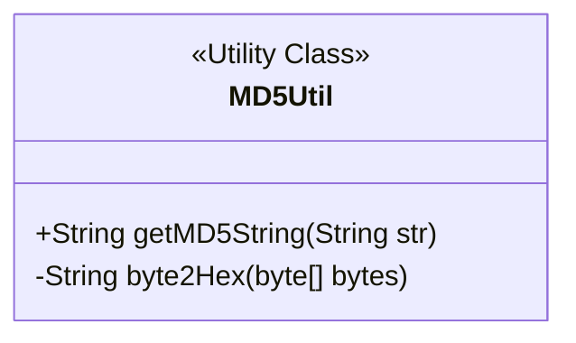
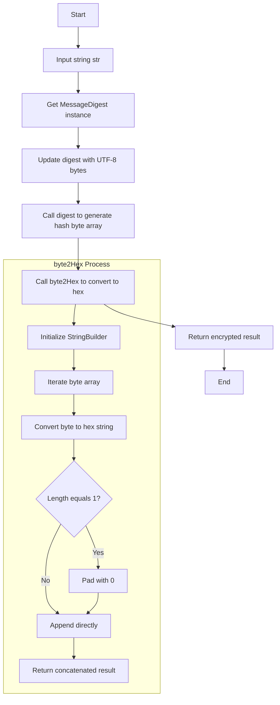
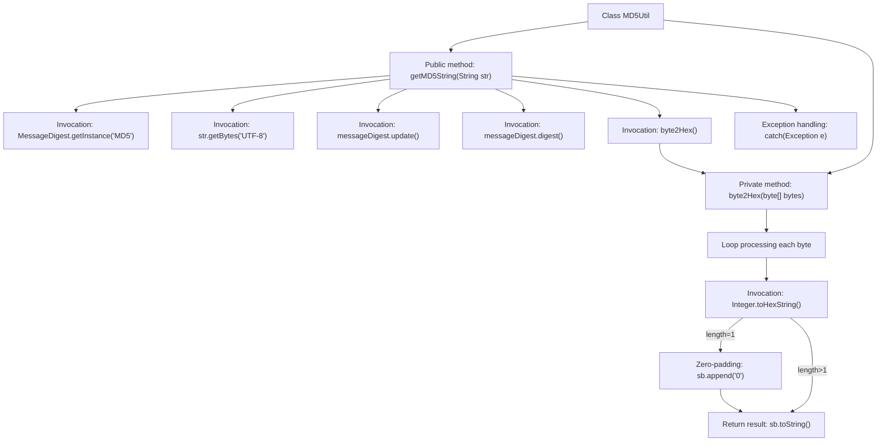

# Basic Information

|      |      |
|------|------|
| Name | MD5Util |
| Language | .java |
| Code Path | WeFe/serving/serving-service/src/main/java/com/welab/wefe/serving/service/utils/MD5Util.java |
| Package Name | com.welab.wefe.serving.service.utils |
| Dependencies | ['java.security.MessageDigest'] |
| Brief Description | The MD5Util class provides MD5 encryption functionality, including the getMD5String method for string encryption and the byte2Hex method for converting bytes to hexadecimal strings. |

# Description

This is a Java utility class named MD5Util that provides MD5 encryption functionality. The class contains two methods: The getMD5String method takes a string parameter, implements MD5 encryption using Java's native MessageDigest class, specifies UTF-8 encoding during processing, and converts the result to a hexadecimal string via the byte2Hex method before returning it; byte2Hex is a private method that converts a byte array to its hexadecimal string representation, ensuring each byte is converted to a two-digit hexadecimal number with zero-padding for insufficient digits. In case of exceptions, stack trace information will be printed but program execution will not be interrupted.

# Class Summary

| Name   | Type  | Description |
|-------|------|-------------|
| MD5Util | class | The MD5Util class provides MD5 encryption functionality, including the getMD5String method for UTF-8 encoded MD5 encryption, and the private byte2Hex method for converting byte arrays to hexadecimal strings. |

## Class MD5Util

|      |      |
|------|------|
| Access Modifier | public |
| Type | class |
| Name | MD5Util |
| Description | The MD5Util class provides MD5 encryption functionality, including the getMD5String method for UTF-8 encoded MD5 encryption, and the private byte2Hex method for converting byte arrays to hexadecimal strings. |

### UML Class Diagram

This code implements an MD5 encryption utility class, with its core functionality being to perform MD5 hash computation on an input string via MessageDigest, then convert the generated byte array into a hexadecimal string representation. The class diagram shows this is a stateless utility class containing a public encryption method and a private byte conversion method. The flowchart details the main encryption process and the byte conversion sub-process, with special attention given to zero-padding for single-character hexadecimal values to ensure uniform output format. The entire design adheres to typical utility class characteristics, featuring single responsibility and static method invocation.

### Internal Method Call Graph

This code flowchart illustrates the core logic of the MD5Util utility class. The main process starts with the getMD5String method, which implements MD5 encryption through MessageDigest, converts the input string into a byte array to generate a hash value, and then calls the byte2Hex method to convert the byte array into a hexadecimal string. The byte2Hex method internally processes each byte in a loop, using bitwise operations and zero-padding to ensure the output is a standard 32-character MD5 string. The entire process includes an exception handling mechanism to print error messages if encryption fails.

### Field List

| Name  | Type  | Description |
|-------|-------|------|

### Method List

| Name  | Type  | Description |
|-------|-------|------|
| byte2Hex | String | Convert a byte array to a hexadecimal string, pad single bytes with zeros, and concatenate the result before returning. |
| getMD5String | String | The static method `getMD5String` accepts a string parameter, generates a hash value using the MD5 algorithm, and returns a hexadecimal string. In case of an exception, it prints the stack trace. |

