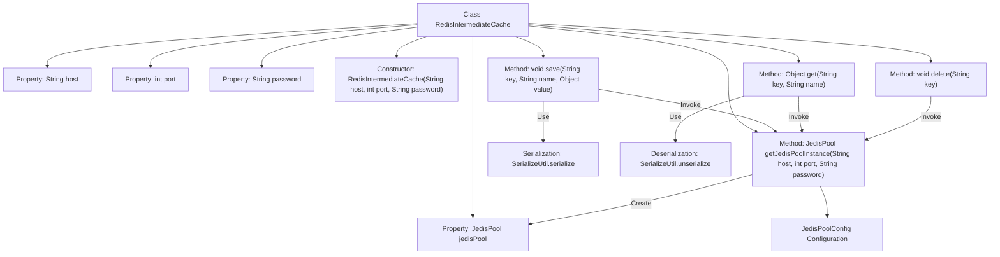

# Basic Information

|      |      |
|------|------|
| Name | RedisIntermediateCache |
| Language | .java |
| Code Path | WeFe/serving/serving-service/src/main/java/com/welab/wefe/serving/service/utils/RedisIntermediateCache.java |
| Package Name | com.welab.wefe.serving.service.utils |
| Dependencies | ['org.apache.commons.lang3.StringUtils', 'org.slf4j.Logger', 'org.slf4j.LoggerFactory', 'com.welab.wefe.mpc.cache.intermediate.CacheOperation', 'redis.clients.jedis.Jedis', 'redis.clients.jedis.JedisPool', 'redis.clients.jedis.JedisPoolConfig'] |
| Brief Description | Redis Cache Operation Class, utilizing JedisPool for connection management, supports saving, retrieving, and deleting data, with thread safety and logging capabilities. |

# Description

The RedisIntermediateCache class implements the CacheOperation interface for operating Redis caches. This class manages Redis connections via JedisPool, supporting configurations such as host, port, and password. It employs double-checked locking to ensure thread-safe singleton initialization of JedisPool and configures connection pool parameters like maximum idle connections. The class provides save, get, and delete methods for serializing and storing objects, deserializing and retrieving objects, and deleting key-value pairs, respectively. All operations acquire resources through the Jedis connection pool and log activities. Exception handling is robust, with error information logged and exceptions thrown.

# Class Summary

| Name   | Type  | Description |
|-------|------|-------------|
| RedisIntermediateCache | class | The `RedisIntermediateCache` class implements caching operations, manages Redis connections through `JedisPool`, supports saving, retrieving, and deleting data, and includes connection pool configuration and exception handling. |


## Class RedisIntermediateCache

|      |      |
|------|------|
| Access Modifier | public |
| Type | class |
| Name | RedisIntermediateCache |
| Description | The `RedisIntermediateCache` class implements caching operations, manages Redis connections through `JedisPool`, supports saving, retrieving, and deleting data, and includes connection pool configuration and exception handling. |


### UML Class Diagram

```mermaid
classDiagram
    class RedisIntermediateCache {
        -JedisPool jedisPool
        -String host
        -int port
        -String password
        +RedisIntermediateCache(String host, int port, String password)
        +JedisPool getJedisPoolInstance(String host, int port, String password)
        +void save(String key, String name, Object value)
        +Object get(String key, String name)
        +void delete(String key)
    }

    <<Interface>> CacheOperation {
        +void save(String key, String name, Object value)
        +Object get(String key, String name)
        +void delete(String key)
    }

    class JedisPool {
        +Jedis getResource()
        +void close()
    }

    class Jedis {
        +void set(byte[] key, byte[] value)
        +byte[] get(byte[] key)
        +void del(byte[] key)
    }

    class SerializeUtil {
        +byte[] serialize(Object obj)
        +Object unserialize(byte[] bytes)
    }

    RedisIntermediateCache ..|> CacheOperation : Implements
    RedisIntermediateCache --> JedisPool : Uses
    JedisPool --> Jedis : Creates
    RedisIntermediateCache --> SerializeUtil : Uses
```

This code demonstrates a Redis-based intermediate cache implementation class RedisIntermediateCache, which implements the CacheOperation interface to provide functionality for saving, retrieving, and deleting cached data. The class manages Redis connections through JedisPool, employing double-checked locking to ensure thread-safe connection pool initialization, and utilizes SerializeUtil for object serialization and deserialization operations. The overall design reflects efficient management of connection resources and an exception handling mechanism.


### Internal Method Call Graph



This code implements a Redis-based intermediate cache class that manages Redis connections through a Jedis connection pool. The flowchart illustrates the class structure and core method invocation relationships, including constructor initialization of connection parameters, double-checked locking for singleton pool creation, and three core cache operations (save/get/delete). All operations acquire resources via the connection pool with exception handling and logging functionality, where save/get methods involve object serialization and deserialization operations.

### Field List

| Name  | Type  | Description |
|-------|-------|------|
| LOG = LoggerFactory.getLogger(RedisIntermediateCache.class) | Logger | A protected static final log object LOG is defined in the RedisIntermediateCache class. |
| host | String | The private string variable `host` is used to store host information. |
| jedisPool = null | JedisPool | Declare a private JedisPool variable named jedisPool with an initial value of null. |
| port | int | The private integer variable `port` is used to store the port number. |
| password | String | Private string type variable password. |

### Method List

| Name  | Type  | Description |
|-------|-------|------|
| get | Object | The method `get` retrieves data from Redis. If the connection pool is empty, it initializes it. It obtains a Jedis instance from the connection pool, concatenates the key name to query the data. If the data is empty, it returns null; otherwise, it deserializes and returns the data. In case of an exception, it logs the error and throws it. |
| getJedisPoolInstance | JedisPool | This is a singleton pattern implementation for obtaining a JedisPool, which ensures thread safety through double-checked locking. It supports two initialization methods: with or without a password, and configures connection pool parameters such as maximum idle connections, maximum total connections, etc. |
| save | void | This method is used to serialize an object and store it in Redis. If the connection pool is not initialized, it will be created. After obtaining a connection, the value is serialized and stored as a byte array, with the key name being a combination of `name` and `key`. If an exception occurs, it logs the error and throws it; upon success, it logs the operation information. |
| delete | void | This method is used to delete the specified key in Redis. If the connection pool is not initialized, it will be created first. A connection is obtained from the connection pool to perform the deletion operation, exceptions are caught and logged, and finally, the deletion operation information is recorded. |


