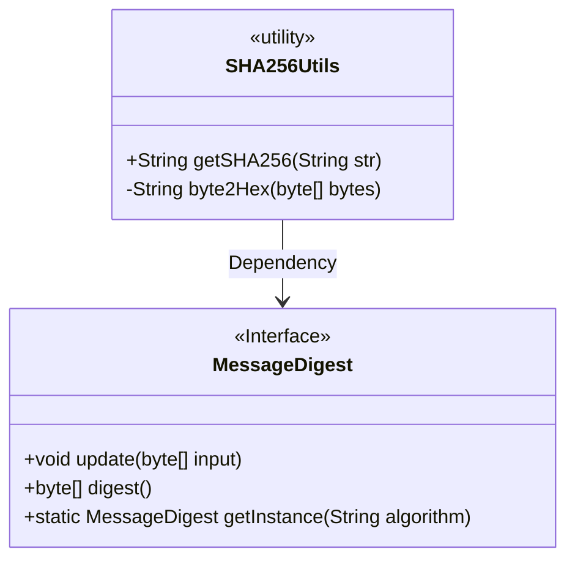
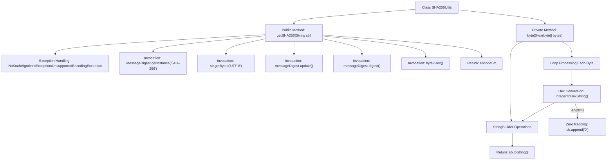

# Basic Information

|      |      |
|------|------|
| Name | SHA256Utils |
| Language | .java |
| Code Path | WeFe/serving/serving-service/src/main/java/com/welab/wefe/serving/service/utils/SHA256Utils.java |
| Package Name | com.welab.wefe.serving.service.utils |
| Dependencies | ['java.io.UnsupportedEncodingException', 'java.security.MessageDigest', 'java.security.NoSuchAlgorithmException'] |
| Brief Description | The SHA256Utils class provides SHA256 encryption functionality, utilizing MessageDigest to encrypt strings and converting the results into hexadecimal strings. |

# Description

The content describes a Java utility class named SHA256Utils, primarily designed to implement SHA-256 encryption functionality. The class contains two methods: the `getSHA256` method accepts a string parameter, performs SHA-256 encryption using Java's native `MessageDigest` class, and converts the result into a hexadecimal string for return; the private `byte2Hex` method is used to convert a byte array into a hexadecimal string representation, ensuring each byte is displayed as a two-digit hexadecimal number. The utility class handles potential exceptions, such as unsupported algorithms or encoding formats.

# Class Summary

| Name   | Type  | Description |
|-------|------|-------------|
| SHA256Utils | class | The SHA256Utils class provides SHA256 encryption functionality, which encrypts strings via MessageDigest and converts the result into a hexadecimal string. |

## Class SHA256Utils

|      |      |
|------|------|
| Access Modifier | public |
| Type | class |
| Name | SHA256Utils |
| Description | The SHA256Utils class provides SHA256 encryption functionality, which encrypts strings via MessageDigest and converts the result into a hexadecimal string. |

### UML Class Diagram

Class diagram description: SHA256Utils is a utility class that provides SHA-256 encryption functionality. It depends on the native Java interface MessageDigest to implement encryption operations. It mainly contains two methods: the public method getSHA256 for providing encryption services externally, and the private method byte2Hex for internal byte-to-hexadecimal conversion. The MessageDigest interface provides basic cryptographic operation capabilities.

### Internal Method Call Graph

This code flowchart illustrates the complete encryption process of the SHA256Utils utility class. It primarily consists of two core methods: getSHA256 handles the main encryption flow by implementing the SHA-256 algorithm via MessageDigest, while byte2Hex converts a byte array into a hexadecimal string, performing zero-padding operations on single characters during processing. The flowchart clearly presents the full invocation chain from algorithm initialization, data updating, digest calculation to format conversion, as well as the exception handling path, demonstrating the rigorous data transformation logic at each stage of the encryption process.

### Field List

| Name  | Type  | Description |
|-------|-------|------|

### Method List

| Name  | Type  | Description |
|-------|-------|------|
| byte2Hex | String | Convert a byte array to a hexadecimal string, pad single bytes with zeros, and concatenate the results before returning. |
| getSHA256 | String | Java Method: Encrypts the input string using the SHA-256 algorithm and returns the hash value in hexadecimal format. Prints an error and returns an empty string in case of an exception. |

