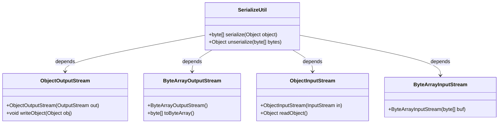
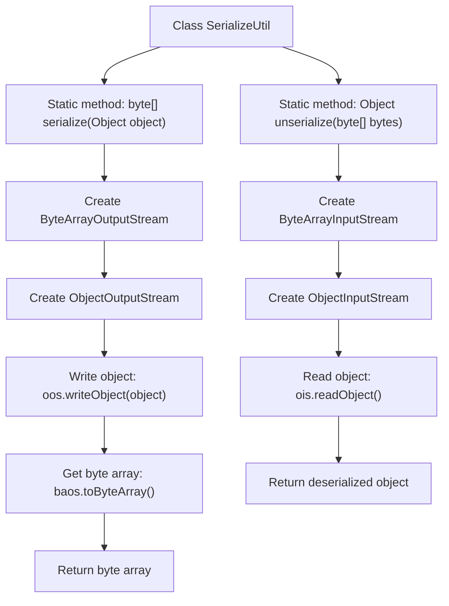

# Basic Information

|      |      |
|------|------|
| Name | SerializeUtil |
| Language | .java |
| Code Path | WeFe/serving/serving-service/src/main/java/com/welab/wefe/serving/service/utils/SerializeUtil.java |
| Package Name | com.welab.wefe.serving.service.utils |
| Dependencies | ['java.io.ByteArrayInputStream', 'java.io.ByteArrayOutputStream', 'java.io.ObjectInputStream', 'java.io.ObjectOutputStream'] |
| Brief Description | The `SerializeUtil` class provides serialization and deserialization methods to convert objects into byte arrays or vice versa, returning `null` in case of exceptions. |

# Description

SerializeUtil is a utility class that provides object serialization and deserialization functionality. It contains two static methods: the serialize method converts any object into a byte array using ObjectOutputStream and ByteArrayOutputStream, while the unserialize method restores the original object from a byte array via ByteArrayInputStream and ObjectInputStream. Both methods catch exceptions but do not handle them, returning null upon errors. This class enables bidirectional conversion between Java objects and binary data.

# Class Summary

| Name   | Type  | Description |
|-------|------|-------------|
| SerializeUtil | class | The SerializeUtil class provides serialization and deserialization methods to convert objects into byte arrays or perform the reverse conversion, returning null in case of exceptions. |

## Class SerializeUtil

|      |      |
|------|------|
| Access Modifier | public |
| Type | class |
| Name | SerializeUtil |
| Description | The SerializeUtil class provides serialization and deserialization methods to convert objects into byte arrays or perform the reverse conversion, returning null in case of exceptions. |

### UML Class Diagram

This code demonstrates a serialization utility class `SerializeUtil`, which contains two static methods `serialize` and `unserialize` for object serialization and deserialization respectively. The serialization process relies on `ObjectOutputStream` and `ByteArrayOutputStream` to convert objects into byte arrays, while deserialization uses `ObjectInputStream` and `ByteArrayInputStream` to restore byte arrays back into objects. The class diagram clearly illustrates the dependency relationships between the utility class and Java IO stream classes, reflecting the core workflow of object serialization.

### Internal Method Call Graph

This code demonstrates a utility class for object serialization and deserialization. The flowchart clearly illustrates the workflow of two core methods: the serialize method converts an object into a byte array via ByteArrayOutputStream and ObjectOutputStream, while the unserialize method restores the original object from the byte array using ByteArrayInputStream and ObjectInputStream. Both methods include exception handling logic (not expanded in the diagram) and return null when exceptions occur. The entire process reflects the key operational steps of Java's standard serialization mechanism.

### Field List

| Name  | Type  | Description |
|-------|-------|------|

### Method List

| Name  | Type  | Description |
|-------|-------|------|
| unserialize | Object | Java deserialization method that converts a byte array into an object, returning null in case of exceptions. |
| serialize | byte[] | Serialize the object into a byte array using ObjectOutputStream and ByteArrayOutputStream, returning null in case of an exception. |

