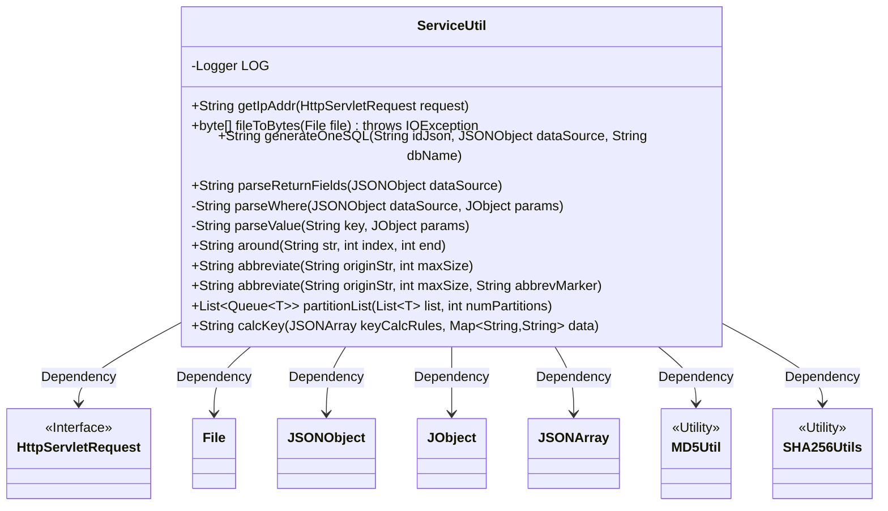
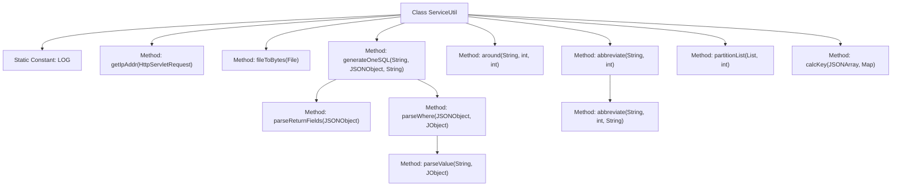
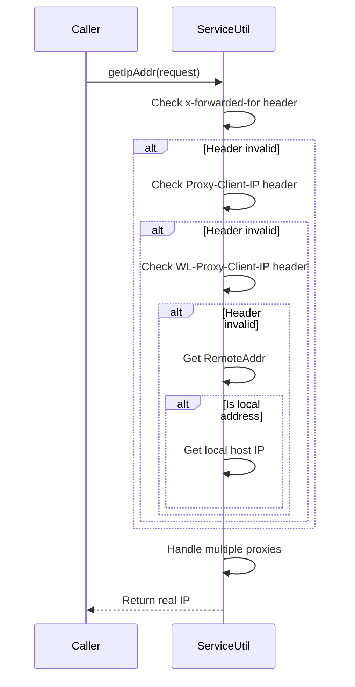

# Basic Information

|      |      |
|------|------|
| Name | ServiceUtil |
| Language | .java |
| Code Path | WeFe/serving/serving-service/src/main/java/com/welab/wefe/serving/service/utils/ServiceUtil.java |
| Package Name | com.welab.wefe.serving.service.utils |
| Dependencies | ['java.io.ByteArrayOutputStream', 'java.io.File', 'java.io.FileInputStream', 'java.io.IOException', 'java.net.InetAddress', 'java.net.UnknownHostException', 'java.util.ArrayDeque', 'java.util.ArrayList', 'java.util.Iterator', 'java.util.List', 'java.util.Map', 'java.util.Queue', 'javax.servlet.http.HttpServletRequest', 'org.apache.commons.lang3.StringUtils', 'org.slf4j.Logger', 'org.slf4j.LoggerFactory', 'com.alibaba.fastjson.JSONArray', 'com.alibaba.fastjson.JSONObject', 'com.google.common.base.Preconditions', 'com.welab.wefe.common.util.JObject'] |
| Brief Description | The ServiceUtil utility class provides various functions: retrieving client IP, converting files to byte arrays, generating SQL queries, parsing fields, string desensitization processing, shard list and key computation. |

# Description

ServiceUtil is a utility class that provides various practical methods. Its main functionalities include: obtaining the client IP address, handling proxy and local addresses; converting files into byte arrays; generating SQL query statements, parsing returned fields and conditions; string processing, such as partial hiding, truncation, and ellipsis; list partitioning; and calculating key values based on rules, supporting MD5 and SHA256 encryption. The class includes detailed exception handling and resource management.

# Class Summary

| Name   | Type  | Description |
|-------|------|-------------|
| ServiceUtil | class | The ServiceUtil class provides various utility methods: retrieving client IP, converting files to byte arrays, generating SQL queries, string desensitization, list partitioning, key-value calculation, and other practical functionalities. |

## Class ServiceUtil

|      |      |
|------|------|
| Access Modifier | public |
| Type | class |
| Name | ServiceUtil |
| Description | The ServiceUtil class provides various utility methods: retrieving client IP, converting files to byte arrays, generating SQL queries, string desensitization, list partitioning, key-value calculation, and other practical functionalities. |

### UML Class Diagram

This class diagram illustrates the structure of the ServiceUtil utility class and its dependencies. ServiceUtil is a utility class containing various practical methods, primarily including: retrieving client IP addresses, converting files to byte arrays, SQL statement generation, string processing (desensitization/truncation), collection partitioning, and key calculation. The class depends on the HttpServletRequest interface for handling network requests, uses JSONObject/JObject/JSONArray for JSON data processing, and invokes MD5Util/SHA256Utils for cryptographic operations. All methods are static, reflecting the stateless nature of utility classes.

### Internal Method Call Graph

The flowchart illustrates the structure of the ServiceUtil class, including a logger and various utility methods such as IP address retrieval, file-to-byte-array conversion, SQL generation, and string manipulation. The sequence diagram details the call flow of the getIpAddr method, which determines the client's real IP address by sequentially checking multiple HTTP headers, ultimately handling multiple proxy scenarios before returning the result.

### Field List

| Name  | Type  | Description |
|-------|-------|------|
| LOG = LoggerFactory.getLogger(ServiceUtil.class) | Logger | Declare the static constant LOG in the ServiceUtil class for logging purposes. |

### Method List

| Name  | Type  | Description |
|-------|-------|------|
| abbreviate | String | The static method `abbreviate` takes a string `originStr` and an integer `maxSize`, then calls the method of the same name passing `null` as the third parameter. |
| around | String | Method `around` processes strings: if `str` is empty, return empty; otherwise, take the first `index` characters of `str`, concatenate them with the `end` character (padding with `*` if insufficient and removing the first three `*`). |
| generateOneSQL | String | This method generates an SQL query statement based on input parameters to retrieve a single record from a specified database table. It concatenates the table name, return fields, and conditions, ultimately returning an SQL string formatted as "SELECT fields FROM table_name WHERE conditions LIMIT 1". |
| parseReturnFields | String | Parse the returned fields in JSON data. If there are no fields, return "*"; otherwise, concatenate the field names separated by commas. |
| getIpAddr | String | Java method to obtain the client IP address, sequentially checking the x-forwarded-for, Proxy-Client-IP, WL-Proxy-Client-IP request headers, and if empty, taking the remoteAddr, handling local addresses and multi-proxy scenarios. |
| fileToBytes | byte[] | Read the file content as a byte array, process the data using a file input stream and a byte array output stream, ensure resources are closed, and throw an IO exception in case of errors. |
| parseValue | String | Parse key-value: If the parameter is empty, return the key with #; otherwise, return the string value corresponding to the key. |
| parseWhere | String | Parse JSON conditions to generate SQL WHERE clause. If no conditions exist, return 1=1; otherwise, iterate through conditional fields, concatenate field names, operators, and parameter values, and finally add logical operators. |
| abbreviate | String | This method is used to truncate a string, appending an ellipsis marker at the end if it exceeds the maximum length. The parameters are the original string, the maximum length, and the ellipsis marker (defaulting to "..."). An empty string is returned directly, and if the length is insufficient, the original string is returned. |
| partitionList | List<Queue<T>> | Split the list evenly into multiple queues based on the number of partitions, throwing an exception for empty lists or non-positive partition counts. |
| calcKey | String | This method calculates the key value based on rules: it traverses the rule array, concatenates the values of specified fields, processes them with operators such as MD5, SHA256, or leaves them unchanged, and finally returns the concatenated result. |

