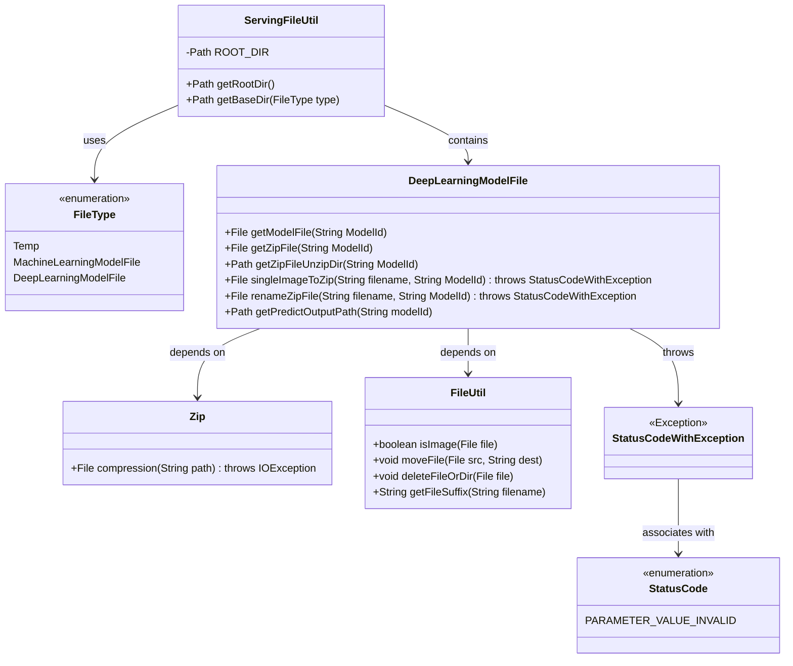
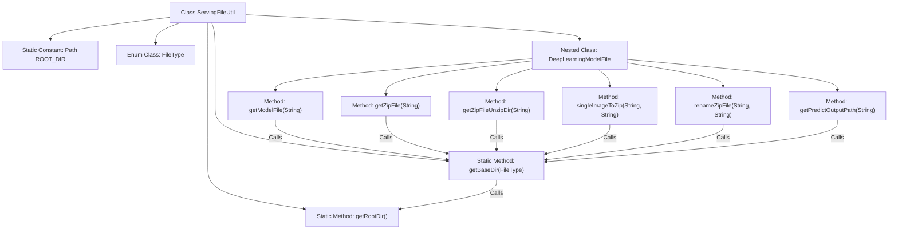

# Basic Information

|      |      |
|------|------|
| Name | ServingFileUtil |
| Language | .java |
| Code Path | WeFe/serving/serving-service/src/main/java/com/welab/wefe/serving/service/utils/ServingFileUtil.java |
| Package Name | com.welab.wefe.serving.service.utils |
| Dependencies | ['com.welab.wefe.common.StatusCode', 'com.welab.wefe.common.exception.StatusCodeWithException', 'com.welab.wefe.common.file.compression.impl.Zip', 'com.welab.wefe.common.util.FileUtil', 'com.welab.wefe.common.util.StringUtil', 'com.welab.wefe.common.web.Launcher', 'com.welab.wefe.serving.service.config.Config', 'java.io.File', 'java.io.IOException', 'java.nio.file.Path', 'java.nio.file.Paths'] |
| Brief Description | The ServingFileUtil class provides file path management functionalities, including obtaining the root directory, categorizing directories by type (temporary, machine learning models, deep learning models), and supporting compression, decompression, renaming of deep learning model files, as well as processing prediction result output paths. |

# Description

ServingFileUtil is a file service utility class that provides file path management and operation functionalities. It defines the root directory ROOT_DIR, which can be obtained via the getRootDir method. The getBaseDir method generates corresponding subdirectory paths based on the FileType enum (Temp, MachineLearningModelFile, DeepLearningModelFile). The DeepLearningModelFile nested class specifically handles deep learning model files, including functionalities such as obtaining model file paths, ZIP file paths, decompression directory paths, as well as single-image-to-ZIP conversion, ZIP file renaming, and prediction result output paths. It incorporates file type checks, exception handling, and file operation logic.

# Class Summary

| Name   | Type  | Description |
|-------|------|-------------|
| ServingFileUtil | class | The ServingFileUtil class provides file management functionalities, including obtaining root directories, categorizing paths by type, handling deep learning model files (such as compression, renaming, and prediction output paths), etc. It supports temporary files as well as machine learning and deep learning model file types. |

## Class ServingFileUtil

|      |      |
|------|------|
| Access Modifier | public |
| Type | class |
| Name | ServingFileUtil |
| Description | The ServingFileUtil class provides file management functionalities, including obtaining root directories, categorizing paths by type, handling deep learning model files (such as compression, renaming, and prediction output paths), etc. It supports temporary files as well as machine learning and deep learning model file types. |

### UML Class Diagram

This code implements a file service utility class, with main functionalities including retrieving file storage root directories, categorizing storage paths by type, and handling deep learning model files. The core class ServingFileUtil manages different file types through the FileType enumeration. Its inner class DeepLearningModelFile provides specific operations such as model file compression, renaming, and prediction output paths. The code relies on FileUtil for file operations, uses the Zip class for compression, and handles exceptions through StatusCodeWithException. The overall design adopts a static utility class pattern for convenient direct invocation of file operation methods.

### Internal Method Call Graph

This code defines a file service utility class ServingFileUtil, primarily used for managing storage paths and operations of different file types. Core functionalities include obtaining root directory path (ROOT_DIR), generating base paths based on file types (getBaseDir), and specialized handling methods for deep learning model files. The nested class DeepLearningModelFile provides functionalities such as model file retrieval, compressed file processing, renaming, and prediction output path generation, with all methods constructing specific paths based on getBaseDir. The code uses the FileType enum to distinguish file storage types, ensuring different file types are stored in separate directories, while incorporating strict file format validation and exception handling mechanisms.

### Field List

| Name  | Type  | Description |
|-------|-------|------|
| ROOT_DIR = Paths.get(Launcher.getBean(Config.class).getFileUploadDir()) | Path | The code defines ROOT_DIR as the file upload directory path, which is obtained through the Config class configuration. |

### Method List

| Name  | Type  | Description |
|-------|-------|------|
| getRootDir | Path | Static method to get the root directory path, directly returns the ROOT_DIR constant. |
| getBaseDir | Path | The static method `getBaseDir` returns the base path based on the file type, converting the type name to lowercase with underscores and appending it to the root directory path. |

