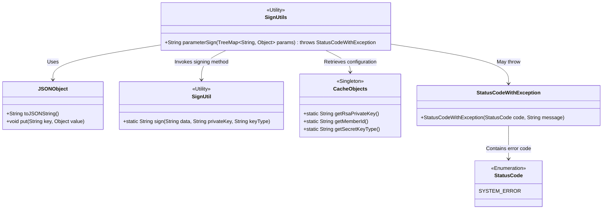
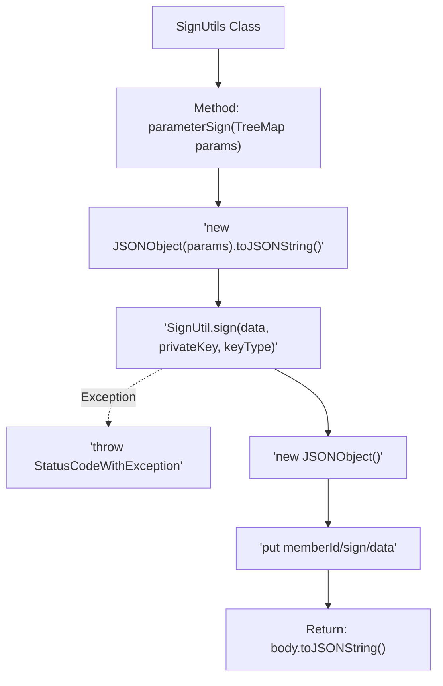

# Basic Information

|      |      |
|------|------|
| Name | SignUtils |
| Language | .java |
| Code Path | WeFe/serving/serving-service/src/main/java/com/welab/wefe/serving/service/utils/SignUtils.java |
| Package Name | com.welab.wefe.serving.service.utils |
| Dependencies | ['com.alibaba.fastjson.JSONObject', 'com.welab.wefe.common.StatusCode', 'com.welab.wefe.common.exception.StatusCodeWithException', 'com.welab.wefe.common.util.RSAUtil', 'com.welab.wefe.common.util.SignUtil', 'com.welab.wefe.serving.service.service.CacheObjects', 'java.util.TreeMap'] |
| Brief Description | The SignUtils class provides parameter signing methods, converting a TreeMap into a JSON string and signing it with an RSA private key, then returning a JSON string containing memberId, signature, and data. It throws a StatusCodeWithException in case of errors. |

# Description

The `parameterSign` method in the `SignUtils` class is used to generate the request body signature. This method accepts a `TreeMap` parameter to ensure the key-value pairs are ordered, preventing signature verification failures. After converting the parameters into a JSON string, it uses `SignUtil` to perform RSA signing. If the signing fails, a system error exception is thrown. Finally, it returns a JSON string containing the member ID, signature, and data content.

# Class Summary

| Name   | Type  | Description |
|-------|------|-------------|
| SignUtils | class | The SignUtils class provides the parameterSign method, which generates JSON using a TreeMap of ordered parameters, performs RSA signing, and returns a JSON string containing memberId, signature, and data. It throws a StatusCodeWithException in case of exceptions. |

## Class SignUtils

|      |      |
|------|------|
| Access Modifier | public |
| Type | class |
| Name | SignUtils |
| Description | The SignUtils class provides the parameterSign method, which generates JSON using a TreeMap of ordered parameters, performs RSA signing, and returns a JSON string containing memberId, signature, and data. It throws a StatusCodeWithException in case of exceptions. |

### UML Class Diagram

This class diagram illustrates the core structure of the signature utility class SignUtils and its dependencies. SignUtils accepts parameters via TreeMap, formats data using JSONObject, invokes SignUtil for signing operations, and relies on CacheObjects to obtain key configurations. Exception handling is implemented through StatusCodeWithException, which contains the enumeration-type error code StatusCode. The overall design demonstrates the separation of responsibilities among parameter signing, exception handling, and configuration management.

### Internal Method Call Graph

Flowchart Description: This flowchart illustrates the signature generation process of the SignUtils class. It first converts the input TreeMap parameters into a JSON string, then uses SignUtil for digital signing. If signing fails, it throws a StatusCodeWithException; if successful, it constructs a triple JSON object containing memberId, signature, and data, ultimately returning the JSON string representation of this object. The entire process strictly ensures parameter order and exception handling, implementing a secure API request signing mechanism.

### Field List

| Name  | Type  | Description |
|-------|-------|------|

### Method List

| Name  | Type  | Description |
|-------|-------|------|
| parameterSign | String | This method converts the TreeMap parameters into a JSON string, signs it with a private key, and then combines the memberId, signature, and data to return a JSON string. A system error is thrown in case of exceptions. |

