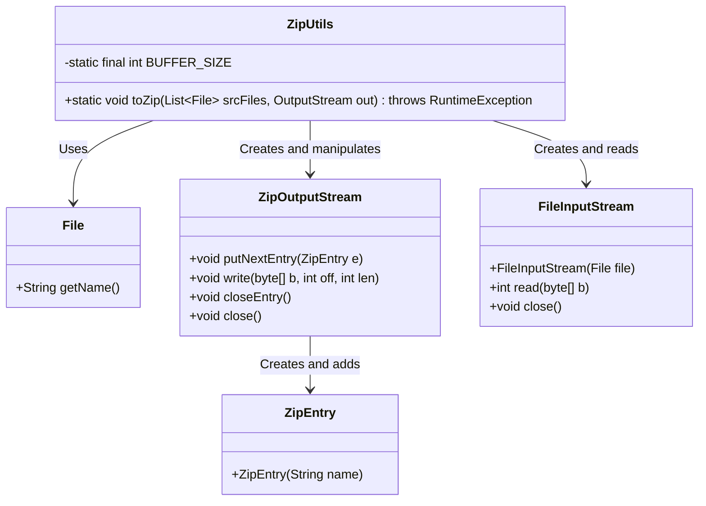
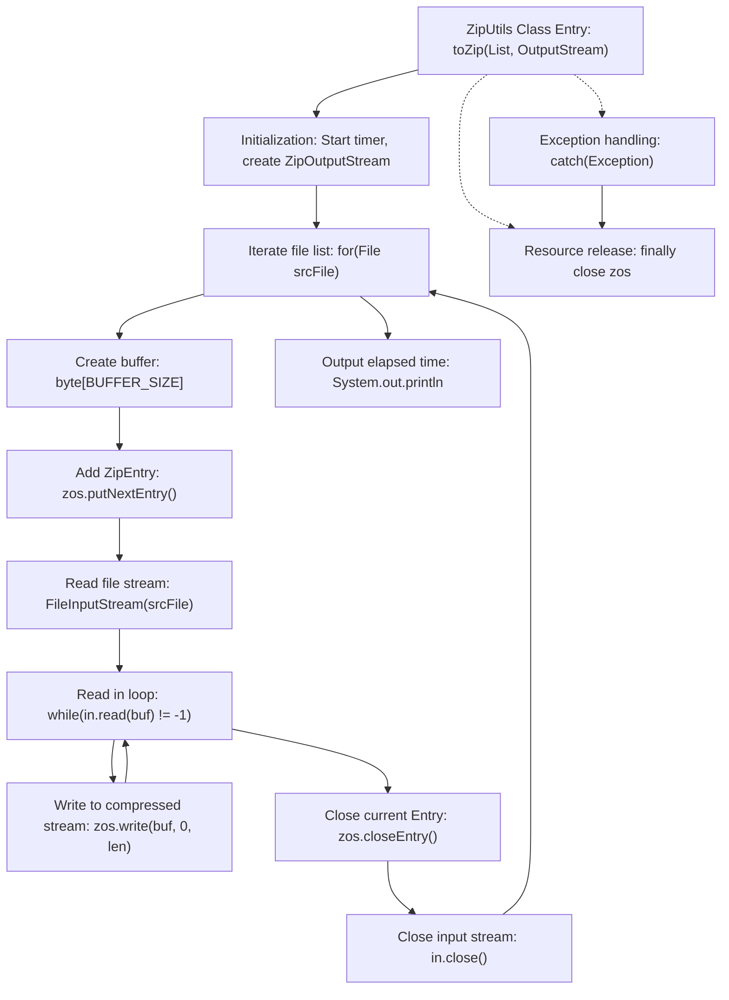

# Basic Information

|      |      |
|------|------|
| Name | ZipUtils |
| Language | .java |
| Code Path | WeFe/serving/serving-service/src/main/java/com/welab/wefe/serving/service/utils/ZipUtils.java |
| Package Name | com.welab.wefe.serving.service.utils |
| Dependencies | ['java.io.File', 'java.io.FileInputStream', 'java.io.IOException', 'java.io.OutputStream', 'java.util.List', 'java.util.zip.ZipEntry', 'java.util.zip.ZipOutputStream'] |
| Brief Description | The ZipUtils class provides file compression functionality, packaging multiple files into a ZIP format output stream, using a 2KB buffer to improve efficiency, recording time consumption, and handling exceptions. |

# Description

The ZipUtils class provides functionality to compress a list of files into a ZIP archive. It employs a fixed buffer size of 2KB, processing input files sequentially via ZipOutputStream by reading each file's data into the buffer and writing it to the ZIP entry. The method logs compression time and throws a RuntimeException on errors. Finally, it ensures proper resource cleanup, including closing both ZipOutputStream and FileInputStream.

# Class Summary

| Name   | Type  | Description |
|-------|------|-------------|
| ZipUtils | class | The ZipUtils class provides file compression functionality, packaging multiple files into a ZIP format output stream, using a 2KB buffer to improve efficiency, and recording processing time. It throws a RuntimeException in case of exceptions. |

## Class ZipUtils

|      |      |
|------|------|
| Access Modifier | public |
| Type | class |
| Name | ZipUtils |
| Description | The ZipUtils class provides file compression functionality, packaging multiple files into a ZIP format output stream, using a 2KB buffer to improve efficiency, and recording processing time. It throws a RuntimeException in case of exceptions. |

### UML Class Diagram

Class diagram description: ZipUtils is a utility class providing file compression functionality. Its main method toZip accepts a list of files and an output stream, utilizing ZipOutputStream for compression processing. It relies on File to obtain filenames, reads file content through FileInputStream, creates compression entries using ZipEntry, and ultimately writes compressed data to the output stream. The entire process includes exception handling and resource cleanup to ensure safe and reliable operations.

### Internal Method Call Graph

This flowchart illustrates the core process of the ZipUtils compression tool: starting from initializing the compressed stream, iterating through each file for chunked reading and compressed writing operations, and finally releasing resources and outputting elapsed time. The process includes exception handling paths and mandatory resource release steps, with particular emphasis on the core operation of cyclically reading file content and writing to the compressed stream, as well as strict stream closure sequence to ensure resource safety.

### Field List

| Name  | Type  | Description |
|-------|-------|------|
| BUFFER_SIZE = 2 * 1024 | int | Define a static constant BUFFER_SIZE with a value of 2048 bytes. |

### Method List

| Name  | Type  | Description |
|-------|-------|------|
| toZip | void | Compress multiple files into a ZIP output stream, record time consumption, and handle exceptions. |

